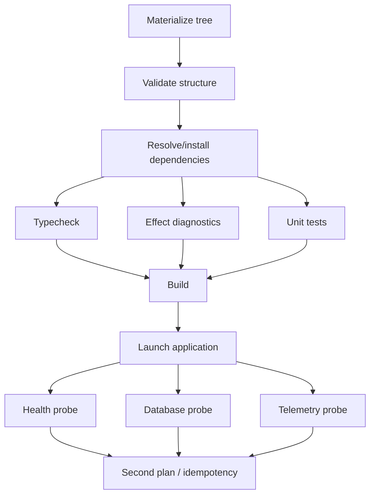

# EffectGrade — Product Strategy, Technical Architecture, and Implementation Plan

> **Product name:** EffectGrade  
> **Document status:** Implementation blueprint, draft v0.2 — naming and Effect v4 RC baseline incorporated  
> **Prepared for:** Ricardo Trejos  
> **Date:** August 13, 2026  
> **Primary objective:** Build a brownfield-first Effect adoption, verification, and upgrade platform—not another greenfield full-stack generator.  
> **Initial technical baseline:** Effect `4.0.0-rc.108`, Node.js `22.16+`, TypeScript `5.9+`, strict mode, pnpm-first certification.

---

## Table of contents

1. [Executive decision](#1-executive-decision)
2. [The product in one sentence](#2-the-product-in-one-sentence)
3. [Research-backed market position](#3-research-backed-market-position)
4. [Product thesis and strategic wedge](#4-product-thesis-and-strategic-wedge)
5. [Target users and jobs to be done](#5-target-users-and-jobs-to-be-done)
6. [Product principles](#6-product-principles)
7. [Scope, non-goals, and anti-scope](#7-scope-non-goals-and-anti-scope)
8. [Core user journeys](#8-core-user-journeys)
9. [CLI product specification](#9-cli-product-specification)
10. [Configuration and lockfile design](#10-configuration-and-lockfile-design)
11. [System architecture](#11-system-architecture)
12. [Domain model](#12-domain-model)
13. [Repository inspection engine](#13-repository-inspection-engine)
14. [Compatibility profiles](#14-compatibility-profiles)
15. [Capability pack system](#15-capability-pack-system)
16. [Dependency and capability resolver](#16-dependency-and-capability-resolver)
17. [Planning engine](#17-planning-engine)
18. [Transformation engine](#18-transformation-engine)
19. [Sandbox and repository materialization](#19-sandbox-and-repository-materialization)
20. [Verification engine](#20-verification-engine)
21. [Apply, transactionality, and rollback](#21-apply-transactionality-and-rollback)
22. [Status, drift, doctor, and upgrades](#22-status-drift-doctor-and-upgrades)
23. [Effect v3-to-v4 migration strategy](#23-effect-v3-to-v4-migration-strategy)
24. [Agent, MCP, and programmatic APIs](#24-agent-mcp-and-programmatic-apis)
25. [Security and trust model](#25-security-and-trust-model)
26. [Recommended monorepo and technology choices](#26-recommended-monorepo-and-technology-choices)
27. [Initial capability packs](#27-initial-capability-packs)
28. [First end-to-end vertical slice](#28-first-end-to-end-vertical-slice)
29. [Fixtures and reference repositories](#29-fixtures-and-reference-repositories)
30. [Testing strategy](#30-testing-strategy)
31. [CI, release engineering, and compatibility certification](#31-ci-release-engineering-and-compatibility-certification)
32. [Documentation and developer experience](#32-documentation-and-developer-experience)
33. [Telemetry and product analytics](#33-telemetry-and-product-analytics)
34. [Open-source strategy and governance](#34-open-source-strategy-and-governance)
35. [Distribution and ecosystem integrations](#35-distribution-and-ecosystem-integrations)
36. [Commercial product and path to revenue](#36-commercial-product-and-path-to-revenue)
37. [Validation program and evidence gates](#37-validation-program-and-evidence-gates)
38. [Milestone roadmap](#38-milestone-roadmap)
39. [Detailed implementation backlog](#39-detailed-implementation-backlog)
40. [Definition of done](#40-definition-of-done)
41. [Risk register](#41-risk-register)
42. [Architecture decision records](#42-architecture-decision-records)
43. [First commits and immediate build order](#43-first-commits-and-immediate-build-order)
44. [Open questions](#44-open-questions)
45. [Source material](#45-source-material)

---

# 1. Executive decision

Build **a deterministic lifecycle tool for adopting and maintaining Effect in existing TypeScript repositories**.

Do **not** build:

- Another Better-T-Stack clone.
- Another fixed Effect starter template.
- Another Effect patterns library.
- Another generic AI code generator.
- A broad plugin marketplace before the core transformation engine is trustworthy.
- A SaaS dashboard before repeat CLI usage is demonstrated.

The product should own this lifecycle:

```text
Inspect an existing repository
  → Resolve a compatible Effect capability set
  → Produce a deterministic, reviewable plan
  → Materialize the plan in an isolated workspace
  → Install and verify the resulting application
  → Present evidence and a patch
  → Apply only after repository preconditions still match
  → Record desired state and exact resolved versions
  → Detect drift and generate future upgrades
```

The first public proof should be deliberately narrow:

> Add a production-grade Effect runtime boundary to an existing Node + Hono application, verify it in a sandbox, and apply an idempotent patch without replacing the existing framework.

The first complete capability bundle should then add:

- Effect core/runtime boundary
- Typed configuration
- Hono bridge
- Native Effect HTTP API option
- PostgreSQL through Effect SQL
- OpenTelemetry
- Vitest and Effect diagnostics
- Health/readiness checks
- Docker-based local PostgreSQL
- Repeatable verification

The commercial product should eventually sell **continuous compatibility, private golden paths, automated upgrade pull requests, policy enforcement, and migration support**. Project creation itself should remain free and open source.

---

# 2. The product in one sentence

> **EffectGrade safely adopts, composes, verifies, and upgrades Effect inside real TypeScript repositories.**

Alternative concise positioning:

> **Verified Effect adoption for existing TypeScript applications.**

Core promise:

> **See exactly what will change, prove that the result works in isolation, and apply only the verified patch.**

The meaningful unit of value is not “files generated.” It is:

```text
A repository transformation
+ explicit compatibility guarantees
+ executable verification evidence
+ an upgrade path
```

## 2.1 Naming decision

The product name is permanently selected as **EffectGrade**.

The name describes the result rather than the mechanism. The product is not primarily a project generator; it evaluates and improves the production readiness of an Effect repository over time.

“Grade” supports the complete product thesis:

- grade a repository’s current Effect topology;
- grade dependency and runtime compatibility;
- grade the safety of a planned transformation;
- grade verification evidence;
- grade upgrade readiness;
- publish an auditable certification status.

It also supports a coherent product family:

```text
EffectGrade CLI
EffectGrade Profiles
EffectGrade Registry
EffectGrade Verified
EffectGrade Cloud
```

## 2.2 Brand system

```text
Product:           EffectGrade
CLI binary:        effectgrade
Initial repository: aclabs/effectgrade
Initial npm package: @aclabs/effectgrade
Initial website:   effectgrade.aclabs.io
Future docs domain: effectgrade.dev, only after validation and availability review
State directory:   .effectgrade/
Desired-state file: effectgrade.config.jsonc
Resolved lockfile: effectgrade.lock.json
Diagnostic prefix: EG
Backlog prefix:    EG-
```

The initial public package should use the existing `@aclabs` organization so launch does not depend on obtaining another namespace. Internal workspace package names may use `@effectgrade/*` while private; public extraction of those packages requires an explicit namespace-availability and migration decision.

Do not ship a short binary alias in v0.x. `effectgrade` is already compact, searchable, and unambiguous.

## 2.3 Primary tagline and messaging

Primary tagline:

> **Adopt Effect. Keep it production-grade.**

Homepage heading:

> **Make your Effect stack production-grade.**

Homepage description:

> EffectGrade safely introduces Effect into existing TypeScript repositories, verifies capability combinations, and keeps them upgradeable.

GitHub description:

> Verified adoption, upgrades, and compatibility for Effect applications.

Commercial description:

> Continuous Effect compatibility across every repository, runtime, and release.

## 2.4 Naming safeguards

Before a dedicated domain purchase or commercial trademark filing:

- repeat exact-name searches across GitHub, npm, package registries, search engines, and major software directories;
- perform registrar/RDAP checks for the preferred domains;
- perform USPTO, WIPO, and EUIPO searches;
- avoid implying that EffectGrade is an official Effect project unless an explicit relationship exists;
- retain “for Effect applications” positioning without using Effect’s visual identity as EffectGrade’s own brand;
- document the preliminary nature of availability checks until legal clearance is complete.

The project should launch under `effectgrade.aclabs.io` and `@aclabs/effectgrade`; a dedicated domain is a validation reward, not a prerequisite.

# 3. Research-backed market position

## 3.1 Better-T-Stack is the distribution benchmark

Better-T-Stack already supports a broad combination matrix across frontends, backends, APIs, runtimes, databases, ORMs, deployment targets, authentication providers, add-ons, structured JSON commands, a programmatic API, in-memory generation, schema introspection, MCP tools, agent workflows, and a browser stack builder.

Its current documentation explicitly includes:

- `create-json`
- `add-json`
- `schema`
- `mcp`
- `--dry-run`
- `create()`
- `add()`
- `createVirtual()`

Its FAQ says the main CLI is for new projects and that `add` extends Better-T-Stack projects, not arbitrary repositories. That leaves an important brownfield gap.

Its public analytics page reported 54,119 tracked project creations in its current telemetry stream as of July 28, 2026, with an estimated all-time total above 100,000. This makes it an excellent validation and distribution partner, but a poor project to clone.

There is also an open Better-T-Stack request for an Effect `HttpApi` backend/API option. This validates some interest, but the issue itself is not enough evidence to justify an entire competing generator.

**Implication:** contribute an Effect integration to Better-T-Stack after the core capability pack works, then measure real selections.

## 3.2 Stack Effect is the direct greenfield competitor

`lloydrichards/stack-effect` already provides an Effect-first scaffolding CLI with:

- `init`, `add`, and `graph`
- Bun and Node runtime choices
- Targets and modules
- Dependency closure
- Cross-target implications
- Repository-aware planning
- Dry runs
- Structured contributions
- Idempotent JSON and TypeScript composition
- A catalog/scaffold architecture
- Effect HTTP API, RPC, chat, WebSocket, database, and DevTools modules

Its documented lifecycle is effectively:

```text
Selection → Blueprint → Plan → Apply → Finalize
```

Its internal design is thoughtful and directly overlaps any “Better-T-Stack but for Effect” proposal.

**Implication:** do not compete on Effect greenfield scaffolding. Either collaborate, contribute verification capabilities, or remain complementary.

## 3.3 Official Effect covers basic templates and examples

The official `Effect-TS/examples` repository provides templates and examples consumable through `create-effect-app`. This covers basic project bootstrap and canonical examples.

**Implication:** do not compete on “hello world,” library templates, or CLI templates.

## 3.4 Official Effect diagnostics are already sophisticated

The official Effect Language Service and `@effect/tsgo` already provide type-aware diagnostics, quick fixes, refactors, layer analysis, code generation, outdated API detection, project overview, and structured diagnostic output.

Important current behavior:

- The classic language-service package supports Effect v3 and v4.
- TypeScript 7+ users are directed to `@effect/tsgo`.
- Diagnostics can run from the CLI.
- The tools can detect duplicate Effect packages, missing requirements, missing errors, floating Effects, outdated v4 APIs, problematic layer composition, and many other Effect-specific issues.

**Implication:** integrate these tools as verifiers. Do not build an inferior Effect linter.

## 3.5 Effect v4 RC creates the compatibility opportunity

Effect v4 is now officially in **release-candidate** status. The initial RC release is:

```text
effect@4.0.0-rc.108
```

It was published on August 12, 2026, directly after `effect@4.0.0-beta.107`. The official installation channel is now:

```bash
npm install effect@rc
```

Official v4 integration packages are also published under the `rc` tag. The current documented requirements are:

- TypeScript 5.9 or newer;
- TypeScript 7 recommended for the strongest Effect tooling integration and performance;
- `strict: true` in `tsconfig.json`;
- Node.js 18 or newer as the general runtime floor;
- integration-specific runtime floors where necessary—for example, `@effect/sql-sqlite-node` requires Node.js 22.16 or newer.

The move from beta to RC materially improves the timing for EffectGrade. It means the project should no longer be architected around v4 remaining a distant preview, and it removes most of the rationale for implementing the engine on Effect v3.

However, RC does **not** mean that every API is frozen. `rc.108` itself includes an API-level move of `SchemaError` into the `Schema` module, and Effect v4 explicitly distinguishes stable modules from `effect/unstable/*` modules. Unstable namespaces may continue to receive breaking changes even after the core v4 release becomes stable.

Relevant unstable areas include:

```text
effect/unstable/ai
effect/unstable/cli
effect/unstable/cluster
effect/unstable/devtools
effect/unstable/http
effect/unstable/httpapi
effect/unstable/observability
effect/unstable/persistence
effect/unstable/rpc
effect/unstable/sql
effect/unstable/workflow
effect/unstable/workers
```

The first RC also contains production-oriented fixes directly relevant to the product:

- safer BigInt handling in JSON diagnostics and logger formats;
- corrected `HttpApi` query decoding for single-value array parameters;
- fresh OpenAPI specifications from cached `OpenApi.fromApi` calls;
- declaration consistency when consumers run with `skipLibCheck: false`;
- improved union candidate selection;
- logging/redaction refinements;
- concurrency and wake-up fixes across queues, deferred values, workflows, and cluster behavior.

These changes signal increasing maturity while simultaneously proving why exact compatibility evidence remains valuable.

Effect v4 also introduces structural changes that strengthen the product thesis:

- unified versions across the official Effect ecosystem;
- consolidation of multiple v3 packages into the core `effect` package;
- exact release-coordinate matching for remaining `@effect/*` integrations;
- a large v3-to-v4 import and API migration surface;
- deliberately unstable modules whose risk must be declared and certified.

**Implication:** EffectGrade should run on Effect v4 RC, pin every official Effect package to one exact release coordinate, certify each RC independently, and treat unstable-module usage as explicit capability risk—not hide it behind “latest dependencies.”

Primary RC evidence:

- [Official Effect v4 RC README and requirements](https://github.com/Effect-TS/effect/blob/main/README.md)
- [Effect 4.0.0-rc.108 release notes](https://github.com/Effect-TS/effect/releases/tag/effect%404.0.0-rc.108)
- [README transition from beta to RC, PR #7197](https://github.com/Effect-TS/effect/pull/7197)

## 3.6 Pattern libraries and agent skills already exist

EffectPatterns offers hundreds of patterns and a CLI. The official Effect skills repository includes both an Effect development skill and a v3-to-v4 migration skill.

**Implication:** do not build another educational snippets database. Use patterns and official migration material as inputs and references.

## 3.7 Strategic conclusion

The occupied space:

```text
Greenfield templates
Greenfield stack selectors
Effect examples
Effect coding patterns
Effect editor diagnostics
AI-oriented Effect instructions
```

The fragmented space:

```text
Brownfield repository inspection
Safe incremental Effect adoption
Cross-package compatibility policy
Verified repository transformation
Repeatable sandbox validation
Repository drift detection
Continuous Effect upgrades
Private team golden paths
Automated migration pull requests
```

That fragmented space is the product.

---

# 4. Product thesis and strategic wedge

## 4.1 Primary thesis

TypeScript teams do not primarily need another way to start an empty Effect repository. They need confidence that Effect can be introduced into an existing system without destabilizing it.

The hardest parts are:

- Understanding the existing repository.
- Selecting compatible Effect packages and versions.
- Finding the correct integration boundary.
- Modifying source without destroying local conventions.
- Composing layers correctly.
- Preserving framework behavior.
- Proving that installation, type checking, tests, runtime startup, database access, and observability still work.
- Repeating the process safely when Effect changes.

## 4.2 Wedge

The wedge is:

> **Brownfield Hono adoption with sandbox verification.**

Why Hono first:

- It is common in Better-T-Stack’s own telemetry.
- It is already familiar to Ricardo.
- Its small surface makes integration boundaries clearer than Next.js.
- It runs across Node, Bun, and Workers, giving future expansion paths.
- An embedded Effect runtime can be introduced without replacing Hono.
- A native Effect `HttpApi` subtree can be added later.

## 4.3 Expansion path

```text
Hono + Node
  ↓
Hono + Effect services
  ↓
Native Effect HttpApi mounted under Hono
  ↓
PostgreSQL + OpenTelemetry + tests
  ↓
Fastify and Express adapters
  ↓
Effect v3/v4 doctor and migrations
  ↓
CI verification and upgrade PRs
  ↓
Private team capability packs
  ↓
Managed compatibility platform
```

## 4.4 Moat

The defensible asset is not generated code. It is the accumulated body of:

- Tested compatibility profiles.
- Repository detectors.
- Source-preserving transformations.
- Fixture repositories.
- Verification scenarios.
- Known-incompatibility rules.
- Migration recipes.
- Upgrade histories.
- Real-world failure evidence.
- Private team policy and capability definitions.

A competitor can copy a template. It is much harder to copy a continuously tested compatibility graph and transformation corpus.

---

# 5. Target users and jobs to be done

## 5.1 Persona A — Experienced TypeScript developer evaluating Effect

Characteristics:

- Already uses Hono, Fastify, Express, Next.js, or TanStack.
- Understands TypeScript deeply.
- Does not want to rewrite the application.
- Wants a production pattern, not another tutorial.
- Is willing to use a CLI if it is transparent and reversible.

Job:

> When I introduce Effect into an existing service, help me choose the correct boundary and prove that the application still works.

Success criteria:

- Existing endpoints remain unchanged.
- One new Effect-backed endpoint works.
- Typed configuration and errors are present.
- The patch is reviewable.
- A second run is a no-op.
- The tool explains the next incremental step.

## 5.2 Persona B — Tech lead adopting Effect for a team

Job:

> Establish an approved Effect architecture and keep developers from inventing incompatible patterns.

Success criteria:

- Standard service/layer structure.
- Approved package versions.
- Required diagnostics.
- Required tracing.
- Required tests.
- CI policy.
- A repeatable adoption path across repositories.

## 5.3 Persona C — Platform engineer

Job:

> Roll out an internal Effect golden path across many repositories and continuously verify compliance.

Success criteria:

- Private capability packs.
- Organization-level compatibility profile.
- Policy-as-code.
- Scheduled scans.
- Upgrade pull requests.
- Auditability.
- No source code uploaded to a third-party service by default.

## 5.4 Persona D — Maintainer migrating Effect v3 to v4

Job:

> Classify what can be migrated automatically, apply safe rewrites, and isolate manual work.

Success criteria:

- Package version alignment.
- Import migration.
- Mechanical API changes.
- LSP/TSGO diagnostics.
- Manual-review report for uncertain transformations.
- Before/after verification evidence.

## 5.5 Persona E — Coding agent

Job:

> Use a deterministic system to inspect, plan, and apply Effect changes instead of hand-writing boilerplate.

Success criteria:

- JSON schemas.
- Stable machine-readable output.
- Read-only inspection tools.
- Explicit destructive tools.
- Plan-before-apply.
- No hidden terminal prompts.
- Clear failures and retry semantics.

---

# 6. Product principles

## 6.1 Brownfield first

Every design decision must work in an existing, imperfect repository.

Greenfield creation may eventually be offered as a trivial special case of an empty repository, but it must not drive the architecture.

## 6.2 Deterministic before intelligent

The core workflow must not require an LLM.

Use deterministic detectors, schemas, dependency rules, AST transforms, and verifiers. AI may explain results or suggest a capability request, but it must not be the source of truth for repository mutation.

## 6.3 Verify before mutate

Default flow:

```text
Plan → sandbox apply → verify → show evidence → real apply
```

Not:

```text
Write files → hope → debug user repository
```

## 6.4 Source preserving

Prefer:

- New dedicated files.
- Minimal imports.
- Minimal registration calls.
- Structured JSON edits.
- AST-positioned text edits.
- Generated regions only in explicitly tool-owned files.

Avoid:

- Reprinting entire source files.
- Reformatting unrelated code.
- Regex-driven broad rewrites.
- Replacing user architecture.
- Arbitrary templates over existing files.

## 6.5 Exact compatibility, not “latest”

A capability is supported only against a tested compatibility profile.

“Latest” is an input to profile certification—not a runtime resolution strategy.

## 6.6 Official tooling over duplication

Use:

- Effect Language Service
- `@effect/tsgo`
- Official migration references
- Effect Schema
- Effect SQL
- Effect OpenTelemetry
- `@effect/vitest`

Do not duplicate their diagnostics or documentation.

## 6.7 Transparent trust

The user must know:

- Every file to be touched.
- Every dependency to be added or removed.
- Every command to be executed.
- Whether network access is needed.
- Whether install scripts are allowed.
- Which capability requested each change.
- Which checks passed or failed.

## 6.8 Idempotency is a contract

Running the same operation twice against the same desired state must produce zero changes.

## 6.9 Plans are immutable artifacts

A plan is tied to:

- A repository snapshot.
- A compatibility profile.
- Capability versions.
- Tool version.
- Transformation versions.

If the repository changes, the plan becomes stale and must not silently adapt during apply.

## 6.10 Narrow support is better than fake support

An unsupported repository should receive a useful report—not a risky best guess.

---

# 7. Scope, non-goals, and anti-scope

## 7.1 MVP scope

- Node runtime.
- Hono applications.
- npm and pnpm.
- Bun package-manager smoke coverage, but no Bun-runtime-specific capability initially.
- Single-package and standard workspace layouts.
- Existing Git repository or plain directory.
- Effect core runtime boundary.
- Typed config.
- One Effect-backed Hono route.
- Optional native Effect HTTP API subtree.
- PostgreSQL.
- OpenTelemetry.
- Vitest.
- Effect diagnostics.
- Sandbox materialization.
- Unified diff.
- Config + lock state.
- `inspect`, `plan`, `apply`, `verify`, `status`, `doctor`.
- JSON output.
- Basic MCP wrapper after CLI schemas stabilize.

## 7.2 Explicit non-goals for MVP

- Next.js App Router.
- React client generation.
- React Native.
- Cloudflare Workers.
- Bun-specific server runtime.
- Authentication.
- Payments.
- Queues.
- AI/LLM capabilities.
- Durable workflows.
- Effect Cluster.
- Multiple databases.
- Multiple ORMs.
- A public third-party capability registry.
- A visual stack builder.
- A hosted SaaS control plane.
- Automated PR creation.
- Full v3-to-v4 migration.
- Removing capabilities.
- Arbitrary user-defined shell scripts.
- Automatic conversion of an entire codebase to Effect.

## 7.3 Anti-scope rules

Reject or defer a feature when it:

1. Does not strengthen brownfield adoption, verification, or upgrades.
2. Adds a new framework before Hono is production-grade.
3. Adds a new capability without a complete verifier.
4. Adds a transformation without idempotency and conflict tests.
5. Adds a third-party pack mechanism before signing and trust policy exist.
6. Adds a SaaS screen that can be replaced by a CLI report.
7. Adds an AI feature that can be implemented deterministically.
8. Expands the support matrix without fixture coverage.
9. Introduces a raw shell command where a structured action can exist.
10. Changes more user code than necessary.

---

# 8. Core user journeys

## 8.1 Inspect an existing repository

```bash
npx @aclabs/effectgrade inspect
```

Expected output:

```text
Repository
  Root              /workspace/acme-api
  Git               detected, dirty
  Package manager   pnpm
  Workspace         pnpm workspace
  TypeScript        detected
  Runtime           Node
  Framework         Hono
  Entry point       apps/api/src/index.ts
  Effect            not installed

Targets
  apps/api
    kind             server
    framework        hono
    confidence       0.97

Warnings
  - Working tree contains uncommitted changes.
  - No test script was detected for apps/api.
```

No writes. No network. No execution of project files.

## 8.2 Plan Effect adoption

```bash
npx @aclabs/effectgrade plan add \
  core \
  config \
  hono-bridge \
  testing-vitest \
  --target apps/api
```

Expected output:

```text
Plan 01J...
Profile          effect-v4-rc108-node22-pnpm-hono-bridge
Target           apps/api

Safe changes     8
Review changes   1
Manual changes   0
Blocked changes  0

Dependencies
  + effect@<profile version>
  + @effect/platform-node@<profile version>
  + @effect/vitest@<profile version>

Files
  + apps/api/src/effect/AppRuntime.ts
  + apps/api/src/effect/AppConfig.ts
  + apps/api/src/effect/Health.ts
  + apps/api/src/effect/index.ts
  ~ apps/api/src/index.ts
  ~ apps/api/package.json

Verification
  - install dependencies
  - TypeScript type check
  - Effect diagnostics
  - unit tests
  - runtime startup
  - GET /health/effect
```

## 8.3 Verify without touching the repository

```bash
npx @aclabs/effectgrade verify --plan .effectgrade/plans/01J....json
```

Expected behavior:

1. Materialize a sandbox snapshot.
2. Apply the plan.
3. Install dependencies under trust policy.
4. Type-check.
5. Run Effect diagnostics.
6. Run tests.
7. Start the service.
8. Probe the health endpoint.
9. Stop the service gracefully.
10. Produce a report and patch.

## 8.4 Apply the verified patch

```bash
npx @aclabs/effectgrade apply --plan .effectgrade/plans/01J....json
```

Apply must:

- Recheck every touched-file precondition.
- Refuse stale plans.
- Recheck the verified patch digest.
- Present command approvals.
- Apply all file edits before running any finalize action.
- Write config and lock state.
- Preserve the user’s Git index.
- Leave no partial files on failure.

## 8.5 Check managed state

```bash
npx @aclabs/effectgrade status
```

Expected output:

```text
Desired state
  core                 1.0.0
  config               1.0.0
  hono-bridge          1.0.0
  testing-vitest       1.0.0

Profile
  effect-v4-rc108-node22-pnpm-hono-bridge
  digest sha256:...

Drift
  clean

Compatibility
  verified

Upgrade
  none available
```

## 8.6 Diagnose a repository

```bash
npx @aclabs/effectgrade doctor
```

Checks:

- Effect package version alignment.
- Duplicate Effect packages.
- Known vulnerable versions.
- Profile compliance.
- Missing layers.
- Missing diagnostics.
- Invalid runtime wiring.
- Config drift.
- Generated file drift.
- Unsupported unstable imports.
- Lockfile mismatch.
- Verification command availability.
- PostgreSQL and OTel setup when requested.

## 8.7 Upgrade

```bash
npx @aclabs/effectgrade upgrade --to profile:effect-v4-stable
```

Output must classify:

- Fully automatic changes.
- Safe but review-required changes.
- Manual migrations.
- Blocked items.
- Verification plan.

---

# 9. CLI product specification

## 9.1 Binary and package naming

Canonical naming:

```text
product:             EffectGrade
binary:              effectgrade
initial npm package: @aclabs/effectgrade
repository:          aclabs/effectgrade
initial website:     effectgrade.aclabs.io
state directory:     .effectgrade/
config:              effectgrade.config.jsonc
lockfile:            effectgrade.lock.json
```

Usage:

```bash
pnpm dlx @aclabs/effectgrade inspect
npx @aclabs/effectgrade inspect
```

The package exposes the `effectgrade` binary, so installed-project usage remains:

```bash
effectgrade inspect
```

Do not publish a `grade`, `eg`, or other short alias in v0.x. A short alias creates shell collisions and weakens searchability without materially improving ergonomics.

If the `@effectgrade` npm organization is later secured, migrate through a documented wrapper/deprecation period rather than silently changing package identity.

## 9.2 Command surface

| Command     |  Mutates repository |  Runs user code | Network by default | Purpose                           |
| ----------- | ------------------: | --------------: | -----------------: | --------------------------------- |
| `inspect`   |                  No |              No |                 No | Build repository inventory        |
| `catalog`   |                  No |              No |                 No | List capabilities and profiles    |
| `plan`      |                  No |              No |                 No | Create immutable plan             |
| `verify`    |        No real repo | Yes, in sandbox |            Usually | Materialize and verify            |
| `apply`     |                 Yes |        Optional |           Optional | Apply verified plan               |
| `adopt`     |                 Yes | Yes, in sandbox |            Usually | High-level plan/verify/apply flow |
| `status`    |                  No |              No |                 No | Compare desired and actual state  |
| `doctor`    |                  No |  Limited checks |           Optional | Diagnose compatibility            |
| `upgrade`   | No unless `--apply` |  Yes in sandbox |            Usually | Plan and verify upgrades          |
| `migrate`   | No unless `--apply` |  Yes in sandbox |            Usually | Framework/version migrations      |
| `schema`    |                  No |              No |                 No | Emit JSON schemas                 |
| `mcp`       |     Depends on tool |         Depends |            Depends | Expose deterministic engine       |
| `telemetry` |   Local config only |              No |                 No | View/disable telemetry            |
| `version`   |                  No |              No |                 No | Version and profile info          |

## 9.3 Global flags

```text
--root <path>
--target <workspace-path-or-name>
--profile <profile-id>
--package-manager <auto|npm|pnpm|bun>
--json
--output <human|json|ndjson>
--no-color
--non-interactive
--log-level <error|warn|info|debug|trace>
--trace-file <path>
--offline
--telemetry <on|off>
--config <path>
```

Rules:

- `--json` implies no prompts and no decorative terminal output.
- All machine output goes to stdout.
- Diagnostics and logs go to stderr unless embedded in a JSON result.
- No command may mix human text into JSON output.
- `--offline` must fail clearly when a missing profile or package metadata is required.
- `--root` is canonicalized once and all operations remain inside it.

## 9.4 `inspect`

```bash
effectgrade inspect [--deep] [--json]
```

Default inspection:

- Static repository files only.
- No execution.
- No network.
- No dependency installation.

`--deep` may additionally:

- Invoke TypeScript parsing.
- Run Effect LSP overview/diagnostics when already installed.
- Inspect workspace dependency graph.
- Hash relevant files.
- Analyze imports and entrypoints.

It still must not execute arbitrary config or package scripts.

## 9.5 `catalog`

```bash
effectgrade catalog
effectgrade catalog capability postgres
effectgrade catalog profile effect-v4-rc108-node22-pnpm-hono-bridge
effectgrade catalog --json
```

Must expose:

- capabilities
- versions
- stability
- profile support
- required capabilities
- conflicts
- supported target kinds
- required approvals
- verification coverage
- known limitations

## 9.6 `plan`

```bash
effectgrade plan add <capability...>
effectgrade plan upgrade
effectgrade plan migrate v3-to-v4
```

Important flags:

```text
--target
--set key=value
--config-file capability-options.json
--save <path>
--diff
--explain
--fail-on-review
--fail-on-manual
```

`plan` must be side-effect-free with respect to the repository.

Allowed side effects:

- Writing the requested plan artifact outside the repository or under `.effectgrade/plans`.
- Reading cached compatibility profiles.
- Local telemetry only after command completion.

## 9.7 `verify`

```bash
effectgrade verify --plan <path>
effectgrade verify --plan <path> --check typecheck,diagnostics,test,runtime
effectgrade verify --plan <path> --sandbox copy
```

Flags:

```text
--sandbox <auto|copy|git-snapshot|container>
--check <csv>
--skip <csv>
--allow-network
--allow-install-scripts <package...>
--keep-sandbox
--report <path>
--max-log-bytes <n>
```

`verify` must never mutate the real repository.

## 9.8 `apply`

```bash
effectgrade apply --plan <path>
```

Default requirements:

- Plan is not stale.
- Plan is verified.
- Verification report digest matches the plan and patch.
- There are no unresolved conflicts.
- Required approvals are provided.
- Git working tree state is acknowledged when dirty.

Flags:

```text
--accept
--allow-unverified
--allow-command <action-id>
--create-branch <name>
--commit
--no-finalize
--backup
```

`--allow-unverified` must be noisy, non-default, and unavailable through implicit agent flows unless explicitly requested.

## 9.9 `adopt`

High-level convenience flow:

```bash
effectgrade adopt \
  core config hono-bridge postgres opentelemetry testing-vitest \
  --target apps/api
```

Lifecycle:

```text
inspect
resolve
plan
show summary
materialize sandbox
verify
show evidence and diff
confirm
apply
status
```

The high-level command is valuable for humans, but all internal stages must remain available independently for automation.

## 9.10 `status`

```bash
effectgrade status
effectgrade status --json
effectgrade status --strict
```

Status categories:

```text
clean
drifted
profile-outdated
capability-outdated
unsupported
broken
unmanaged
unknown
```

`--strict` exits non-zero for any state other than `clean`.

## 9.11 `doctor`

```bash
effectgrade doctor
effectgrade doctor --fix
```

`--fix` must not perform direct ad hoc edits. It creates a plan and routes through the normal lifecycle.

## 9.12 Stable exit codes

| Exit code | Meaning                                                   |
| --------: | --------------------------------------------------------- |
|       `0` | Success                                                   |
|       `1` | Internal or uncategorized failure                         |
|       `2` | Invalid CLI input or configuration                        |
|       `3` | Unsupported or ambiguous repository                       |
|       `4` | Plan contains unresolved conflicts/manual blockers        |
|       `5` | Verification failed                                       |
|       `6` | Plan is stale                                             |
|       `7` | Security approval required                                |
|       `8` | Compatibility profile unavailable or invalid              |
|       `9` | Drift detected under strict mode                          |
|      `10` | Partial apply was rolled back; user should inspect report |

These codes become part of the public API and must not be casually reassigned.

## 9.13 Machine-readable result envelope

Every JSON command should return:

```ts
type CommandEnvelope<A> = {
  schemaVersion: string
  command: string
  ok: boolean
  result?: A
  errors: ReadonlyArray<Diagnostic>
  warnings: ReadonlyArray<Diagnostic>
  metadata: {
    toolVersion: string
    profileId?: string
    startedAt: string
    completedAt: string
    durationMs: number
  }
}
```

No absolute source file contents should appear unless explicitly requested through a plan/diff endpoint.

# 10. Configuration and lockfile design

EffectGrade needs two committed state files with different responsibilities:

```text
effectgrade.config.jsonc   Human-owned desired state
effectgrade.lock.json      Tool-owned resolved state and evidence anchors
```

Local ephemeral state belongs under:

```text
.effectgrade/
├── cache/
├── plans/
├── reports/
├── sandboxes/
├── backups/
└── logs/
```

Only selected plans and reports should be committed. Cache, sandboxes, backups, and logs should be ignored by default.

## 10.1 Design goals

The state model must:

- Separate user intent from exact resolution.
- Support deterministic planning.
- Support reproducible upgrades.
- Detect drift without claiming ownership of the whole repository.
- Survive manual edits.
- Remain inspectable in code review.
- Be forward-migratable.
- Avoid storing secrets.
- Be target-aware inside monorepos.
- Support multiple Effect profiles in one repository only when explicitly allowed.
- Distinguish “managed by EffectGrade” from “observed but unmanaged.”

## 10.2 Desired-state configuration

Proposed initial schema:

```jsonc
{
  "$schema": "https://effectgrade.aclabs.io/schemas/config/v1.json",
  "schemaVersion": "1",
  "profile": "effect-v4-rc108-node22-pnpm-hono-bridge",
  "defaults": {
    "packageManager": "auto",
    "verification": "standard",
    "installScripts": "deny",
    "sandbox": "auto",
  },
  "targets": {
    "apps/api": {
      "runtime": "node",
      "framework": "hono",
      "capabilities": {
        "core": {},
        "config": {
          "environmentPrefix": "APP_",
        },
        "hono-bridge": {
          "mountPath": "/effect",
        },
        "postgres": {
          "driver": "pg",
          "databaseUrlVariable": "DATABASE_URL",
          "localDevelopment": "docker-compose",
        },
        "opentelemetry": {
          "exporter": "otlp-http",
          "serviceName": "api",
        },
        "testing-vitest": {},
      },
    },
  },
  "policies": {
    "unstableEffectApis": "certified-only",
    "minimumVerification": ["install", "typecheck", "effect-diagnostics", "test"],
    "forbidInstallScripts": true,
    "requireCleanGitForApply": false,
    "requireVerifiedApply": true,
  },
}
```

Key rules:

- JSONC is used for the human-owned file so comments are permitted.
- Unknown fields produce warnings in human mode and errors in strict/CI mode.
- Capability option schemas are versioned independently.
- Configuration is declarative; it cannot import JavaScript or execute code.
- Environment variables may parameterize CLI behavior, but committed config must contain only variable names, not secret values.
- Relative paths are resolved from the config file’s directory and must remain under the repository root unless a field explicitly allows external paths.
- Capability identifiers are stable logical names, not package names.
- Unstable API policy values are `deny`, `certified-only`, and `allow-experimental`; the default is `certified-only`.
- Omitted defaults are materialized in the plan but not unnecessarily written back.

## 10.3 Resolved lockfile

Proposed shape:

```json
{
  "$schema": "https://effectgrade.aclabs.io/schemas/lock/v1.json",
  "schemaVersion": "1",
  "tool": {
    "name": "effectgrade",
    "version": "0.1.0"
  },
  "profile": {
    "id": "effect-v4-rc108-node22-pnpm-hono-bridge",
    "version": "2026.08.2",
    "digest": "sha256:..."
  },
  "targets": {
    "apps/api": {
      "repositoryFingerprint": "sha256:...",
      "runtime": {
        "kind": "node",
        "range": ">=22.16"
      },
      "capabilities": {
        "core": {
          "version": "0.1.0",
          "definitionDigest": "sha256:...",
          "resolvedPackages": {
            "effect": "4.0.0-rc.108"
          },
          "managedArtifacts": [
            {
              "path": "apps/api/src/effect/AppRuntime.ts",
              "ownership": "tool",
              "contentDigest": "sha256:..."
            }
          ],
          "sharedArtifacts": [
            {
              "path": "apps/api/package.json",
              "operationDigest": "sha256:..."
            }
          ],
          "verification": {
            "profile": "standard",
            "lastSuccessAt": "2026-08-13T00:00:00.000Z",
            "reportDigest": "sha256:..."
          }
        }
      }
    }
  }
}
```

The lockfile records:

- Exact compatibility profile.
- Exact capability definition versions.
- Definition and profile digests.
- Exact package versions selected by the profile.
- Tool-owned file digests.
- Semantic operation digests for shared files.
- Last successful verification evidence.
- Repository fingerprint scope.
- Migration history.
- Applied plan digest.
- Any explicitly accepted exceptions.

It must **not** record:

- API keys.
- Raw environment values.
- Absolute user paths.
- Full source file contents.
- Dependency registry tokens.
- Unredacted command output.

## 10.4 Configuration precedence

Highest precedence first:

```text
CLI flag
  → command-specific environment variable
  → target configuration
  → repository defaults
  → compatibility profile defaults
  → capability defaults
```

Resolution must be visible:

```bash
effectgrade plan add postgres --explain
```

Example explanation:

```text
postgres.databaseUrlVariable = DATABASE_URL
  source: target config
postgres.localDevelopment = docker-compose
  source: target config
postgres.migrations = effect-sql
  source: compatibility profile
```

No hidden magical override should exist.

## 10.5 State migrations

State files need explicit migrators:

```ts
interface StateMigration<From, To> {
  readonly from: string
  readonly to: string
  readonly decode: (input: unknown) => Effect.Effect<From, DecodeError>
  readonly migrate: (input: From) => Effect.Effect<To, MigrationError>
}
```

Migration rules:

- Never silently rewrite configuration during an unrelated command.
- Read older formats when possible.
- `doctor` should report when a migration is available.
- `effectgrade state migrate` should preview the state-file diff.
- Lockfile regeneration may occur after a successful verified plan.
- A backup is written before changing either file.
- Downgrade behavior must be explicit; unsupported lockfile versions fail with a useful diagnostic.

## 10.6 Multi-target and multi-profile policy

MVP:

- One repository profile.
- Multiple targets under that profile.
- A target may opt out of management.
- Package dependencies shared by multiple targets are resolved once at the nearest workspace owner.

Post-MVP:

- Multiple profiles may exist only where workspace package boundaries prevent incompatible Effect versions from leaking into the same TypeScript program.
- The inspector should reject duplicate Effect package installations when the selected profile forbids them.
- Cross-profile target dependencies require an explicit bridge and are blocked by default.

## 10.7 Generated `.gitignore` entries

EffectGrade may propose, but not silently insert, these entries:

```gitignore
.effectgrade/cache/
.effectgrade/sandboxes/
.effectgrade/backups/
.effectgrade/logs/
```

Recommended committed artifacts:

```text
effectgrade.config.jsonc
effectgrade.lock.json
.effectgrade/reports/compatibility-summary.json
```

Whether detailed reports are committed should be a repository policy.

---

# 11. System architecture

## 11.1 Architectural style

Use a modular monolith with functional-core / imperative-shell boundaries.

Do not start with:

- Microservices.
- A plugin process protocol.
- A remote registry.
- A daemon.
- A persistent database.
- A web dashboard.
- A generalized workflow engine.

The CLI, programmatic API, and future MCP server must call the same application services. Terminal rendering is an adapter, not the location of business logic.

## 11.2 End-to-end pipeline

```mermaid
flowchart LR
  A[Repository root] --> B[Inspect]
  B --> C[Repository inventory]
  C --> D[Resolve profile and capabilities]
  D --> E[Build immutable plan]
  E --> F[Materialize isolated workspace]
  F --> G[Apply transformations]
  G --> H[Install dependencies]
  H --> I[Run verification graph]
  I --> J{Passed?}
  J -->|No| K[Evidence report + failed patch]
  J -->|Yes| L[Verified patch + report]
  L --> M{Apply approved?}
  M -->|No| N[Persist report only]
  M -->|Yes| O[Revalidate repository preconditions]
  O --> P[Transactional apply]
  P --> Q[Finalize approved actions]
  Q --> R[Update lockfile]
  R --> S[Post-apply status]
```



## 11.3 Bounded contexts

### Repository Inventory

Owns:

- Static file discovery.
- Workspace/package graph.
- Runtime/framework detection.
- Effect package/version detection.
- Target discovery.
- Git state.
- relevant-file fingerprints.
- Confidence and ambiguity diagnostics.

Does not own:

- What should be installed.
- Transformations.
- Package resolution.
- Verification.

### Compatibility Catalog

Owns:

- Profiles.
- Capabilities.
- Option schemas.
- Version constraints.
- Verification requirements.
- Known incompatibilities.
- Security metadata.
- Stability labels.

Does not inspect repositories or write files.

### Resolution

Owns:

- Requested capabilities.
- Dependency closure.
- Conflicts.
- Target placement.
- Package version resolution from a profile.
- Default option resolution.
- Explanation/provenance.

Does not mutate files.

### Planning

Owns:

- Compiling resolved capabilities into operations.
- Reading relevant repository snapshots.
- Classifying operations.
- Conflict detection.
- Precondition construction.
- Planned patch model.
- Approval requirements.
- Deterministic ordering.

### Transformation

Owns:

- Pure or isolated application of operations to a virtual tree.
- JSONC edits.
- TypeScript structural edits.
- Text/generated-file writes.
- File moves/deletions where supported.
- Composition diagnostics.
- Idempotency behavior.

### Sandbox

Owns:

- Workspace materialization.
- Filesystem containment.
- Dependency-cache strategy.
- Process execution boundary.
- Cleanup and optional preservation.
- Log capture and redaction.

### Verification

Owns:

- Check graph.
- Check execution.
- Evidence.
- Timeouts.
- Exit status.
- Runtime probes.
- Compatibility certification results.

### Apply

Owns:

- Staleness checks.
- Precondition validation.
- Patch application.
- Atomicity/rollback.
- Approved finalize actions.
- Lockfile write.
- Apply result.

### Status and Upgrade

Owns:

- Desired versus actual state.
- Drift classifications.
- Profile update discovery.
- Capability update planning.
- Migration orchestration.

## 11.4 Ports and adapters

Core ports:

```ts
interface FileSystem {
  readFile(path: RepoPath): Effect.Effect<string, FileSystemError>
  writeFile(path: RepoPath, contents: string): Effect.Effect<void, FileSystemError>
  stat(path: RepoPath): Effect.Effect<FileStat, FileSystemError>
  list(path: RepoPath): Effect.Effect<ReadonlyArray<RepoPath>, FileSystemError>
}

interface ProcessRunner {
  run(command: CommandSpec): Effect.Effect<ProcessResult, ProcessError>
}

interface PackageMetadataSource {
  resolve(request: PackageMetadataRequest): Effect.Effect<PackageMetadata, MetadataError>
}

interface GitRepository {
  status(): Effect.Effect<GitStatus, GitError>
  diff(spec: DiffSpec): Effect.Effect<string, GitError>
  apply(patch: Patch): Effect.Effect<void, GitError>
}

interface Clock {
  now(): Effect.Effect<Date>
}

interface ProfileStore {
  get(id: ProfileId): Effect.Effect<CompatibilityProfile, ProfileError>
}
```

Adapters:

- Real Node filesystem.
- In-memory filesystem for tests.
- Temporary-directory filesystem.
- Native process runner.
- Fake deterministic process runner.
- npm registry metadata client.
- Offline profile store.
- Git CLI adapter.
- No-Git adapter.

## 11.5 Layering rules

```text
domain
  ↑
catalog / inventory / resolution / planning / transformation / verification
  ↑
application workflows
  ↑
cli / json / mcp / node adapters
```

Hard constraints:

- Domain packages do not import CLI rendering.
- Catalog definitions cannot access the real filesystem.
- Capability definitions cannot execute arbitrary commands at module import time.
- Transformation code receives explicit input; it does not rediscover repository state.
- Verification runs only after materialization.
- Apply never rebuilds a plan internally.
- JSON and MCP adapters never bypass application invariants.
- Human prompts produce explicit policy inputs; they are not embedded inside domain services.

## 11.6 Error model

Use tagged, serializable errors:

```ts
type EffectGradeError =
  | InventoryError
  | AmbiguousTargetError
  | UnsupportedRepositoryError
  | ProfileResolutionError
  | CapabilityConflictError
  | PlanConflictError
  | TransformationError
  | SandboxError
  | VerificationError
  | StalePlanError
  | SecurityApprovalError
  | ApplyError
  | RollbackError
```

Every error should carry:

```ts
type DiagnosticContext = {
  code: string
  title: string
  detail: string
  severity: "info" | "warning" | "error"
  path?: RepoPath
  range?: SourceRange
  capabilityId?: CapabilityId
  targetId?: TargetId
  operationId?: OperationId
  remediation?: ReadonlyArray<Remediation>
  docsKey?: string
}
```

No thrown strings in core code. Defects still exist, but expected failures remain typed.

## 11.7 Determinism boundary

Given the same:

- tool version
- catalog/profile digest
- capability request
- resolved options
- relevant repository snapshot
- platform normalization settings

the plan must be byte-for-byte equivalent apart from explicitly excluded timestamp fields.

Deterministic fields include:

- Operation IDs.
- Ordering.
- Generated contents.
- Diagnostics ordering.
- Patch.
- Verification graph.
- Required approvals.
- Lockfile projection.

Dates, durations, temporary paths, and process IDs must remain outside plan identity.

---

# 12. Domain model

The following model is intentionally explicit. It is a starting contract, not an instruction to place every type in one file.

## 12.1 Branded identifiers

```ts
import { Schema } from "effect"

export const RepoPath = Schema.String.pipe(Schema.brand("RepoPath"))
export type RepoPath = typeof RepoPath.Type

export const TargetId = Schema.String.pipe(Schema.brand("TargetId"))
export type TargetId = typeof TargetId.Type

export const CapabilityId = Schema.String.pipe(Schema.brand("CapabilityId"))
export type CapabilityId = typeof CapabilityId.Type

export const ProfileId = Schema.String.pipe(Schema.brand("ProfileId"))
export type ProfileId = typeof ProfileId.Type

export const PlanId = Schema.String.pipe(Schema.brand("PlanId"))
export type PlanId = typeof PlanId.Type

export const OperationId = Schema.String.pipe(Schema.brand("OperationId"))
export type OperationId = typeof OperationId.Type
```

IDs should be derived from canonical data, not random UUIDs, where stable identity is useful.

## 12.2 Repository inventory

```ts
type RepositoryInventory = {
  readonly root: RepoPath
  readonly repositoryKind: "single-package" | "workspace"
  readonly packageManager: DetectedValue<PackageManager>
  readonly workspaceTool?: DetectedValue<WorkspaceTool>
  readonly git: GitInventory
  readonly packages: ReadonlyArray<PackageInventory>
  readonly targets: ReadonlyArray<TargetInventory>
  readonly effect: EffectInventory
  readonly diagnostics: ReadonlyArray<Diagnostic>
  readonly fingerprint: RepositoryFingerprint
}

type DetectedValue<A> = {
  readonly value?: A
  readonly confidence: "certain" | "high" | "medium" | "low"
  readonly evidence: ReadonlyArray<EvidenceRef>
  readonly alternatives: ReadonlyArray<A>
}

type TargetInventory = {
  readonly id: TargetId
  readonly root: RepoPath
  readonly packageName?: string
  readonly kind: "server" | "web" | "library" | "cli" | "worker" | "unknown"
  readonly runtime: DetectedValue<RuntimeKind>
  readonly frameworks: ReadonlyArray<DetectedFramework>
  readonly entrypoints: ReadonlyArray<RepoPath>
  readonly scripts: Readonly<Record<string, string>>
  readonly tsconfig?: RepoPath
}
```

## 12.3 Compatibility profile

```ts
type CompatibilityProfile = {
  readonly id: ProfileId
  readonly version: string
  readonly digest: string
  readonly channel: "stable" | "preview" | "experimental"
  readonly releasedAt: string
  readonly toolRange: string
  readonly supportedPlatforms: ReadonlyArray<PlatformConstraint>
  readonly packageVersions: Readonly<Record<string, PackageVersionRule>>
  readonly capabilityVersions: Readonly<Record<CapabilityId, string>>
  readonly policies: ProfilePolicies
  readonly knownIssues: ReadonlyArray<KnownCompatibilityIssue>
  readonly signature?: ProfileSignature
}
```

Package rules need exactness:

```ts
type PackageVersionRule =
  | { readonly _tag: "exact"; readonly version: string }
  | { readonly _tag: "range"; readonly range: string; readonly prefer: string }
  | { readonly _tag: "forbidden"; readonly reason: string }
  | {
      readonly _tag: "runtime-specific"
      readonly variants: Readonly<Record<RuntimeKind, PackageVersionRule>>
    }
```

## 12.4 Capability definition

```ts
type CapabilityDefinition<Options> = {
  readonly id: CapabilityId
  readonly version: string
  readonly title: string
  readonly description: string
  readonly stability: "stable" | "preview" | "experimental"
  readonly supportedProfiles: ReadonlyArray<ProfileId>
  readonly supportedTargets: ReadonlyArray<TargetPredicate>
  readonly optionsSchema: Schema.Schema<Options>
  readonly defaults: (context: DefaultContext) => Options
  readonly requires: ReadonlyArray<CapabilityRequirement>
  readonly recommends: ReadonlyArray<CapabilityRecommendation>
  readonly conflicts: ReadonlyArray<CapabilityConflict>
  readonly packageRequirements: ReadonlyArray<PackageRequirement>
  readonly approvals: ReadonlyArray<ApprovalRequirement>
  readonly plan: (
    context: CapabilityPlanContext<Options>,
  ) => Effect.Effect<ReadonlyArray<Operation>, CapabilityPlanError>
  readonly verification: ReadonlyArray<VerificationContribution>
  readonly ownership: CapabilityOwnershipPolicy
  readonly docs: CapabilityDocumentation
}
```

A capability definition is data plus deterministic functions. It must not:

- Read files outside the passed snapshot.
- Read the network.
- Execute processes.
- Use wall-clock time.
- Generate random identifiers.
- Depend on current working directory.
- mutate shared module state.

## 12.5 Operation model

Operations should express semantic intent rather than “run this script.”

```ts
type Operation =
  | EnsureDirectory
  | WriteOwnedFile
  | RemoveOwnedFile
  | MoveOwnedFile
  | UpsertJsonProperty
  | RemoveJsonProperty
  | UpsertPackageDependency
  | RemovePackageDependency
  | UpsertPackageScript
  | UpsertPackageExport
  | AddTsImport
  | AddTsExport
  | AddTsStatement
  | AddArrayElement
  | AddObjectProperty
  | AddFunctionArgument
  | RegisterHonoRoute
  | RegisterEffectLayer
  | InsertGeneratedRegion
  | AddGitIgnorePattern
  | CreateEnvExampleEntry
```

Common fields:

```ts
type OperationBase = {
  readonly id: OperationId
  readonly capabilityId: CapabilityId
  readonly targetId: TargetId
  readonly path: RepoPath
  readonly description: string
  readonly provenance: ReadonlyArray<Provenance>
  readonly preconditions: ReadonlyArray<OperationPrecondition>
  readonly risk: "safe" | "review" | "manual" | "blocked"
}
```

Example semantic operation:

```ts
type RegisterHonoRoute = OperationBase & {
  readonly _tag: "RegisterHonoRoute"
  readonly appIdentifier: string
  readonly routeImport: {
    readonly importedName: string
    readonly moduleSpecifier: string
  }
  readonly method: "route" | "use"
  readonly mountPath: string
}
```

## 12.6 Planned outcomes

```ts
type PlannedPath =
  | {
      readonly _tag: "create"
      readonly path: RepoPath
      readonly contentDigest: string
      readonly operations: ReadonlyArray<OperationId>
    }
  | {
      readonly _tag: "modify"
      readonly path: RepoPath
      readonly beforeDigest: string
      readonly afterDigest: string
      readonly operations: ReadonlyArray<OperationId>
    }
  | {
      readonly _tag: "unchanged"
      readonly path: RepoPath
      readonly digest: string
      readonly operations: ReadonlyArray<OperationId>
    }
  | {
      readonly _tag: "conflict"
      readonly path: RepoPath
      readonly reason: PlanConflictReason
      readonly operations: ReadonlyArray<OperationId>
    }
  | {
      readonly _tag: "manual"
      readonly path: RepoPath
      readonly reason: string
      readonly suggestedPatch?: string
      readonly operations: ReadonlyArray<OperationId>
    }
```

The plan:

```ts
type Plan = {
  readonly schemaVersion: string
  readonly id: PlanId
  readonly toolVersion: string
  readonly profile: ResolvedProfileRef
  readonly repository: RepositoryPlanRef
  readonly request: CapabilityRequest
  readonly resolution: ResolvedCapabilityGraph
  readonly operations: ReadonlyArray<Operation>
  readonly outcomes: ReadonlyArray<PlannedPath>
  readonly patch: PatchArtifact
  readonly verificationGraph: VerificationGraph
  readonly approvals: ReadonlyArray<ApprovalRequirement>
  readonly diagnostics: ReadonlyArray<Diagnostic>
  readonly identityDigest: string
}
```

Invariants:

- One outcome per path.
- Every operation belongs to exactly one target and capability.
- Every operation contributes to one or more outcomes or an explicit no-file action.
- Conflicts and outcome classifications agree.
- Patch digest matches projected outcomes.
- Verification graph references only declared files/actions.
- No unresolved target references.
- No path escapes repository root.
- No duplicate operation IDs.
- Stable ordering is canonical.

## 12.7 Verification result

```ts
type VerificationReport = {
  readonly schemaVersion: string
  readonly reportId: string
  readonly planId: PlanId
  readonly planDigest: string
  readonly patchDigest: string
  readonly profile: ResolvedProfileRef
  readonly sandbox: SandboxSummary
  readonly checks: ReadonlyArray<VerificationCheckResult>
  readonly status: "passed" | "failed" | "cancelled"
  readonly evidenceDigest: string
  readonly startedAt: string
  readonly completedAt: string
  readonly redactions: ReadonlyArray<RedactionSummary>
}
```

Each check:

```ts
type VerificationCheckResult = {
  readonly id: string
  readonly kind: VerificationKind
  readonly status: "passed" | "failed" | "skipped" | "blocked"
  readonly required: boolean
  readonly durationMs: number
  readonly command?: RedactedCommand
  readonly exitCode?: number
  readonly evidence: ReadonlyArray<VerificationEvidence>
  readonly diagnostics: ReadonlyArray<Diagnostic>
}
```

## 12.8 Apply result

```ts
type ApplyResult = {
  readonly planId: PlanId
  readonly verificationReportId?: string
  readonly status: "applied" | "not-applied" | "rolled-back" | "rollback-failed"
  readonly created: ReadonlyArray<RepoPath>
  readonly modified: ReadonlyArray<RepoPath>
  readonly removed: ReadonlyArray<RepoPath>
  readonly unchanged: ReadonlyArray<RepoPath>
  readonly finalizeActions: ReadonlyArray<FinalizeActionResult>
  readonly lockfile: {
    readonly changed: boolean
    readonly digest?: string
  }
  readonly diagnostics: ReadonlyArray<Diagnostic>
}
```

## 12.9 Drift model

```ts
type DriftFinding =
  | ManagedFileModified
  | ManagedFileMissing
  | SharedOperationMissing
  | SharedOperationChanged
  | DependencyVersionDrift
  | DuplicateEffectPackage
  | ProfileOutdated
  | CapabilityDefinitionOutdated
  | VerificationExpired
  | UnsupportedRuntime
  | UnknownManualChange
```

Drift is evidence, not automatically wrongdoing. The tool must distinguish:

- Safe manual evolution.
- Lost managed intent.
- Incompatible version movement.
- Expected generated-file edits.
- Ambiguous changes requiring review.

---

# 13. Repository inspection engine

Inspection is the foundation. A wrong inventory leads to a confidently wrong plan.

## 13.1 Inspection guarantees

Default inspection:

- Is read-only.
- Does not execute project configuration.
- Does not load user code.
- Does not run package scripts.
- Does not install packages.
- Does not contact the network.
- Follows ignore rules.
- Avoids traversing dependency/build/cache directories.
- Reports uncertainty instead of guessing.

## 13.2 Discovery order

1. Canonicalize root.
2. Confirm filesystem and symlink policy.
3. Identify Git boundary.
4. Read root manifest.
5. Detect package manager.
6. Detect workspace layout.
7. Build package graph.
8. Locate TypeScript configs.
9. Find candidate application targets.
10. Detect runtime/framework evidence.
11. Detect Effect packages and code usage.
12. Detect existing Effect runtime composition.
13. Detect test, observability, database, and deployment context.
14. Compute relevant fingerprints.
15. Emit ambiguities and candidate targets.

## 13.3 File inclusion and exclusion

Default exclusions:

```text
node_modules
.git
.next
.turbo
.nx
dist
build
coverage
.cache
.output
.vercel
.wrangler
.effectgrade/cache
.effectgrade/sandboxes
```

Rules:

- Respect `.gitignore` where available.
- Always inspect explicitly relevant files even if ignored only when the user opts in.
- Never recursively inspect vendor trees by default.
- Cap file count and total bytes.
- Binary files are classified but not parsed.
- Very large files receive metadata-only inspection unless explicitly needed.
- Symlinks are not followed outside the root.
- Case normalization follows the filesystem but plan identity uses canonical slash-separated paths.

## 13.4 Package manager detection

Evidence, strongest first:

1. `packageManager` field in root `package.json`.
2. Lockfile:
   - `pnpm-lock.yaml`
   - `package-lock.json`
   - `bun.lock` / `bun.lockb`
   - `yarn.lock`
3. Workspace configuration.
4. Scripts and CI commands.
5. Installed metadata.

Ambiguity examples:

- Both pnpm and npm lockfiles.
- `packageManager` disagrees with lockfile.
- Nested application has a separate lockfile.
- Bun is runtime but pnpm is package manager.

Do not collapse runtime and package manager into one field.

## 13.5 Workspace detection

Support at MVP:

- Single package.
- npm workspaces.
- pnpm workspaces.
- Turborepo metadata as an orchestration hint.

Detect but initially classify as limited:

- Nx.
- Yarn workspaces.
- Rush.
- Lerna.
- custom recursive scripts.

The package graph uses:

- workspace declarations
- package names
- workspace protocol dependencies
- TypeScript project references
- task-runner configuration
- import evidence where needed

## 13.6 TypeScript detection

Capture:

- TypeScript version.
- Root and target `tsconfig`.
- `extends` graph.
- module/moduleResolution.
- strictness.
- JSX.
- decorators.
- path aliases.
- project references.
- build mode.
- included/excluded files.
- TS plugin configuration.
- Effect language-service plugin presence.

Do not evaluate a JavaScript `tsconfig` generator.

## 13.7 Runtime detection

Runtime values:

```text
node
bun
cloudflare-workers
deno
browser
react-native
unknown
```

MVP supports transformations for Node. Bun may be used as package manager and receive smoke coverage, but Bun-specific runtime behavior remains out of scope until certified.

Evidence:

- package engines
- runtime-specific imports
- scripts
- deployment config
- type packages
- framework adapter
- CI
- Docker base image

## 13.8 Framework detection

Initial framework detectors:

- Hono.
- Fastify.
- Express.
- Native Effect HTTP.
- Unknown Node HTTP.

Only Hono is transformation-supported in the first vertical slice. Others can be detected and reported as future support.

Hono evidence:

- dependency.
- imports.
- `new Hono()`.
- exported `app`.
- Node serve adapter.
- route registration.
- target script.
- entrypoint.

Detector output:

```ts
type DetectedFramework = {
  readonly id: string
  readonly version?: string
  readonly confidence: Confidence
  readonly entrypoints: ReadonlyArray<RepoPath>
  readonly identifiers: ReadonlyArray<string>
  readonly evidence: ReadonlyArray<EvidenceRef>
  readonly supportedTransformations: ReadonlyArray<string>
}
```

## 13.9 Effect topology inspection

Detect:

- `effect` version(s).
- `@effect/*` package versions.
- duplicate Effect installations.
- v3 versus v4 API evidence.
- runtime entrypoints.
- `Layer` composition.
- `Context` services.
- `Schema`.
- `Config`.
- platform/runtime packages.
- SQL packages.
- OpenTelemetry packages.
- test integrations.
- language-service/TSGO integration.
- unstable imports.
- custom wrappers.

Output should describe topology, not dump source:

```text
Effect detected in apps/api
  version: 3.20.1
  services: 8 likely Context services
  runtime roots: 1
  layer composition roots: 2
  unstable imports: 0
  duplicate package instances: 0
  language-service integration: configured
```

AST analysis is deeper inspection and may be optional for the initial fast path.

## 13.10 Target selection

If one unambiguous server target exists, select it by default in interactive mode.

If several exist:

```text
apps/api       Hono + Node       high confidence
apps/admin     Next.js           high confidence
packages/core  library           certain
```

Machine mode must never guess. It returns candidate targets and exits with code `3` until `--target` is supplied.

## 13.11 Inspection diagnostics

Examples:

```text
EG1001 Conflicting package-manager evidence
EG1104 Target framework is ambiguous
EG1202 Multiple Effect versions resolve in one TypeScript program
EG1207 Effect package versions are outside the selected profile
EG1301 Hono app identifier could not be determined
EG1403 JavaScript-based configuration was not executed
EG1501 Symlink points outside repository and was skipped
```

Each diagnostic includes evidence and a remediation.

## 13.12 Performance budget

Inspection should be incremental and bounded:

- Hash file metadata before contents.
- Cache by path + size + mtime + inode where safe.
- Parse only files needed by detectors.
- Reuse TypeScript programs per target.
- Limit glob breadth.
- Stream directory traversal.
- Provide trace diagnostics when a detector is expensive.

Correctness is more important than a sub-second goal, but routine repeat inspection should avoid reparsing an unchanged repository.

---

# 14. Compatibility profiles

A compatibility profile is the core trust product. Capability recipes alone are insufficient.

## 14.1 What a profile means

A profile states:

> These exact versions, runtime assumptions, capability definitions, unstable-module exposures, and verification procedures were tested together and are supported at this declared level.

It is not merely a dependency catalog.

A profile contains:

- Effect release channel and exact version;
- the exact matching versions of every official `@effect/*` package;
- Node/Bun/runtime constraints;
- TypeScript minimum, tested, and recommended versions;
- strictness and compiler-tooling requirements;
- package-manager constraints;
- capability versions;
- stable and unstable import declarations;
- known exclusions;
- install-script policy;
- minimum verifier versions;
- certification evidence;
- known issues;
- profile lifecycle status.

## 14.2 Initial release baseline

The initial engine and generated-project baseline is:

```text
Effect:         4.0.0-rc.108
Node.js:        22.16+
TypeScript:     5.9+
Recommended TS: TypeScript 7 tooling lane
Compiler:       strict true
Package manager: pnpm first, npm second
Framework:      existing Hono server
```

Initial profile IDs:

```text
effect-v4-rc108-node22-pnpm-hono-bridge
effect-v4-rc108-node22-npm-hono-bridge
effect-v4-rc108-node22-pnpm-httpapi-native
effect-v4-rc108-node22-pnpm-production-hono
```

Profile identifiers are immutable aliases for a fully resolved profile document. The exact package versions remain inside the signed profile even when the compact ID omits patch-level runtime or compiler versions.

## 14.3 Release coordinate model

Effect v4 official packages share one release coordinate. Model it explicitly:

```ts
interface EffectReleaseCoordinate {
  readonly major: 4
  readonly channel: "stable" | "rc" | "beta" | "nightly"
  readonly version: string
}
```

For the first profile:

```json
{
  "major": 4,
  "channel": "rc",
  "version": "4.0.0-rc.108"
}
```

Every official Effect dependency selected by the profile must use that coordinate unless the profile explicitly documents an exception. A mismatch is a hard resolution error:

```text
EG2214 Effect release-family mismatch

effect is pinned to 4.0.0-rc.108
@effect/sql-pg is pinned to 4.0.0-beta.107

All official Effect v4 packages in this profile must share the exact
release coordinate 4.0.0-rc.108.
```

Third-party packages such as `pg`, Hono, or OpenTelemetry SDK peers follow their own profile-pinned constraints and are not required to share the Effect version.

## 14.4 Engine profile

Build the EffectGrade engine directly on Effect `4.0.0-rc.108`.

Reasons:

- v4 is in release-candidate status, not an early beta;
- building on v3 would create immediate migration debt;
- EffectGrade must deeply understand v4 package topology and unstable-module boundaries;
- dogfooding exposes breakage before users encounter it;
- a product promising safe v4 adoption should itself pass the same profile discipline.

The engine may use unstable APIs, but every such dependency must be isolated behind an internal port. In particular, terminal parsing/rendering must not leak `effect/unstable/cli` types into application workflows or serialized contracts.

Required boundary:

```ts
interface CliAdapter {
  readonly parse: (args: ReadonlyArray<string>) => Effect.Effect<Command, CliParseError>

  readonly render: (event: CliEvent) => Effect.Effect<void, CliRenderError>

  readonly prompt: <A>(prompt: Prompt<A>) => Effect.Effect<A, PromptError>
}
```

The core lifecycle remains terminal-independent:

```text
Inspect → Resolve → Plan → Materialize → Verify → Apply → Status
```

## 14.5 Generated-project profile strategy

The first supported generation/adoption channel is v4 RC.

Support policy:

- Effect v4 RC is the primary engine and generated-project target.
- Effect v3 is an inspection and migration source, not the default generated architecture.
- Previous v4 beta repositories are migration sources.
- No implicit v3→v4 or beta→RC migration occurs during ordinary capability adoption.
- Every transition is a named, reviewable profile-to-profile migration.
- Exact official package-family matching is mandatory.

The first migration fixture is:

```text
effect@4.0.0-beta.107
  → effect@4.0.0-rc.108
```

That fixture must exercise dependency alignment, import/API corrections such as `SchemaError`, diagnostics, lockfile changes, and a clean second plan.

## 14.6 Stability labels

Product support labels are independent from the upstream Effect release channel:

```text
certified
preview
experimental
unsupported
deprecated
```

### Certified

- Exact matrix repeatedly passes.
- Public capability behavior is supported.
- Upgrade path exists.
- No known destructive-transform or false-verification defect remains.
- Capability works across the declared runtime/package-manager matrix.
- Evidence is published and tied to immutable digests.

An RC profile may be **certified for that exact RC** without claiming Effect v4 itself is stable.

### Preview

- Complete vertical path works.
- Some combinations or upgrades are not certified.
- Capability/profile schema may change with migration notes.
- Appropriate for the first public Effect v4 RC profile.

### Experimental

- Useful for evaluation.
- No compatibility guarantee.
- Requires explicit opt-in.
- Lockfile records acceptance and unstable dependencies.

### Unsupported

- Detected but blocked.
- Includes reason and potential path forward.

### Deprecated

- Existing state remains readable.
- New additions are warned or blocked.
- Replacement/migration is documented.

## 14.7 Profile storage

MVP:

- Profiles ship inside the CLI package.
- They are immutable by profile ID and revision.
- Offline operation uses bundled profiles.
- A local cache may store signed updates.
- Profile selection never executes remote code.

Later:

- signed profile index;
- transparent certification metadata;
- release attestations;
- enterprise mirror;
- policy-pinned profile channels;
- organization-private profiles.

Do not allow an arbitrary remote URL to inject executable capability code.

## 14.8 Signing and integrity

A profile signature covers:

- canonical profile JSON;
- Effect release coordinate;
- capability definition digests;
- verification-spec digests;
- migration metadata;
- unstable-import declarations;
- release timestamp;
- issuer key ID.

The CLI verifies:

- signature;
- schema;
- tool compatibility;
- digest;
- revocation metadata;
- optional organization policy.

Bundled profiles can rely on package integrity for distribution but should still use the same digest and identity model.

## 14.9 Initial certification matrix

| Profile     | Target                | Runtime        | Package manager | Capability set                 | Product status                      |
| ----------- | --------------------- | -------------- | --------------- | ------------------------------ | ----------------------------------- |
| v4 rc.108   | Hono                  | Node 22.16     | pnpm            | core + config + bridge         | preview → first certified candidate |
| v4 rc.108   | Hono                  | Node 22.16     | npm             | core + config + bridge         | preview                             |
| v4 rc.108   | Native HttpApi        | Node 22.16     | pnpm            | core + HttpApi                 | preview                             |
| v4 rc.108   | Hono                  | Node 22.16     | pnpm            | production-hono bundle         | preview after PostgreSQL/OTel       |
| v4 rc.108   | Hono                  | Bun            | bun             | core + bridge                  | unsupported initially               |
| v4 rc.108   | Worker                | Cloudflare     | pnpm            | core                           | experimental later                  |
| v3 stable   | Existing repositories | supported Node | any detected    | inspect + migration assessment | migration source only               |
| v4 beta.107 | Existing repositories | Node           | pnpm/npm        | RC migration fixture           | migration source only               |

The public profile should link to certification-run evidence without embedding huge logs.

## 14.10 Compiler certification

The first profile must exercise:

```text
TypeScript 5.9, skipLibCheck false
TypeScript 5.9, skipLibCheck true
TypeScript 7 recommended tooling lane
```

`skipLibCheck: false` is mandatory in certification because `rc.108` specifically addressed declaration consistency for this consumer mode.

TypeScript 7 is a separate recommended lane until its release/tooling status and repository compatibility justify making it the default.

## 14.11 Unstable-module risk declaration

Each capability declares the unstable modules it imports:

```ts
interface CapabilityRiskDeclaration {
  readonly stableImports: ReadonlyArray<string>
  readonly unstableImports: ReadonlyArray<string>
  readonly certificationRequired: boolean
  readonly releaseSensitive: boolean
}
```

Example:

```json
{
  "capability": "http-api-native",
  "stableImports": ["effect/Effect", "effect/Layer", "effect/Schema"],
  "unstableImports": ["effect/unstable/http", "effect/unstable/httpapi"],
  "certificationRequired": true,
  "releaseSensitive": true
}
```

The plan and status output must surface this exposure:

```text
http-api-native uses release-sensitive Effect modules:
  effect/unstable/http
  effect/unstable/httpapi

Certified against:
  Effect 4.0.0-rc.108
  Node 22.16.0
  TypeScript 5.9.3
```

## 14.12 Immutable RC certification

Never silently move a certified profile from one RC to another.

When `rc.109` appears:

```text
keep rc.108 profile immutable
  → create rc.109 candidate profile
  → generate fixtures
  → cold install
  → typecheck
  → Effect diagnostics
  → tests
  → runtime probes
  → idempotency
  → upgrade from rc.108
  → sign and publish candidate
```

Users explicitly select or approve the new profile. `doctor` may recommend it but cannot rewrite the lockfile automatically.

## 14.13 Profile promotion gates

Promote a profile from preview to certified only when:

- all required matrix jobs pass repeatedly;
- generated project installs from a cold package cache;
- strict type checking passes;
- official Effect diagnostics pass at the declared policy level;
- idempotency passes;
- upgrade from the preceding profile passes;
- status is clean after apply;
- no high-severity unresolved security issue exists;
- docs and troubleshooting exist;
- rollback/apply failure scenarios pass;
- at least one real external repository validates the profile.

When Effect `4.0.0` stable ships, create a new stable-channel profile. Do not relabel `rc.108` as stable.

## 14.14 Profile revocation

A profile may be marked:

```text
active
superseded
revoked
```

Revocation reasons:

- security vulnerability;
- corrupt capability definition;
- known destructive transformation;
- broken package publication;
- invalid or false certification;
- upstream release withdrawal.

Behavior:

- existing lockfiles remain readable;
- `doctor` emits a high-severity finding;
- new plans are blocked unless an explicit emergency override is supplied;
- upgrade path is preferred over blanket failure;
- evidence and historical profile metadata remain available.

## 14.15 Package metadata versus profile truth

Registry metadata informs diagnostics, but the compatibility profile is authoritative for supported combinations.

Do not automatically upgrade to the newest npm version merely because it exists or because the `rc` dist-tag moved.

Resolution priority:

```text
Pinned repository lockfile where compatible
  → selected immutable profile exact version
  → allowed third-party dependency range
  → fail with explanation
```

The npm `rc` tag is for discovery. EffectGrade-generated plans use exact versions.

# 15. Capability pack system

Capabilities are the unit of composition, support, verification, and future monetization.

A capability is not a template folder. It is:

```text
metadata
+ option schema
+ dependency constraints
+ target predicates
+ semantic operations
+ verification contributions
+ ownership policy
+ upgrade/migration metadata
+ documentation
```

## 15.1 Capability categories

Initial categories:

```text
foundation
framework-integration
transport
database
observability
testing
tooling
deployment
migration
```

Examples:

| ID                   | Category              |
| -------------------- | --------------------- |
| `core`               | foundation            |
| `config`             | foundation            |
| `hono-bridge`        | framework-integration |
| `http-api-native`    | transport             |
| `postgres`           | database              |
| `opentelemetry`      | observability         |
| `testing-vitest`     | testing               |
| `effect-diagnostics` | tooling               |
| `migration-v3-v4`    | migration             |

## 15.2 Capability lifecycle

```text
draft
  → experimental
  → preview
  → stable
  → deprecated
  → removed from new resolution
```

The lockfile must preserve the definition version so old repositories can still be inspected even after a capability changes.

## 15.3 Capability authoring rules

Every capability must:

- Have a stable logical ID.
- Use a version independent of the npm package version.
- Declare all direct capability dependencies.
- Declare all package requirements.
- Declare conflicts and target requirements.
- Have a machine-readable option schema.
- Produce deterministic operations.
- Define ownership for every created or modified artifact.
- Contribute at least structural verification.
- Include an idempotency fixture.
- Include removal policy, even if removal is “not supported.”
- Include upgrade notes.
- Include security approvals.
- Include examples and failure troubleshooting.
- Pass generated-repository certification before promotion.

A capability must not:

- Execute code while being loaded.
- Read process environment directly.
- use arbitrary shell strings as its primary operation.
- Write outside its target/repository.
- mutate files that it did not declare.
- overwrite user-owned files without a conflict.
- silently install a package outside its profile.
- rely on global tools without declaring a verifier prerequisite.
- inject secrets.
- claim cross-runtime support without certification.

## 15.4 Options

Options should be narrow and domain-specific.

Good:

```json
{
  "mountPath": "/effect",
  "runtimeStrategy": "managed-runtime",
  "databaseUrlVariable": "DATABASE_URL"
}
```

Bad:

```json
{
  "extraCode": "arbitrary TypeScript...",
  "postInstall": "curl ... | bash",
  "dependencies": {
    "anything": "latest"
  }
}
```

Options are resolved before planning and serialized into the plan.

Option changes must be classified:

- No-op.
- Safe update.
- Migration required.
- Unsupported after initial apply.
- Destructive/manual.

## 15.5 Requirements

```ts
type CapabilityRequirement =
  | {
      readonly _tag: "capability"
      readonly id: CapabilityId
      readonly range: string
      readonly target: "same" | TargetSelector
    }
  | {
      readonly _tag: "repository-feature"
      readonly feature: RepositoryFeaturePredicate
    }
  | {
      readonly _tag: "runtime"
      readonly runtime: RuntimePredicate
    }
```

Examples:

```text
hono-bridge requires core on same target
postgres requires core and config on same target
testing-vitest requires a supported TypeScript target
http-api-native conflicts with hono-bridge in replace mode,
but may coexist in mounted mode
```

## 15.6 Recommendations versus requirements

Recommendations should never silently become required.

Example:

```text
postgres recommends:
  - testing-vitest database integration fixture
  - opentelemetry SQL instrumentation
```

Interactive UI can propose them. Non-interactive mode returns them in the resolution result. The user must explicitly add them or configure a policy to accept recommendations.

## 15.7 Conflicts

Conflict kinds:

```text
hard
conditional
exclusive-group
version
target-placement
policy
```

Example:

```ts
{
  _tag: "conditional",
  with: "http-api-native",
  when: {
    option: "mode",
    equals: "replace"
  },
  reason:
    "Native HttpApi replacement and Hono bridge replacement cannot both own the server entrypoint."
}
```

Conflicts must include a remediation:

- change option
- choose another target
- remove capability
- select another profile
- manual architecture required

## 15.8 Package requirements

Capabilities declare semantic package requirements:

```ts
type PackageRequirement = {
  readonly packageName: string
  readonly section: "dependencies" | "devDependencies"
  readonly source: "profile"
  readonly reason: string
  readonly target: PackagePlacement
}
```

The compatibility profile selects the actual version.

No capability should contain `"latest"`.

## 15.9 Ownership policy

Three classes:

### Tool-owned

EffectGrade creates the complete file and may update it in later capability versions.

Rules:

- Header marker identifies ownership.
- Lockfile stores digest.
- User modifications create drift and require a merge/ownership decision.
- The tool never silently resets modified tool-owned files.

### Shared structured

The file is user-owned, but the tool contributes semantic entries.

Examples:

- `package.json`
- `tsconfig.json`
- `src/index.ts`
- Hono route-registration entrypoint
- `.gitignore`

Rules:

- Only declared semantic contributions are tracked.
- No claim over unrelated content.
- Status checks whether intent still exists.
- Upgrades modify only the managed semantic contribution.

### User-owned generated example

The file is created as a starting point and immediately handed to the user.

Rules:

- Lockfile may record that it was seeded.
- Future upgrades do not overwrite it.
- The capability should depend on stable public seams, not on editing the example later.
- Removal does not delete it automatically.

## 15.10 Capability composition

Capabilities may contribute to the same file only through compatible semantic operations.

Example:

```text
core:
  package dependency effect
  owned AppRuntime.ts

config:
  package dependency effect
  register ConfigLive in AppRuntime.ts

postgres:
  package dependency @effect/sql-pg
  register DatabaseLive in AppRuntime.ts

opentelemetry:
  register TelemetryLive in AppRuntime.ts
```

Do not have every capability rewrite `AppRuntime.ts` wholesale. Instead:

- `core` owns a generated composition file with explicit tool-owned slots; or
- the transformation model composes a known AST declaration.

Preferred generated shape:

```ts
// @effectgrade-owned
import { Layer } from "effect"

export const AppLayers =
  Layer.mergeAll(
    // @effectgrade-slot layers:start
    // @effectgrade-slot layers:end
  )
```

However, AST operations are preferable to fragile comments when a stable declaration can be identified.

## 15.11 Finalize actions

Capabilities may declare structured finalize actions:

```ts
type FinalizeAction =
  InstallDependencies | RunPackageScript | RunDatabaseMigration | InitializeGit | StartHealthProbe
```

Requirements:

- Exact command is generated centrally.
- Originating capability is shown.
- Working directory is explicit.
- Environment variable names are explicit.
- Network/filesystem/process permissions are classified.
- Action is previewed.
- Execution requires policy approval.
- Duplicate actions are deduplicated by full identity, not command text alone.

Arbitrary shell remains blocked in public built-in capabilities.

## 15.12 Capability removal

Removal is not an MVP command, but every capability must classify its future removal behavior:

```text
fully reversible
partially reversible
manual
irreversible
```

Examples:

- Removing an unused package dependency may be reversible.
- Removing a registered layer may be reversible.
- Dropping a database table is not automatically reversible.
- User-owned example files are never automatically removed.
- Generated migrations remain history.

This metadata prevents painting the architecture into a corner.

## 15.13 Built-in versus third-party capabilities

MVP:

- Built-in capabilities only.
- Bundled with the CLI.
- Reviewed and certified together.
- No dynamic JavaScript loading.
- No public marketplace.

Later safe extension options, in order:

1. Declarative capability bundles containing schemas and supported operation types.
2. Signed packages from an allowlisted registry.
3. Sandboxed capability evaluation.
4. Enterprise private registry.

Avoid a free-form Node plugin API until there is real demand and a robust security model.

---

# 16. Dependency and capability resolver

The resolver turns user intent into one deterministic, explainable graph.

## 16.1 Inputs

```ts
type ResolutionInput = {
  readonly inventory: RepositoryInventory
  readonly profile: CompatibilityProfile
  readonly requests: ReadonlyArray<RequestedCapability>
  readonly existingState?: EffectGradeLockState
  readonly policies: ResolutionPolicies
}
```

## 16.2 Outputs

```ts
type ResolvedCapabilityGraph = {
  readonly nodes: ReadonlyArray<ResolvedCapability>
  readonly edges: ReadonlyArray<CapabilityEdge>
  readonly packageResolution: ReadonlyArray<ResolvedPackage>
  readonly recommendations: ReadonlyArray<ResolvedRecommendation>
  readonly approvals: ReadonlyArray<ApprovalRequirement>
  readonly diagnostics: ReadonlyArray<Diagnostic>
  readonly digest: string
}
```

## 16.3 Resolution stages

1. Normalize target identifiers.
2. Decode capability options.
3. Validate target predicates.
4. Add direct requests.
5. Expand required capabilities.
6. Resolve cross-target requirements.
7. Detect cycles.
8. Evaluate conflicts.
9. Apply profile capability versions.
10. Resolve package requirements.
11. Reconcile existing EffectGrade state.
12. Reconcile existing repository dependency versions.
13. Compute recommendations.
14. Compute approvals.
15. Canonicalize graph and produce explanation.

## 16.4 Existing dependency reconciliation

For each package requirement:

```text
No existing dependency
  → plan addition at profile version

Existing compatible exact dependency
  → preserve if profile policy allows

Existing compatible range but lockfile resolves elsewhere
  → inspect lockfile and profile policy

Existing incompatible dependency
  → plan upgrade only with explicit upgrade intent
  → otherwise emit conflict

Duplicate dependency sections
  → emit normalization conflict

Multiple Effect versions in one TS program
  → block if profile forbids
```

The resolver must not quietly downgrade or upgrade unrelated packages.

## 16.5 Target placement

Capabilities should describe target roles, not hard-code `apps/api`.

Example resolution:

```text
request: postgres
target: apps/api

requires config:
  same target apps/api

package placement:
  @effect/sql-pg → apps/api/package.json
  test utility → apps/api devDependencies

workspace shared config:
  none
```

A future shared-domain capability might place contracts into `packages/domain`, but cross-target creation must remain explicit and inspectable.

## 16.6 Cross-target implications

MVP avoids implicit creation of new targets.

If a capability requires another target:

```text
http-client requires API contracts target
```

the resolver should:

- Reuse an unambiguous existing target.
- Ask interactively.
- Require explicit mapping in machine mode.
- Never guess from package-name similarity alone.

## 16.7 Cycle detection

Cycles in capability dependencies are invalid unless modeled as a single atomic capability group.

Diagnostic example:

```text
EG2201 Capability dependency cycle

postgres → config → secrets → postgres

Capabilities must form an acyclic dependency graph.
Suggested action: merge the mutually dependent concerns or change one edge
to a recommendation.
```

## 16.8 Deterministic ordering

Canonical sort:

1. Target path.
2. Dependency depth.
3. Capability category weight.
4. Capability ID.
5. Capability version.

Operation order is separately canonicalized by planning.

Do not depend on JavaScript object insertion order from user config.

## 16.9 Explainability

```bash
effectgrade plan add postgres --explain
```

Expected graph explanation:

```text
Requested
  apps/api#postgres

Required
  apps/api#core
    because postgres requires an Effect runtime
  apps/api#config
    because postgres reads DATABASE_URL through typed Config

Packages
  effect@4.0.0-rc.108
    profile effect-v4-rc108-node22-pnpm-hono-bridge
  @effect/platform-node@4.0.0-rc.108
    required by the Node runtime profile
  @effect/sql-pg@4.0.0-rc.108
    selected PostgreSQL integration
  pg@<profile-pinned-version>
    peer/driver dependency selected by the profile

Recommended, not selected
  apps/api#testing-vitest
  apps/api#opentelemetry
```

Every implicit addition must be explainable.

## 16.10 Solver complexity

Do not build a general SAT solver initially.

The capability graph should remain:

- Declarative.
- Acyclic.
- Exact-profile driven.
- Limited conditional branches.
- Explicit exclusive groups.

A deterministic graph resolver is easier to reason about and debug. Introduce a constraint solver only if real use cases exceed this model.

---

# 17. Planning engine

Planning is the trust boundary between repository reality and proposed mutation.

## 17.1 Planning contract

```ts
plan(
  inventory,
  resolvedGraph,
  repositorySnapshot,
  configuration
): Effect.Effect<Plan, PlanError>
```

It must not write to the repository, install dependencies, or execute project code.

## 17.2 Relevant repository snapshot

The planner should not hash the entire repository.

It collects:

- Files directly targeted by operations.
- Parent directories needed for path existence.
- Root and target manifests.
- relevant lockfile sections.
- target tsconfig chain.
- framework entrypoints.
- EffectGrade config and lock.
- Git HEAD/branch metadata where available.
- any AST dependency needed for semantic anchors.

Snapshot entry:

```ts
type SnapshotEntry =
  | {
      readonly _tag: "file"
      readonly path: RepoPath
      readonly digest: string
      readonly size: number
      readonly contents?: string
      readonly mode?: number
    }
  | {
      readonly _tag: "directory"
      readonly path: RepoPath
    }
  | {
      readonly _tag: "missing"
      readonly path: RepoPath
    }
```

## 17.3 Operation risk classification

### Safe

Examples:

- Create a missing new file.
- Add a missing package dependency with no conflict.
- Add an idempotent import to a recognized module.
- Add an exact missing route registration to a recognized Hono app.
- Update an unmodified tool-owned file through a known capability upgrade.

### Review

Examples:

- Modify a shared file with a structurally supported transformation.
- Change an existing compatible dependency range.
- Add a new environment variable requirement.
- Add a new process/listener at runtime.
- Enable network-exporting telemetry.

### Manual

Examples:

- Multiple possible Hono app identifiers.
- Existing runtime architecture conflicts with expected composition.
- Existing dependency has incompatible major/version channel.
- Tool-owned file was manually edited and no safe merge exists.
- tsconfig shape is valid but unsupported.

### Blocked

Examples:

- Path traversal.
- Symlink escape.
- profile revoked.
- known vulnerable package with no accepted remediation.
- unsupported runtime.
- destructive database operation without an explicit migration policy.
- arbitrary untrusted command.

## 17.4 Conflict accumulation

Planning should continue after per-path conflicts so the user receives a full picture.

Example:

```text
13 paths safe
2 paths require review
1 path manual
0 paths blocked
```

One ambiguous entrypoint should not hide otherwise valid package changes, but apply remains blocked until all required decisions are explicit.

## 17.5 Plan identity

Plan identity should hash canonical:

```text
schema version
tool version
profile ID/version/digest
capability graph digest
resolved options
target mapping
relevant snapshot digests
operations
verification graph
approval requirements
```

Excluded:

- timestamps
- local absolute paths
- durations
- temporary directory names
- human render formatting

## 17.6 Preconditions

Precondition types:

```ts
type OperationPrecondition =
  | { readonly _tag: "path-missing"; readonly path: RepoPath }
  | { readonly _tag: "file-digest"; readonly path: RepoPath; readonly digest: string }
  | {
      readonly _tag: "json-value"
      readonly path: RepoPath
      readonly pointer: string
      readonly digest: string
    }
  | {
      readonly _tag: "ts-anchor"
      readonly path: RepoPath
      readonly anchor: TsAnchor
      readonly digest: string
    }
  | { readonly _tag: "package-version"; readonly packageName: string; readonly version: string }
  | { readonly _tag: "profile-digest"; readonly digest: string }
```

Apply rechecks them before any write.

A semantic precondition may reduce false staleness compared with whole-file hashes for safe shared-file operations, but the MVP can begin conservatively with file digests. The plan format should accommodate semantic preconditions later.

## 17.7 Patch generation

The planner may project final file contents in memory and produce:

- Unified diff.
- Structured operation list.
- create/delete metadata.
- before/after digests.
- binary-file refusal.

The patch is evidence and an apply artifact. It must derive from the operations and snapshot, never from an unrelated later filesystem read.

## 17.8 Plan rendering

Human summary:

```text
EffectGrade plan 8e42…

Target
  apps/api — Hono / Node / pnpm

Capabilities
  + core
  + config
  + hono-bridge

Changes
  create    4
  modify    2
  unchanged 1
  review    1
  manual    0
  blocked   0

Verification
  install
  typecheck
  effect diagnostics
  unit tests
  runtime health probe
  idempotency

Approvals
  network access for dependency installation
  local process launch for health probe
```

Detailed mode must tie each file to capability and semantic operation.

## 17.9 Conflict decisions

Decision model:

```ts
type PlanDecision =
  | {
      readonly path: RepoPath
      readonly action: "accept-proposed"
      readonly expectedOutcomeDigest: string
    }
  | {
      readonly path: RepoPath
      readonly action: "skip"
    }
  | {
      readonly path: RepoPath
      readonly action: "use-manual-file"
      readonly pathToResolvedFile: string
      readonly digest: string
    }
```

Do not support arbitrary inline JavaScript callbacks in serialized plans.

A decision is bound to a plan and expected outcome digest. If the proposed result changes, the decision is stale.

## 17.10 Dry run semantics

A dry run can contain unresolved conflicts. It reports them without pretending there is an executable apply intent.

Separate concepts:

```text
Plan preview: unresolved decisions allowed
Apply intent: exact decisions required
```

This avoids weakening apply invariants.

## 17.11 Plan storage

Default:

```text
.effectgrade/plans/<plan-id>.json
.effectgrade/plans/<plan-id>.patch
```

The JSON plan may reference the patch by digest/path.

Privacy:

- Do not store secret environment values.
- Redact credential-like strings discovered in manifests/config.
- Source file contents should be absent from machine plan unless required for offline apply; patch already contains changed snippets.
- A portable plan with contents must be an explicit option and should warn about sensitive code exposure.

---

# 18. Transformation engine

The transformation engine converts semantic operations into a virtual filesystem projection.

## 18.1 Core requirement

Transformations must be:

- deterministic
- idempotent
- minimal
- formatting-preserving where possible
- explicit about unsupported shapes
- safe against path escape
- testable without the real filesystem
- reversible where declared
- provenance-aware

## 18.2 Virtual tree

```ts
interface VirtualTree {
  read(path: RepoPath): Effect.Effect<Option.Option<VirtualFile>, TreeError>
  write(path: RepoPath, content: Uint8Array): Effect.Effect<void, TreeError>
  delete(path: RepoPath): Effect.Effect<void, TreeError>
  move(from: RepoPath, to: RepoPath): Effect.Effect<void, TreeError>
  changes(): Effect.Effect<ReadonlyArray<TreeChange>, TreeError>
  snapshot(): Effect.Effect<VirtualTreeSnapshot, TreeError>
}
```

Implementations:

- Overlay tree over repository snapshot.
- Pure in-memory tree for unit tests.
- Disk-backed sandbox tree.
- Future connector-backed tree.

Operations apply to the overlay first. No operation writes directly to the real repository.

## 18.3 Path safety

Before any tree operation:

- Normalize separators.
- Reject absolute paths in capability operations.
- Resolve `.` and `..`.
- Reject root escape.
- Reject NUL bytes.
- Inspect symlink ancestors.
- Apply case-collision checks on case-insensitive filesystems.
- Reject writing through a symlink unless policy explicitly allows an in-root target.
- Enforce path-length constraints with useful diagnostics.
- Avoid reserved Windows names if cross-platform support is claimed.

## 18.4 JSON and JSONC transformations

Use a parser/editor that preserves:

- comments
- indentation
- trailing newline
- property order where possible
- existing quote/format conventions

Semantic operations:

- Upsert dependency.
- Remove managed dependency.
- Upsert script.
- Upsert export.
- Upsert compiler option.
- Add array value.
- Add object property.

Conflict rules:

- Existing exact value → unchanged.
- Existing compatible value → preserve or review according to policy.
- Existing incompatible scalar → conflict.
- Existing wrong container type → conflict.
- Duplicate JSON keys → conflict unless a normalization operation is explicitly selected.
- Invalid JSONC → conflict with parse range.

Do not stringify the entire document unless creating a new tool-owned file.

## 18.5 `package.json` rules

Specialized package operations should understand:

- `dependencies`
- `devDependencies`
- `peerDependencies`
- `optionalDependencies`
- `scripts`
- `exports`
- `imports`
- `engines`
- `packageManager`
- workspaces

Package dependency behavior:

```text
missing                             add
same exact version                  unchanged
compatible existing range           preserve/review per profile
incompatible existing range         conflict or upgrade plan
same package in another section     conflict/relocation plan
workspace dependency expected       use workspace protocol
```

Never run a package-manager command to modify `package.json` during planning. The package manager is used only later to update the lockfile in the sandbox.

## 18.6 TypeScript transformations

Use TypeScript compiler APIs for:

- parsing
- symbol/identifier inspection
- import/export detection
- top-level declaration matching
- call-expression matching
- safe source updates

Use a formatting-preserving text-edit layer over AST ranges rather than printing the whole source file by default. Full printer output can create excessive diffs.

Supported initial operations:

- Add named/default/namespace import.
- Add export declaration.
- Add a top-level declaration to a recognized file.
- Add an argument to a recognized call expression.
- Add a property to a recognized object literal.
- Add an element to a recognized array.
- Register a Hono route.
- Register an Effect layer.

## 18.7 AST anchors

Anchors must be precise and serializable:

```ts
type TsAnchor =
  | {
      readonly _tag: "variable-call"
      readonly variableName: string
      readonly functionName: string
    }
  | {
      readonly _tag: "new-expression"
      readonly assignedIdentifier: string
      readonly className: string
    }
  | {
      readonly _tag: "exported-declaration"
      readonly name: string
      readonly kind: "const" | "function" | "class"
    }
  | {
      readonly _tag: "call-chain"
      readonly rootIdentifier: string
      readonly method: string
      readonly argumentLiteral?: string
    }
```

If more than one anchor matches, return an ambiguity conflict. Do not choose the first node.

## 18.8 Hono route registration

Supported initial shapes:

```ts
const app = new Hono()

app.get(...)
export default app
```

and:

```ts
export const app = new Hono()
```

Operation:

```ts
RegisterHonoRoute {
  appIdentifier: "app",
  method: "route",
  mountPath: "/effect",
  import: {
    importedName: "effectRoutes",
    moduleSpecifier: "./effect/routes"
  }
}
```

Projected code:

```ts
import { effectRoutes } from "./effect/routes"

app.route("/effect", effectRoutes)
```

Rules:

- Preserve import grouping.
- Avoid duplicate registration.
- Detect conflicting existing mount path.
- Do not reorder unrelated routes.
- Do not insert after export/serve if semantics are unclear.
- If app construction is hidden in a factory or exported from another module, require explicit entrypoint/identifier options or classify manual.

## 18.9 Effect layer registration

Preferred generated core file:

```ts
import { Layer, ManagedRuntime } from "effect"

export const AppLayer = Layer.mergeAll(ConfigLive, DatabaseLive, TelemetryLive)

export const AppRuntime = ManagedRuntime.make(AppLayer)
```

The actual APIs differ by Effect profile. Capability templates are profile-bound.

Semantic operation:

```ts
RegisterEffectLayer {
  path: "src/effect/AppRuntime.ts",
  declaration: "AppLayer",
  expression: "DatabaseLive",
  import: {
    importedName: "DatabaseLive",
    moduleSpecifier: "./Database"
  }
}
```

Rules:

- Match declaration and `Layer.mergeAll`.
- Detect existing equivalent expression.
- Preserve order using capability dependency order.
- Do not add two providers for the same service without an explicit override model.
- If a user has replaced the generated composition structure, classify drift/manual.

## 18.10 Owned generated files

Owned files should include a machine-readable marker:

```ts
// @generated by effectgrade
// capability: core@0.1.0
// profile: effect-v4-rc108-node22-pnpm-hono-bridge
// edits may require manual reconciliation during upgrades
```

Do not write enormous banners.

The canonical digest excludes only explicitly volatile header fields; ideally all header fields remain deterministic.

## 18.11 User-owned seed files

Seed files should say:

```ts
// Seeded by EffectGrade. This file is now user-owned.
```

The tool should not use markers that imply ongoing ownership.

## 18.12 Formatting

Formatting sequence:

1. Apply minimal structural edits.
2. Detect repository formatter.
3. Prefer formatting only changed files.
4. Preview exact formatter command.
5. Run formatter in the sandbox as an approved verification/finalize action.
6. Include formatter results in the final patch.
7. Re-run idempotency after formatting.

If no formatter exists, use internal conservative formatting for generated files and preserve shared-file style.

## 18.13 Idempotency

For every capability fixture:

```text
apply capability once
  → changes expected

inspect and plan same capability again
  → no semantic operations pending
  → empty patch
  → status clean
```

Idempotency must be tested after:

- formatting
- dependency installation
- lockfile update
- manual unrelated edits
- CRLF/LF normalization
- import sorting where configured

## 18.14 Reversibility metadata

Every operation indicates whether it can be reversed:

```ts
type Reversibility =
  | { readonly _tag: "exact"; readonly inverse: Operation }
  | { readonly _tag: "snapshot"; readonly requiresBackup: true }
  | { readonly _tag: "manual"; readonly reason: string }
```

MVP apply rollback may rely on file snapshots rather than semantic inverse operations. Still, recording reversibility will support future capability removal.

## 18.15 Unsupported shape philosophy

Never force a transformation by broad regex when the recognized structural contract fails.

Return:

```text
EG3402 Unsupported Hono entrypoint shape

Found `createApp()` returning a Hono instance, but no unique exported
application identifier could be selected safely.

Provide:
  --set hono-bridge.entrypoint=src/server.ts
  --set hono-bridge.appIdentifier=app

or integrate manually using the generated adapter.
```

A manual but trustworthy result is better than a false success.

---

# 19. Sandbox and repository materialization

The sandbox is where proposed changes become executable evidence.

## 19.1 Threat model clarification

A local temporary directory protects the user’s working tree from accidental writes. It does **not** protect the host from malicious dependency install scripts or arbitrary project commands.

Therefore:

- Filesystem isolation and execution isolation are separate.
- MVP local verification is for trusted repositories and trusted built-in capabilities.
- Dependency install scripts are denied by default where practical.
- Future SaaS verification must use GitHub Actions in the user repository or microVM/container isolation.
- Marketing must not call a plain temp directory a “secure sandbox.”

## 19.2 Materialization strategies

### `copy`

- Copy relevant repository contents to a temp directory.
- Simple and portable.
- Can be expensive.
- Must preserve modes and symlink policy.
- Use reflinks/copy-on-write where available.
- Exclude dependency/build/cache directories by default.

### `git-snapshot`

- Materialize tracked `HEAD` plus selected working-tree changes.
- Avoid mutating Git index.
- Preserve untracked files only when relevant and explicitly included.
- Good for large repositories.
- More complex on dirty repos.

Possible implementation:

```text
git archive / git checkout-index / temporary worktree-like export
+ overlay relevant modified/untracked files
```

Do not create a real worktree inside the user repository without explicit cleanup guarantees.

### `container`

- Future local option using Docker/Podman.
- Better process/filesystem isolation.
- Needs mounted package cache and network policy.
- Cross-platform complexity.

### Remote isolated runner

- Future SaaS/GitHub integration.
- GitHub Actions or dedicated ephemeral microVM.
- Best for untrusted execution and repeat certification.

## 19.3 MVP strategy

Start with `copy` plus smart exclusions and optional package-cache reuse.

Why:

- Lowest implementation risk.
- Easy to test.
- Works without Git.
- Makes repository mutation guarantees obvious.
- Sufficient for initial Hono fixtures.

Add `git-snapshot` after semantics are correct and performance evidence justifies it.

## 19.4 Materialization steps

1. Allocate temp root.
2. Record strategy and temp identifier.
3. Copy/snapshot repository.
4. Validate root containment.
5. Remove excluded volatile directories.
6. Apply virtual-tree changes.
7. Write projected config/lockfile to sandbox.
8. Generate sandbox manifest.
9. Calculate projected patch digest.
10. Verify materialized tree matches plan outcomes.
11. Proceed to package installation.

## 19.5 Sandbox manifest

```json
{
  "schemaVersion": "1",
  "planId": "...",
  "planDigest": "...",
  "sourceRepositoryFingerprint": "...",
  "strategy": "copy",
  "createdAt": "...",
  "root": "<redacted>",
  "networkPolicy": "dependency-install-only",
  "installScripts": "denied",
  "checks": []
}
```

The persisted user-facing report redacts the temp root.

## 19.6 Package cache strategy

Performance options:

- Use package manager’s global content-addressable cache.
- Never reuse target `node_modules`.
- Use immutable/frozen install when the projected lockfile is already valid.
- Otherwise allow lockfile update in sandbox and include it in patch.
- Cold-cache certification jobs must exist separately.
- Cache corruption must produce a clear retry path.

## 19.7 Lockfile projection

Two cases:

### Capability addition without package changes

- Preserve lockfile byte-for-byte.
- Install with frozen lockfile.

### Package changes

- Apply manifest changes.
- Run approved package-manager lockfile-only/install command in sandbox.
- Capture resulting lockfile.
- Verify no unexpected package changes outside the requested dependency closure.
- Include lockfile diff in plan verification evidence.
- If registry resolution differs from the compatibility profile, fail.

The initial plan may contain a provisional patch excluding the final lockfile. Verification then produces a **verified patch revision** bound to the same plan plus exact resolved lockfile. The data model must distinguish:

```text
planned patch
materialized/verified patch
```

Apply must use the verified patch digest.

## 19.8 Dirty repository behavior

Inspection records:

- staged changes
- unstaged changes
- relevant untracked files
- unrelated untracked files

Planning includes relevant working-tree content.

Apply default:

- Allowed when dirty only with explicit acknowledgement.
- Preconditions ensure relevant files did not change.
- Unrelated dirty files remain untouched.
- `--create-branch` is blocked when Git state makes it unsafe unless the user opts in.

Verification must use the same relevant dirty state the plan observed.

## 19.9 Cleanup

Default:

- Delete sandbox after report creation.
- Preserve logs within configured limits.
- Preserve failed sandbox only with `--keep-sandbox`.
- On crash, write cleanup marker.
- `effectgrade cleanup` removes stale sandboxes after verifying ownership markers.
- Never recursively delete a path that lacks an EffectGrade sandbox marker.
- Avoid automatic cleanup of paths outside the configured state directory.

## 19.10 Resource limits

Local process runner should support:

- command timeout
- idle timeout
- stdout/stderr byte limits
- child-process-tree termination
- CPU/memory hints where platform supports them
- maximum verification duration policy
- network policy metadata
- environment allowlist

MVP cannot enforce every resource limit portably, so unsupported enforcement must be visible.

---

# 20. Verification engine

Verification converts “the patch looks plausible” into “the declared capability path has executable evidence.”

## 20.1 Verification principles

- Checks are a dependency graph, not an opaque shell script.
- Required versus optional checks are explicit.
- Every check has inputs, timeout, permissions, evidence, and remediation.
- Results bind to plan and verified patch digests.
- Skipped required checks prevent a “verified” status.
- The tool reuses repository scripts where safe but shows exactly what it will run.
- Capability-specific checks complement generic checks.
- Official Effect diagnostics are integrated rather than reimplemented.

## 20.2 Verification graph

Example:



Checks can run concurrently only when inputs permit.

## 20.3 Verification kinds

```text
structure
dependency-resolution
lockfile-integrity
install
format
lint
typecheck
effect-diagnostics
unit-test
integration-test
build
runtime-start
http-probe
database-probe
telemetry-probe
idempotency
status-clean
security-policy
custom-certified-check
```

## 20.4 Standard verification levels

### `fast`

- Structural validation.
- Dependency/profile validation.
- TypeScript parse.
- Plan materialization.
- No package install unless already available.
- Intended for interactive iteration, never certification.

### `standard`

- Install.
- Typecheck.
- Effect diagnostics.
- unit tests.
- Build if target has one.
- Capability-specific smoke checks.
- Idempotency.
- status clean.

### `full`

- Cold-cache-compatible install.
- format/lint.
- all tests.
- runtime probe.
- database integration.
- telemetry probe.
- repeat install.
- upgrade-from-previous profile test where relevant.
- generated project packaging.
- security checks.

The lockfile records which level last passed.

## 20.5 Check specification

```ts
type VerificationCheck = {
  readonly id: string
  readonly kind: VerificationKind
  readonly title: string
  readonly required: boolean
  readonly dependsOn: ReadonlyArray<string>
  readonly workingDirectory: RepoPath
  readonly permissions: VerificationPermissions
  readonly timeoutMs: number
  readonly cacheKeyInputs: ReadonlyArray<VerificationInput>
  readonly execute: VerificationExecutor
  readonly interpret: VerificationInterpreter
}
```

Capability definitions should contribute declarative checks where possible. The engine owns command construction.

## 20.6 Package installation

Policy:

- Display package manager and exact command.
- Use lockfile-preserving flags where possible.
- Use install-script denial by default.
- Allow an explicit package allowlist when required.
- Record registry hostnames, not tokens.
- Verify resulting package versions against profile.
- Detect unexpected manifest/lockfile changes.
- Fail if install resolves a revoked/vulnerable version under policy.

Potential commands are profile/package-manager specific and must not be hard-coded in capability templates.

## 20.7 Type checking

Selection order:

1. Existing target/repository typecheck script if unambiguous and policy allows.
2. TypeScript build mode where project references exist.
3. `tsc --noEmit -p <target-tsconfig>`.
4. Fail with configuration guidance if none is safe.

Capture:

- exact command
- TS version
- target tsconfig
- diagnostics
- truncated/raw log reference
- duration

Do not accept a successful unrelated root script as evidence for the target.

## 20.8 Effect diagnostics

Use the official tooling appropriate to the profile:

- Effect language-service diagnostics.
- `@effect/tsgo` for supported TypeScript 7+ setups.
- Existing project plugin configuration where present.
- CLI diagnostics in sandbox.

Checks should include, where supported:

- general Effect diagnostics.
- missing service/layer issues.
- duplicate Effect package detection.
- outdated APIs.
- floating effects.
- generator/yield mistakes.
- schema-related diagnostics.
- profile-specific unstable API policy.

The tool should normalize official diagnostic output into its report while preserving original codes/messages.

## 20.9 Tests

Use the target’s existing runner when detected. Initial certified path is Vitest with `@effect/vitest` integration.

Generated test layers should demonstrate:

- service replacement.
- deterministic configuration.
- failure assertion.
- scoped resource cleanup.
- database test isolation where applicable.

Verification should distinguish:

- existing tests.
- EffectGrade-generated smoke tests.
- capability integration tests.

A newly added capability should not pass merely because the repository has zero tests.

## 20.10 Runtime launch

Runtime check contract:

```ts
type RuntimeLaunchSpec = {
  readonly command: CommandSpec
  readonly readyWhen: HttpReadyCondition | LogReadyCondition | PortReadyCondition
  readonly environment: Readonly<Record<string, RedactedValue>>
  readonly shutdown: ShutdownPolicy
}
```

Requirements:

- Use an available ephemeral port unless the application requires a fixed one.
- Avoid colliding with the user’s running process.
- Kill the entire child process tree.
- Wait for readiness with timeout.
- Capture startup logs.
- Treat immediate exit as failure.
- Run graceful shutdown and verify resource cleanup when possible.

## 20.11 HTTP probe

First Hono capability probe:

```text
GET /effect/health
expect 200
expect JSON schema:
  {
    "status": "ok",
    "runtime": "effect"
  }
```

The response schema is profile/capability versioned.

Later probes:

- readiness.
- typed error path.
- native HttpApi OpenAPI route.
- RPC request.
- authentication where supported.

## 20.12 Database probe

PostgreSQL verification:

1. Detect or start approved local PostgreSQL service.
2. Wait for readiness.
3. Run generated migration.
4. Execute `SELECT 1`.
5. Exercise tiny repository/service path.
6. Roll back or drop test schema/database.
7. Confirm connection pool shutdown.

MVP local DB approach:

- Docker Compose generated by capability only when selected.
- Existing database may be used only with explicit test URL.
- Never run migrations against an unclassified production-looking URL.
- Require database name/schema safety pattern for destructive cleanup.
- Redact credentials.

## 20.13 OpenTelemetry probe

Do not require a real cloud collector.

Use one of:

- in-memory/test span exporter.
- local OTLP test receiver.
- captured span processor.

Verify:

- service name.
- one request span.
- expected route or operation attribute.
- SQL child span when database capability is selected.
- no exporter crash on shutdown.

## 20.14 Idempotency verification

After all formatter/install changes are present in the sandbox:

1. Re-inspect the sandbox.
2. Resolve the same desired state.
3. Plan again.
4. Require zero pending managed changes.
5. Require status clean.
6. Report any non-idempotent capability/operation.

This check is required for stable capability certification.

## 20.15 Evidence model

Evidence examples:

```ts
type VerificationEvidence =
  | { readonly _tag: "command"; readonly command: RedactedCommand }
  | { readonly _tag: "exit"; readonly code: number }
  | { readonly _tag: "diagnostic-summary"; readonly counts: DiagnosticCounts }
  | {
      readonly _tag: "http"
      readonly request: SafeHttpRequest
      readonly response: SafeHttpResponse
    }
  | { readonly _tag: "package-versions"; readonly values: Readonly<Record<string, string>> }
  | { readonly _tag: "file-digest"; readonly path: RepoPath; readonly digest: string }
  | { readonly _tag: "span-summary"; readonly spans: ReadonlyArray<SafeSpanSummary> }
  | { readonly _tag: "log"; readonly artifactRef: string; readonly digest: string }
```

Evidence should be enough to audit the claim without stuffing full logs into the main report.

## 20.16 Verification caching

A check can be cached only if its key includes all relevant inputs:

```text
tool/check implementation version
profile digest
verified patch digest
target package manifests
lockfile digest
relevant config
runtime version
package-manager version
environment policy
```

Never reuse runtime/database evidence across a changed patch.

Local cache is an optimization, not certification. CI certification can force uncached runs.

## 20.17 Failure output

Example:

```text
Verification failed: effect-diagnostics

EFV4102 Missing service requirement
  apps/api/src/effect/routes.ts:18:13

Program requires Database but AppRuntime only provides AppConfig.

Likely cause
  postgres capability generated DatabaseLive, but the layer registration
  could not be found after formatting.

Next action
  effectgrade verify --plan ... --check effect-diagnostics --keep-sandbox
```

The failure must link back to capability and operation provenance where possible.

# 21. Apply, transactionality, and rollback

Apply must execute exactly the repository outcome that was planned and verified. It must not reinterpret the repository, rebuild transformations, or silently use newer file contents.

## 21.1 Apply preconditions

Before any write:

1. Decode and validate plan schema.
2. Verify plan/profile/capability digests.
3. Load verification report when required.
4. Confirm report plan digest.
5. Confirm report verified-patch digest.
6. Confirm verification level satisfies repository policy.
7. Confirm all required checks passed.
8. Re-read relevant repository paths.
9. Validate every plan precondition.
10. Confirm target root and Git boundary.
11. Confirm no path/symlink escape.
12. Confirm approvals.
13. Prepare rollback snapshot.
14. Dry-apply patch against current repository representation.
15. Only then begin mutation.

Any mismatch returns `StalePlanError` or a more specific typed error.

## 21.2 Plan versus verified patch

Package installation and formatters may change the projected lockfile or formatting inside the sandbox. Therefore model two immutable artifacts:

```text
Plan
  planned operations
  provisional projected patch
  verification graph

Verified materialization
  exact final patch
  exact lockfile
  formatter output
  verification report
```

Apply always uses the final verified patch when verification was run.

The verified patch must be bound to:

- plan ID/digest
- source repository fingerprint
- profile digest
- materialized dependency versions
- verification report
- all decisions/approvals

## 21.3 Git repositories

Preferred Git apply flow:

1. Confirm repository root.
2. Save relevant status snapshot.
3. Run an in-memory or `git apply --check` equivalent against patch.
4. Write backup records for affected paths.
5. Apply patch without staging by default.
6. Verify resulting path digests.
7. Run approved finalize actions.
8. Write config/lockfile if not already in patch.
9. Run lightweight post-apply status.
10. Optionally stage/commit only when explicitly requested.

Do not:

- reset the working tree.
- stash automatically.
- stage unrelated files.
- amend an existing commit.
- force checkout.
- change branch without explicit request.
- invoke user Git hooks without showing the consequence.

`--create-branch` behavior:

- Requires Git.
- Requires a safe branch state.
- Branch name is validated.
- Creation happens before mutation.
- If mutation rolls back, branch may remain but is reported.
- No remote push in the core CLI.

`--commit` behavior:

- Stages only paths in the apply result.
- Shows generated commit message.
- Does not bypass hooks unless explicit policy allows.
- Reports hook mutations as unexpected changes.
- Verifies staged diff matches expected apply paths.

## 21.4 Non-Git repositories

For repositories without Git:

1. Create a backup directory with ownership marker.
2. Copy every affected existing file preserving mode.
3. Record missing paths.
4. Write changes using temp-file + atomic rename where supported.
5. Verify digests.
6. Run finalize actions.
7. On failure, restore backups and remove newly created paths.
8. Keep rollback evidence.

Non-Git apply is supported, but Git is strongly recommended.

## 21.5 Write transaction

Portable filesystem writes are not globally atomic. Implement best-effort transactionality:

- Compute complete write set first.
- Refuse if any precondition fails.
- Write new contents to sibling temp files.
- Flush where practical.
- Rename existing files to backup or preserve external snapshot.
- Rename temp files into place.
- Apply removals last.
- Verify file modes and digests.
- On failure, roll back every recorded path in reverse deterministic order.

The apply result must distinguish:

```text
not-started
partially-written
rolled-back
rollback-failed
applied
```

Never report success because “most files changed.”

## 21.6 Finalize semantics

Finalize operates on the successfully applied repository state.

Policy:

- No finalize action starts if file apply failed.
- A skipped path can disable dependent finalize actions.
- Each action has stable ID including working directory and arguments.
- Preview and execution use the same prepared action object.
- Actions are resolved once.
- Next steps are available even if there are no executable actions.
- Failure policy is action-specific:
  - rollback on failure
  - preserve files and report
  - manual recovery required

Default MVP:

- Dependency install belongs to sandbox verification, not real-repo finalize.
- Real repository may run a lockfile-consistent install only by explicit approval.
- Formatting is already represented in verified patch.
- Database migrations are **not** automatically run against the real environment.
- Git init/commit is optional and separate.

This minimizes post-apply surprises.

## 21.7 Rollback policy

Rollback triggers:

- write failure
- digest verification failure
- required finalize failure marked `rollback`
- lockfile write failure
- state-file write failure
- unexpected mutation of managed paths

Rollback does not attempt to undo:

- external network side effects
- package-manager cache changes
- user Git hooks
- database migrations unless capability provides a verified inverse
- user-started concurrent edits

Therefore the default core apply avoids these side effects.

## 21.8 Concurrent repository changes

Between precondition validation and final writes, a user/editor may change a file.

Mitigations:

- Minimize time between check and write.
- Revalidate each existing file immediately before replacing it.
- Use file descriptor/stat metadata when available.
- Abort and roll back if the expected digest changed.
- Never merge concurrent changes during apply.

The user re-plans after resolving the concurrent change.

## 21.9 Post-apply validation

Required:

- Every expected path digest matches.
- EffectGrade config decodes.
- Lockfile decodes and references the applied plan.
- `status` finds no managed drift.
- Git diff paths are within the expected set, except approved hooks/actions.
- No temp files remain.
- Rollback snapshot is deleted only after success or retained per policy.

Optional:

- Fast typecheck.
- no-install structural check.
- target smoke probe when dependencies already exist.

Full verification need not rerun if the exact verified patch was applied and preconditions held, but CI should still run normally.

## 21.10 Apply audit artifact

```json
{
  "schemaVersion": "1",
  "applyId": "...",
  "planId": "...",
  "planDigest": "...",
  "verifiedPatchDigest": "...",
  "verificationReportId": "...",
  "sourceFingerprint": "...",
  "preconditions": {
    "passed": true
  },
  "status": "applied",
  "paths": {
    "created": [],
    "modified": [],
    "removed": []
  },
  "finalize": [],
  "postApplyStatus": "clean",
  "completedAt": "..."
}
```

Store under `.effectgrade/reports` only when configured. Redact absolute paths.

---

# 22. Status, drift, doctor, and upgrades

Project creation is one-time. Status, drift, and upgrades create recurring utility.

## 22.1 Status contract

`status` compares:

```text
desired configuration
+ resolved lock state
+ current compatibility catalog
+ actual repository state
+ optional recent verification evidence
```

It does not rewrite files.

## 22.2 Status dimensions

### Configuration state

- config valid
- config schema outdated
- target missing
- capability requested but not locked
- capability locked but no longer desired
- unresolved option migration

### Managed artifact state

- tool-owned file unchanged
- tool-owned file edited
- tool-owned file missing
- shared semantic operation present
- shared semantic operation changed
- shared semantic operation missing
- user-owned seed ignored after handoff

### Dependency state

- exact supported
- compatible but unverified
- profile drift
- duplicate Effect package
- prohibited version
- vulnerable version
- lockfile mismatch
- package manager mismatch

### Verification state

- current patch verified
- verification stale
- verification below policy
- last verification failed
- no verification evidence

### Catalog state

- profile current
- profile superseded
- profile revoked
- capability update available
- capability deprecated
- unsupported combination

## 22.3 Overall status calculation

Precedence:

```text
broken
  > unsupported
  > drifted
  > profile-outdated
  > capability-outdated
  > verification-stale
  > clean
```

`unmanaged` describes a detected Effect project without EffectGrade state.

`unknown` is used only when inspection cannot establish enough evidence.

## 22.4 Drift examples

### Tool-owned file edited

```text
DRIFT EG5101
apps/api/src/effect/AppRuntime.ts differs from the managed digest.

The file is tool-owned but contains user changes.

Options:
  1. Adopt current file as user-owned and stop automatic upgrades.
  2. Plan a three-way reconciliation.
  3. Restore the last managed version.
```

No automatic overwrite.

### Shared operation removed

```text
DRIFT EG5104
Hono route registration is missing from apps/api/src/index.ts.

Expected:
  app.route("/effect", effectRoutes)

The generated route file still exists, but it is unreachable.
```

### Dependency drift

```text
UNSUPPORTED EG5202
effect resolved to 4.0.0-rc.109, while profile
effect-v4-rc108-node22-pnpm-hono-bridge certifies Effect 4.0.0-rc.108.

Run:
  effectgrade upgrade --profile <new-profile>
or restore the certified version.
```

## 22.5 `doctor`

Doctor performs diagnostic checks broader than managed state:

- package manager consistency
- runtime support
- Node/Bun version
- TypeScript compatibility
- Effect package alignment
- duplicate packages
- language-service/TSGO setup
- profile validity
- state schema
- path ownership
- stale temp directories
- failed cleanup
- unsupported install-script requirements
- revoked profiles
- known security advisories
- workspace boundary issues
- missing target scripts
- missing environment variable declarations
- database migration configuration
- telemetry exporter misconfiguration
- Git state and line-ending risks

`doctor --fix` creates a plan. It never performs bespoke mutations.

## 22.6 Upgrade categories

### Tool-only upgrade

The CLI changes, but repository state does not.

### Profile upgrade

Package versions/compatibility rules change without capability-definition behavior changes.

### Capability upgrade

Generated or shared operations change.

### Effect API migration

Source-level API transformations are required.

### Runtime/framework upgrade

Node/Hono/TypeScript or other environment shifts affect compatibility.

The upgrade planner must show category and risk.

## 22.7 Upgrade workflow

```text
load current lock state
  → discover candidate profiles
  → compare profile/capability definitions
  → inspect current repository and drift
  → refuse to conflate unmanaged drift with upgrade
  → produce migration operations
  → materialize sandbox
  → update dependencies/lockfile
  → run full verification
  → produce verified patch
  → apply through normal transaction
```

## 22.8 Upgrade policies

Config examples:

```jsonc
{
  "upgrade": {
    "channel": "stable",
    "allowPrerelease": false,
    "autoPlan": true,
    "verification": "full",
    "maximumAgeDays": 30,
  },
}
```

No automatic application in the local CLI.

Future GitHub App may open a PR after full verification, but never push directly to default branch.

## 22.9 Three-way reconciliation

For modified tool-owned files, future upgrade support may compare:

```text
base: last managed content
ours: current repository content
theirs: new capability-generated content
```

Use a three-way merge only for text files with safe conflict markers and explicit review. AST-aware reconciliation can be added for recognized structures.

MVP behavior remains manual conflict.

## 22.10 Verification expiration

A report becomes stale when any of these changes:

- verified patch digest
- relevant source/config digest
- dependency lockfile
- runtime/toolchain version beyond policy
- profile revoked/superseded under strict policy
- capability definition
- security advisory state under policy
- verifier implementation version for critical checks

Time alone may produce “verification old” but should not invalidate evidence unless policy says so.

## 22.11 CI mode

```bash
effectgrade status --strict --json
effectgrade doctor --ci --json
effectgrade verify --desired-state --output json
```

CI behavior:

- no prompts
- stable exit codes
- no telemetry by default unless explicitly enabled for CI
- report artifact path
- annotations in a separate adapter
- no repository writes

---

# 23. Effect v3-to-v4 migration strategy

Migration is a major opportunity, but it is too broad for the initial MVP. Design the seams now and ship incrementally.

## 23.1 Migration principles

- Official migration guidance and diagnostics are source-of-truth inputs.
- EffectGrade orchestrates repository migration; it does not recreate every compiler diagnostic.
- Migrations are profile-to-profile transitions.
- Package, import, API, runtime, and architecture changes are separate phases.
- Every automatic rewrite is idempotent.
- Unstable APIs receive conservative handling.
- The tool must distinguish syntactic rewrites from semantic redesign.
- A migration can be useful even when some items remain manual.

## 23.2 Migration phases

```text
0. Preflight and inventory
1. Package consolidation/alignment
2. Import-path changes
3. Mechanical API rewrites
4. Schema migration
5. Platform/runtime migration
6. SQL/HTTP/AI-specific migration
7. Layer/runtime validation
8. Official diagnostics and quick fixes
9. Test/build/runtime verification
10. Residual manual report
```

## 23.3 Preflight

Capture:

- exact Effect v3 version
- all `@effect/*` packages
- duplicate installations
- TypeScript version
- plugin/LSP setup
- unstable imports
- package usage by target
- public package APIs exposing Effect types
- test framework
- runtime/platform package
- database/HTTP/AI usage
- generated code ownership
- current test health

Block or warn when the current repository is already failing before migration. Provide a baseline report.

## 23.4 Migration rule classes

### Automatic

Examples:

- exact import path rename
- package name consolidation
- renamed symbol with equivalent signature
- config file/plugin change
- dependency removal now included in `effect`
- mechanical schema constructor changes with official mapping

Requirements:

- high-confidence AST match
- official documented mapping
- typecheck/diagnostics validation
- idempotency

### Assisted

Examples:

- overload changed and context disambiguates likely replacement
- service construction style changes
- Layer composition can be transformed in known generated structures
- error model changed but pattern is recognized

The tool proposes code/diff and requires review.

### Manual

Examples:

- semantic changes in concurrency/interruption behavior
- unstable AI/workflow APIs
- broad custom abstraction around old packages
- public API compatibility decisions
- multiple possible replacement services
- rewritten domain model

The tool provides precise diagnostics and references, not a fake migration.

## 23.5 Official tooling integration

Potential migration pipeline:

1. Configure the official Effect language service or TSGO in sandbox.
2. Run overview/diagnostic commands.
3. Capture outdated API diagnostics.
4. Request available safe quick fixes where the official tool exposes them.
5. Apply in deterministic batches.
6. Re-run diagnostics after each batch.
7. Attribute changes to official rule IDs.
8. Layer EffectGrade repository-level operations around those fixes.

Do not scrape human terminal text if structured output is available.

## 23.6 Package consolidation

v4’s ecosystem consolidation means migration must reason about:

- packages merged into `effect`
- exact shared versions
- removed/transitional packages
- runtime-specific platform packages
- test tooling
- compiler/language-service integration
- lockfile duplicate resolution

The migration planner should model package changes before source transforms so the sandbox uses the intended APIs.

## 23.7 Schema migration

Schema changes can be deep. Build schema migration as its own rule bundle:

- inventory schema imports and constructors
- map official mechanical changes
- identify custom transformations/refinements
- detect public encoded/type contracts
- run schema-specific diagnostics
- generate before/after type assertions where practical
- require tests for codecs/decoders that cross external boundaries

Do not bundle all schema migration into a generic symbol renamer.

## 23.8 Unstable API policy

Config:

```jsonc
{
  "migration": {
    "unstableApis": "report",
    "automaticRuleConfidence": "high-only",
  },
}
```

Modes:

- `block`
- `report`
- `allow-preview-rules`

Every unstable rewrite should remain preview until certified against representative fixtures.

## 23.9 Migration report

```text
Effect v3 → v4 migration

Automatic
  31 import/package changes
  18 API rewrites
  7 Schema rewrites

Assisted
  4 Layer composition changes
  2 error-channel changes

Manual
  3 unstable AI APIs
  1 custom platform abstraction

Verification
  install passed
  typecheck passed
  Effect diagnostics: 2 residual warnings
  tests: 148 passed
  runtime smoke passed
```

Residual diagnostics are first-class output.

## 23.10 Migration launch gate

Do not market full migration support until:

- multiple representative repositories succeed
- package consolidation is reliable
- official diagnostic integration is stable
- migration rules have confidence metadata
- rollback and residual reports work
- public known-limitations list exists

Before that, call it “migration assessment” or “preview migration.”

---

# 24. Agent, MCP, and programmatic APIs

Agent support is valuable, but it should expose deterministic tools rather than invite the model to edit boilerplate directly.

## 24.1 Programmatic API

```ts
import { EffectGrade } from "@aclabs/effectgrade/sdk"

const result = await EffectGrade.inspect({
  root: process.cwd(),
})

const plan = await EffectGrade.plan({
  root: process.cwd(),
  target: "apps/api",
  capabilities: [
    { id: "core", options: {} },
    { id: "hono-bridge", options: { mountPath: "/effect" } },
  ],
})

const verification = await EffectGrade.verify({
  root: process.cwd(),
  plan,
  policy: {
    network: "dependency-install",
    installScripts: "deny",
  },
})
```

API design:

- Promise convenience layer.
- Native Effect service layer.
- Full schemas exported.
- No implicit prompts.
- No process exit.
- No terminal rendering.
- Caller supplies policy/decisions.
- Resource scopes are explicit.
- JSON-serializable results.

## 24.2 Packages

Initial public surface:

```text
@aclabs/effectgrade          CLI package and `effectgrade` binary
@aclabs/effectgrade/sdk      subpath export for the programmatic API
@aclabs/effectgrade/schema   subpath export for public schemas
```

Private workspace boundaries:

```text
@effectgrade/domain
@effectgrade/catalog
@effectgrade/inventory
@effectgrade/transform
@effectgrade/core
@effectgrade/mcp
```

The private `@effectgrade/*` names are architectural workspace identities, not a promise that the npm organization is owned. Do not publish all internal packages immediately. Extract separate public packages only after external extension demand justifies the compatibility and namespace burden.

## 24.3 MCP tools

Initial read-only tools:

```text
inspect_repository
list_capabilities
get_capability
list_profiles
get_profile
plan_capabilities
get_plan_diff
verify_plan
get_verification_report
get_status
run_doctor
```

Write-capable tool:

```text
apply_verified_plan
```

It must be separately exposed or clearly annotated as destructive.

## 24.4 MCP tool semantics

### `inspect_repository`

Input:

```json
{
  "root": "/workspace",
  "deep": false
}
```

Output:

- target candidates
- repository inventory summary
- diagnostics
- no raw secrets

### `plan_capabilities`

Input:

```json
{
  "root": "/workspace",
  "target": "apps/api",
  "profile": "effect-v4-rc108-node22-pnpm-hono-bridge",
  "capabilities": [
    {
      "id": "core",
      "options": {}
    }
  ]
}
```

Output:

- plan ID
- summary
- operations
- conflicts
- approvals
- diff reference
- verification graph

### `verify_plan`

Must communicate that it:

- reads repository
- writes sandbox only
- may use network
- may execute trusted project/package commands
- does not modify real repository

### `apply_verified_plan`

Requires:

- plan ID
- verification report ID
- exact verified patch digest
- explicit acceptance
- decisions
- approvals

The tool should refuse a plan reconstructed from prose.

## 24.5 MCP annotations and safety

Where protocol/tooling supports annotations, mark:

- read-only
- destructive
- idempotent
- open-world/network use

Even with annotations, enforce rules server-side.

Agent flows must not be able to set `--allow-unverified` implicitly.

## 24.6 Resource model

MCP resources could expose:

```text
effectgrade://catalog/profiles
effectgrade://catalog/capabilities
effectgrade://repository/inventory
effectgrade://plans/<id>
effectgrade://reports/<id>
effectgrade://status
```

Large diffs/logs are paged resources, not oversized tool responses.

## 24.7 Prompt/skill layer

Provide a small official skill teaching agents:

1. Inspect first.
2. Never hand-roll Effect wiring when a certified capability exists.
3. Resolve a target explicitly.
4. Plan.
5. Review conflicts/approvals.
6. Verify.
7. Apply exact verified plan.
8. Run status.
9. Never bypass failed verification without user instruction.

The skill is an adapter; correctness remains in the CLI/server.

## 24.8 JSON schemas

`effectgrade schema` should emit:

- command inputs/results
- config
- lockfile
- inventory
- capability catalog
- profile
- plan
- verification report
- status
- diagnostic

Schemas are versioned and generated from Effect Schema where practical.

## 24.9 Agent-oriented planning features

Useful later:

- compact diff summaries
- provenance queries
- operation dependency graph
- “why is this needed?”
- “what blocks this plan?”
- alternative compatible resolution
- safe/manual classification
- structured remediation
- patch chunks by capability
- source-range references

Do not add natural-language plan generation to the core. Agent models can render explanations from structured results.

---

# 25. Security and trust model

Security is not a side section; it shapes the operation model.

## 25.1 Assets to protect

- User source repository.
- Git history and working tree.
- Secrets and environment variables.
- Package registry credentials.
- SSH/Git credentials.
- Cloud credentials.
- Local filesystem outside repository.
- Developer machine processes/network.
- Verification evidence integrity.
- Compatibility profile integrity.
- Future private capability intellectual property.

## 25.2 Threat actors and failure classes

- Malicious third-party capability.
- Compromised npm package.
- Malicious project install script.
- Malicious repository config/script.
- Compromised profile/catalog distribution.
- Path traversal bug.
- symlink attack.
- command injection.
- secret leakage into logs/reports/telemetry.
- stale plan overwriting user edits.
- dependency confusion.
- unsafe database migration.
- accidental destructive operation.
- agent invoking write operations without informed approval.

## 25.3 Trust tiers

```text
Tier 0: static repository data
Tier 1: bundled signed EffectGrade capability/profile
Tier 2: repository scripts/configuration
Tier 3: package-manager dependency lifecycle scripts
Tier 4: third-party capabilities
Tier 5: remote verification infrastructure
```

MVP trusts Tier 1, treats Tier 2 as user-approved execution, denies Tier 3 by default, and does not support Tier 4.

## 25.4 Command model

Never construct commands through shell string interpolation.

```ts
type CommandSpec = {
  readonly executable: string
  readonly args: ReadonlyArray<string>
  readonly cwd: RepoPath
  readonly env: Readonly<Record<string, string>>
  readonly stdin: "ignore" | "inherit" | Uint8Array
  readonly shell: false
}
```

Rules:

- `shell: false`.
- Executable selected by trusted engine/profile.
- Arguments separate.
- Working directory contained.
- Environment allowlist.
- Secrets redacted.
- No user option becomes executable name.
- No capability supplies unparsed shell.

## 25.5 Environment handling

Default child environment:

- minimal PATH
- HOME/cache paths as needed
- package-manager variables
- explicitly forwarded non-secret build variables
- capability-declared test variables
- safe temporary database URL

Sensitive variables:

- not forwarded by default
- can be explicitly allowlisted
- names shown, values redacted
- never persisted
- known token patterns redacted from output

Future secret providers should inject directly into isolated runners.

## 25.6 Install scripts

Default policy:

```text
deny
```

When package manager supports it, install without lifecycle scripts.

If a package genuinely requires a script:

- Profile lists package and reason.
- Exact package/version is shown.
- User approves package-specific script execution.
- Verification records approval.
- CI policy may still forbid it.
- Script runs only in isolated workspace.
- Stable certification should minimize such dependencies.

npm v12’s stronger install-time security direction supports this default, but EffectGrade must remain package-manager/version aware rather than assuming identical flags.

## 25.7 Network policy

Network categories:

```text
none
package-registry
declared-hosts
unrestricted
```

MVP local enforcement may be advisory except in container/remote runners. The report must say whether policy was enforced or merely declared.

Package install:

- restrict intended hosts in isolated CI where possible
- verify registry/source metadata
- record hostnames
- block Git/remote URL dependencies under strict policy unless approved

Runtime probes should use localhost only.

## 25.8 Filesystem policy

Process execution working directory is the sandbox.

Where isolation supports it:

- mount repository snapshot writable
- mount package cache separately
- no host home directory
- no SSH agent
- no Docker socket
- no cloud config
- no arbitrary host mounts
- bounded temp storage

Local temp-directory mode cannot enforce all of this and must disclose limitations.

## 25.9 Profile and capability integrity

- Built-in definitions are bundled.
- Every profile/capability has canonical digest.
- Remote updates are signed.
- Lockfile records digests.
- Verification report records digests.
- Apply refuses digest mismatch.
- Revocation metadata is checked where network policy permits.
- Enterprise can pin a trusted mirror/key set.

## 25.10 Stale-plan defense

Stale plans are a security and data-integrity concern.

Apply verifies:

- repository root identity
- relevant file digests
- target mapping
- config/lockfile digest
- profile/capability digest
- patch/report digest
- decisions
- symlink state

No `--force` catch-all. Overrides should be narrow and named.

## 25.11 Database safety

- Never infer production DB permission from `DATABASE_URL`.
- Verification uses generated test credentials/database.
- Real migration action is separate from repository apply.
- Destructive SQL cannot be a generic capability finalize action.
- Database identifiers are validated.
- Cleanup checks marker/schema ownership.
- Credentials are redacted.
- Backup requirements belong to future deployment/migration workflows.

## 25.12 Logs and redaction

Redact:

- common token/key/password variables
- URL credentials
- authorization headers
- npm auth tokens
- Git credentials
- database passwords
- known cloud secrets
- user-configured patterns

Store:

- bounded logs
- digest
- command metadata
- redaction count
- safe excerpts around failures

A user can explicitly preserve raw local logs, but telemetry never receives them.

## 25.13 Telemetry privacy

Telemetry must exclude:

- repository name/path
- package names unless first-party capability IDs
- source code
- raw errors/stacks containing paths
- environment values
- organization/user identifiers
- Git remote
- dependency names outside an approved aggregate list

Use random installation ID only after opt-in/notice according to final policy. Provide `telemetry status`, `off`, and deletion/reset.

## 25.14 Vulnerability policy

Profiles can include:

- minimum safe versions
- revoked versions
- advisory IDs
- severity
- remediation profile
- applicability notes

The CLI should not become a generic vulnerability scanner. It enforces known risks relevant to its supported Effect/toolchain combinations and can integrate external scanners separately.

Effect v3 repositories inspected for migration must be flagged when their resolved version is below the patched boundary for the known AsyncLocalStorage context issue. The EffectGrade engine itself runs on the v4 RC profile.

## 25.15 Third-party capability future

Before third-party capabilities:

- declarative operation schema
- signed package format
- static capability validation
- no arbitrary lifecycle code
- permission manifest
- certification status
- provenance
- revocation
- isolated verification
- namespace policy
- typosquat defense
- private registry controls

This is a later product, not MVP.

## 25.16 Security testing

Required tests:

- path traversal operation
- absolute path
- symlink escape
- symlink changed after plan
- command argument injection
- malicious package script fixture
- secret in process output
- secret in URL
- stale plan
- profile digest tampering
- plan tampering
- report tampering
- lockfile tampering
- partial apply failure
- rollback failure
- dirty repo concurrent change
- malicious Git hook mutation
- unexpected lockfile package source
- case-insensitive path collision

## 25.17 Security disclosure

Repository should include:

- `SECURITY.md`
- supported versions
- private reporting route
- response expectations
- scope
- safe-harbor language where appropriate
- profile revocation process
- critical release process

---

# 26. Recommended monorepo and technology choices

## 26.1 Repository layout

```text
effectgrade/
├── apps/
│   ├── cli/
│   ├── docs/                  # later; minimal site initially
│   └── compatibility-site/    # later
├── packages/
│   ├── domain/
│   ├── catalog/
│   ├── inventory/
│   ├── resolution/
│   ├── planning/
│   ├── transform/
│   ├── sandbox/
│   ├── verification/
│   ├── apply/
│   ├── status/
│   ├── workflows/
│   ├── sdk/
│   ├── mcp/                   # after JSON API
│   ├── adapters-node/
│   ├── test-kit/
│   └── capability-packs/
│       ├── core/
│       ├── config/
│       ├── hono-bridge/
│       ├── http-api-native/
│       ├── postgres/
│       ├── opentelemetry/
│       ├── testing-vitest/
│       └── effect-diagnostics/
├── fixtures/
│   ├── repositories/
│   ├── snapshots/
│   └── golden/
├── profiles/
├── scripts/
├── docs/
│   ├── adr/
│   ├── contributing/
│   └── capability-authoring/
├── .github/
└── package.json
```

Avoid dozens of publishable packages at first. Workspace boundaries are for architecture/testing; package publication remains minimal.

## 26.2 Runtime

Primary CLI runtime target:

```text
Node.js 22.16+
```

Reasons:

- broad enterprise compatibility;
- mature Git, package-manager, and process tooling;
- alignment with the first Node/Hono target repositories;
- compatibility with `@effect/sql-sqlite-node` when that capability arrives;
- a modern runtime floor that reduces branching in process and filesystem behavior.

Effect core generally supports Node.js 18+, so a secondary compatibility lane may be added after the first certified lifecycle works. Do not advertise Node 18 support until the complete EffectGrade engine and generated fixtures pass there.

Use standard Node APIs through typed adapters. Bun may execute the published CLI as a later compatibility target but is not the primary runtime.

## 26.3 Package manager

Use pnpm for the repository:

- Efficient workspace.
- strict dependency boundaries.
- mature lockfile.
- workspace protocol.
- good CI cache behavior.

Support generated/target repositories using:

- pnpm.
- npm.

Bun package-manager support can enter after the Node/Hono path is stable. Detect Yarn but classify transformation/install support as limited initially.

## 26.4 Task orchestration

Use Turborepo initially for workspace tasks:

- build
- test
- typecheck
- lint
- fixtures
- certification

Do not overinvest in task-runner abstraction. Root scripts remain usable without Turbo.

## 26.5 Language and compiler

- TypeScript strict mode is mandatory.
- TypeScript 5.9 is the initial minimum and certification floor.
- TypeScript 7 is the recommended tooling/performance lane and must be tested separately.
- ESM.
- Project references or workspace-level package builds where useful.
- Exact TypeScript versions in development and certification fixtures.
- `noUncheckedIndexedAccess`.
- `exactOptionalPropertyTypes` if library ergonomics remain acceptable.
- `skipLibCheck: false` in at least one mandatory certification lane.
- No transpilation-only assumptions.

## 26.6 Effect version for the engine

Recommendation:

```text
Engine:             effect@4.0.0-rc.108
Official packages: exact matching 4.0.0-rc.108 coordinates
Generated profiles: Effect v4 RC first
Migration sources: Effect v3 and prior v4 beta releases
```

Why:

- Effect v4 is now release candidate.
- Building the engine on v3 would create immediate migration debt.
- The product must dogfood the same package topology and diagnostics it certifies.
- Exact-version profiles contain RC churn without pretending it does not exist.
- Unified v4 package versions simplify compatibility resolution.

Guardrails:

- isolate `effect/unstable/cli` behind a terminal adapter;
- isolate other unstable modules behind capability/application ports;
- expose only JSON-serializable domain contracts publicly;
- pin all official Effect packages exactly;
- certify each RC independently;
- never let an npm dist-tag silently change a profile;
- add `beta.107 → rc.108` as the first migration fixture;
- create a new profile when Effect `4.0.0` stable ships.

## 26.7 Core libraries

Recommended:

- `effect@4.0.0-rc.108`;
- matching Effect Node platform package(s) required by the selected APIs;
- `@effect/vitest@4.0.0-rc.108`;
- `effect/unstable/cli` only behind `CliAdapter`, or `@clack/prompts` behind the same adapter if it produces a better v0.x UX;
- TypeScript compiler API;
- `jsonc-parser`;
- minimal glob/walk support or a Node-native traversal wrapper;
- `semver` for third-party constraints and release-channel parsing;
- Node `spawn` through a typed process adapter, or `execa` only if shell execution remains disabled and behavior is wrapped;
- Git CLI through a typed adapter;
- Git or a small deterministic diff library for unified patches;
- SHA-256 through Node crypto;
- `tsdown` or another small library bundler;
- Vitest;
- Oxfmt/Oxlint or Biome after fixture validation.

Do not adopt a full AST framework until TypeScript compiler API editing proves unmanageable. `ts-morph` remains an isolated spike, not a default dependency.

## 26.8 Formatting and linting

Choose one boring repository setup:

Option A:

- Oxfmt.
- Oxlint.
- TypeScript compiler.
- dependency-boundary lint.

Option B:

- Biome.
- TypeScript compiler.

The tool must support repositories using any formatter; its own repo choice is not a product constraint.

Add custom architecture checks:

- domain cannot import adapters/CLI.
- capability definitions cannot import Node filesystem/process.
- application workflows do not import terminal UI.
- no direct `child_process` outside adapter.
- no direct filesystem outside adapter.
- no untyped `unknown` decoding at boundaries.
- no nondeterministic random/time in planning packages.

## 26.9 Build output

CLI publication:

- ESM executable.
- Node shebang.
- bundled or carefully externalized dependencies.
- source maps.
- reproducible build.
- provenance/trusted publishing.
- no postinstall script.
- package `files` allowlist.
- minimal package size.
- `npx`/`pnpm dlx` usage.
- `effectgrade` binary.

SDK:

- ESM.
- typed exports.
- no CLI side effects.
- no process exit.
- stable schema exports.

## 26.10 Terminal UI

MVP:

- structured text.
- tables.
- diff pager integration.
- confirmation prompts.
- no React/Ink TUI.
- no custom animation.
- color can be disabled.
- screen-reader-friendly fallback.
- progress events are line-based in non-TTY mode.

A beautiful TUI is not the wedge.

## 26.11 Documentation site

Start with:

- repository Markdown.
- generated CLI reference.
- capability catalog pages.
- compatibility matrix.
- architecture docs.

Later use a docs framework only when content volume warrants it. Avoid spending first milestones on marketing-site polish.

## 26.12 Persistence

No database for CLI.

State:

- config.
- lockfile.
- plan/report JSON.
- local cache.

Future SaaS can use PostgreSQL, but it is a separate system.

## 26.13 Testing tools

- Vitest unit/component tests.
- `@effect/vitest` for Effect services.
- temporary filesystem fixtures.
- golden/snapshot tests for plans/diffs, reviewed carefully.
- real package-manager integration tests.
- Docker/containers for PostgreSQL certification.
- property-based tests for path/operation invariants where useful.
- mutation tests for security-critical planners later.
- GitHub Actions matrices.

## 26.14 Versioning

CLI and capability versions:

- CLI semver.
- capability-definition semver.
- profile calendar-like IDs plus revision.
- serialized schema version independent from package version.

Example:

```text
CLI 0.3.0
capability postgres 0.2.1
profile effect-v4-rc108-node22-pnpm-hono-bridge revision 3
plan schema 1
```

Before 1.0, still provide state migrators and release notes. “Pre-1.0” is not permission to strand repositories.

# 27. Initial capability packs

The initial capability catalog should be intentionally small and complete. Each pack below includes purpose, generated structure, operations, verification, options, acceptance criteria, and deferred concerns.

## 27.1 `core`

### Purpose

Introduce a single, explicit Effect runtime boundary into an existing TypeScript server target without forcing the application to become fully Effect-native.

### Supported targets

MVP:

- Node TypeScript server.
- ESM.
- Hono integration available separately.

Detected but unsupported initially:

- CommonJS.
- Bun runtime.
- Cloudflare Workers.
- Deno.
- React Native.

### Required packages

Initial v4 RC profile:

```text
effect@4.0.0-rc.108
@effect/platform-node@4.0.0-rc.108
```

The exact imports and whether the platform package is needed in every generated target remain profile-defined, but the release coordinate cannot float.

### Proposed generated files

```text
src/effect/
├── AppRuntime.ts
├── errors.ts
└── index.ts
```

`AppRuntime.ts`:

- Tool-owned.
- Defines root `AppLayer`.
- Defines managed/runtime execution seam appropriate to profile.
- Exposes helpers with explicit failure behavior.
- Contains stable composition anchor for later capabilities.
- Handles shutdown through target integration rather than a hidden process listener when possible.

`errors.ts`:

- User-owned seed or tool-owned minimal shared adapter errors.
- Should not become a dumping ground.

`index.ts`:

- Tool-owned barrel or user-owned stable export depending on architecture choice.

### Public seam

Conceptually:

```ts
export const runAppEffect: <A, E>(effect: Effect.Effect<A, E, AppServices>) => Promise<A>
```

Avoid erasing typed errors casually. For framework adapters, convert typed errors at the boundary.

### Options

```json
{
  "directory": "src/effect",
  "runtimeName": "AppRuntime",
  "layerName": "AppLayer",
  "shutdown": "framework-owned"
}
```

Restrict customization that would invalidate future structural anchors.

### Operations

- Add `effect` dependency.
- Create directory.
- Create runtime/composition file.
- Create barrel.
- Add optional target export.
- Add lock/config state.

### Verification

- Files parse.
- Effect dependency resolves to profile.
- Typecheck.
- Official Effect diagnostics.
- Unit test can execute a trivial Effect.
- Runtime scope can close without hanging.
- Second plan is empty.

### Acceptance criteria

- Existing non-Effect routes continue to compile and run.
- The generated runtime is imported only where explicitly integrated.
- No process listener is added without disclosure.
- No duplicate Effect runtime is created when an existing compatible one is detected.
- Existing Effect topology is either adopted through an explicit mode or produces a conflict.
- Re-running is idempotent.
- Removing the route/framework pack later does not destroy core.

### Existing Effect behavior

Modes:

```text
create
adopt
manual
```

- `create`: no compatible runtime detected.
- `adopt`: recognized runtime/layer structure can be mapped.
- `manual`: existing custom topology cannot be safely owned.

MVP can support `create` and detect/report existing topology; full adoption can follow.

## 27.2 `config`

### Purpose

Provide typed application configuration through Effect, with one explicit environment variable contract.

### Requires

- `core`.

### Generated files

```text
src/effect/
├── AppConfig.ts
└── AppRuntime.ts   # semantic layer registration
```

Potential `.env.example` contribution:

```text
APP_ENV=development
PORT=3000
```

Only selected variables are added.

### Config schema

Initial model:

```ts
class AppConfig extends Context.Tag("AppConfig")<
  AppConfig,
  {
    readonly environment: "development" | "test" | "production"
    readonly port: number
  }
>() {}
```

The exact APIs are profile-specific. The first generated implementation targets Effect `4.0.0-rc.108`; v3 shapes are detected only for migration assessment.

### Options

```json
{
  "environmentPrefix": "APP_",
  "environmentVariable": "APP_ENV",
  "portVariable": "PORT",
  "defaultDevelopmentPort": 3000,
  "dotenv": "preserve-existing"
}
```

MVP should not add a dotenv dependency unless the target already uses one or the profile explicitly supports it.

### Operations

- Add profile packages if needed.
- Create `AppConfig.ts`.
- Register `AppConfigLive` in root layer.
- Add `.env.example` entries structurally.
- Add test configuration layer.

### Verification

- Missing required production config fails with typed diagnostic.
- Test config supplies deterministic values.
- Environment variables decode.
- Secret values are never printed.
- Typecheck/diagnostics.
- Runtime health route can read config.

### Acceptance criteria

- No direct `process.env` is introduced outside the adapter.
- Existing env strategy is preserved.
- Conflicting `.env.example` values are review/manual, not overwritten.
- Config layer participates in the runtime exactly once.
- Test can replace config.
- No secrets enter lockfile/report.

## 27.3 `hono-bridge`

### Purpose

Mount Effect-powered handlers inside an existing Hono application while preserving current routes and middleware.

### Requires

- `core`.
- Hono target detected.

### Generated files

```text
src/effect/http/
├── routes.ts
├── handlers/
│   └── health.ts
└── errors.ts
```

Possible integration:

```ts
import { effectRoutes } from "./effect/http/routes"

app.route("/effect", effectRoutes)
```

### Options

```json
{
  "entrypoint": "auto",
  "appIdentifier": "auto",
  "mountPath": "/effect",
  "errorResponse": "problem-json",
  "requestScope": "per-request",
  "healthPath": "/health"
}
```

### Architecture

```text
Hono request
  → adapter extracts typed request data
  → Effect program
  → AppRuntime
  → typed domain failure mapping
  → Hono response
```

Avoid calling `Effect.runPromise` ad hoc in every handler. Centralize execution and error mapping.

### Error boundary

Initial typed errors:

```text
BadRequest
InternalFailure
ServiceUnavailable
```

Mapping rules are explicit and testable. Unexpected defects:

- logged through configured logger/telemetry.
- return sanitized 500.
- do not expose stack traces in production response.

### Operations

- Detect unique Hono app.
- Add route import.
- Add route registration.
- Generate Effect route group.
- Generate health handler.
- Add dependencies if needed.
- Add tests.

### Verification

- Existing Hono health/example route still responds.
- New Effect health route responds.
- Typed failure produces expected status/body.
- Runtime does not leak/hang.
- Duplicate route is not added.
- Idempotency.
- Route order does not break existing middleware fixture.
- Typecheck/diagnostics/tests.

### Acceptance criteria

- Minimal diff in existing entrypoint.
- No replacement of Hono server.
- No reordering of unrelated routes.
- Mount conflict is detected.
- Existing app identifier ambiguity is manual.
- Works with an app exported as default or named in certified shapes.
- Does not claim support for every Hono composition style.

## 27.4 `http-api-native`

### Purpose

Add a native Effect HTTP API target or mount a native Effect HTTP API behind an existing server boundary, depending on supported profile.

### Modes

```text
standalone
mounted
```

MVP sequence:

1. Build `standalone` as a separate reference fixture.
2. Add `mounted` only when the adapter semantics are clearly supported.
3. Do not offer “replace Hono” automatically.

### Requires

- `core`.
- profile-native HTTP packages/APIs.

### Generated files

```text
src/effect/api/
├── Api.ts
├── HealthApi.ts
├── HealthHandlers.ts
├── HttpLive.ts
└── OpenApi.ts
```

### Options

```json
{
  "mode": "standalone",
  "basePath": "/api",
  "openApi": true,
  "openApiPath": "/openapi.json",
  "docs": "none",
  "portFromConfig": true
}
```

### Verification

- Contract and handlers typecheck.
- Server launches.
- Health endpoint conforms to schema.
- Invalid request produces typed error.
- OpenAPI JSON is generated when selected.
- Runtime shuts down cleanly.
- Idempotency.

### Acceptance criteria

- API contracts remain separated from live implementations.
- Handler requirements are satisfied by declared layers.
- OpenAPI is deterministic.
- Profile versions exactly match.
- Unsupported unstable API changes revoke or update profile rather than silently emitting broken code.

### Deferred

- Client generation.
- RPC.
- auth.
- streaming.
- WebSockets.
- deployment adapters.

## 27.5 `postgres`

### Purpose

Add PostgreSQL access through Effect SQL with typed configuration, resource-safe pooling, migration scaffolding, and integration verification.

### Requires

- `core`.
- `config`.

### Packages

Profile-selected:

```text
effect                         # SQL contracts/APIs under the certified v4 module paths
@effect/sql-pg                 # PostgreSQL platform integration
pg                             # profile-pinned PostgreSQL driver/peer dependency
```

All official Effect packages use the exact profile release coordinate. The profile records the precise `effect/unstable/sql` imports used by the generated capability.

### Generated files

```text
src/effect/db/
├── Database.ts
├── DatabaseConfig.ts
├── migrations.ts
├── health.ts
└── index.ts

migrations/
└── 0001_effectgrade_health.sql

docker-compose.effectgrade.yml
```

The migration filename/path should integrate with existing migration tooling when detected; do not create a competing migration system silently.

### Modes

```text
new-effect-sql
adopt-existing-database
manual
```

MVP supports `new-effect-sql` when no conflicting DB layer/migration system exists.

### Options

```json
{
  "databaseUrlVariable": "DATABASE_URL",
  "pool": {
    "min": 0,
    "max": 10,
    "idleTimeoutSeconds": 30
  },
  "migrationsDirectory": "migrations",
  "migrationStrategy": "effect-sql",
  "localDevelopment": "docker-compose",
  "dockerPort": 54329,
  "healthCheck": true
}
```

Do not hard-code `5432` when it is likely to collide; choose configurable non-default fixture port.

### Database service

- Config-derived connection layer.
- Scoped lifecycle.
- No global connection created at module import.
- Clear transaction seam.
- Health query.
- Test layer/fixture.
- No domain repository abstraction generated prematurely.

### Migration strategy

Initial migration proves the path with a tiny table or migration metadata appropriate to Effect SQL.

Alternative: no application table, only a migration that creates a small `effectgrade_health` table. This should be clearly labeled example and removable.

The tool must detect:

- Drizzle/Prisma/Kysely/Knex/existing SQL migrations.
- Existing Docker Compose DB.
- Existing `DATABASE_URL`.
- Existing PostgreSQL dependency.

Conflicting systems trigger adopt/manual mode.

### Docker Compose

Generated compose file:

- user-owned seed or tool-owned isolated file.
- fixed image digest/version from profile.
- healthcheck.
- named volume with clearly scoped name.
- test/dev credentials only.
- no production claim.
- explicit port.
- `.env` strategy.
- cleanup instructions.

Do not modify a complex existing compose file in MVP. Offer a manual integration note or separate compose include.

### Verification

- Start PostgreSQL fixture.
- Wait for health.
- Apply migration.
- Run `SELECT 1`.
- Exercise `Database` service through Effect.
- Run transaction rollback test.
- Confirm pool closes.
- Typecheck/diagnostics/tests.
- Detect no credential leakage.
- Idempotency.

### Acceptance criteria

- DB process starts from a clean fixture.
- Migration works twice according to migration semantics.
- App starts when DB is ready.
- App fails clearly when DB is unavailable.
- Health/readiness distinction is documented.
- No production database is touched.
- Connection pool closes during runtime shutdown.
- Generated configuration can be replaced in tests.
- Existing migration system is never overwritten.

### Deferred

- Drizzle integration.
- schema/code generation.
- multiple databases.
- SQLite/D1.
- read replicas.
- production deployment.
- migration rollback automation.

## 27.6 `opentelemetry`

### Purpose

Add Effect-aware tracing/logging/metrics wiring with a local verification path and no vendor lock-in.

### Requires

- `core`.
- `config` when exporter configuration is environment driven.

### Generated files

```text
src/effect/observability/
├── Telemetry.ts
├── TelemetryConfig.ts
├── attributes.ts
└── index.ts
```

### Options

```json
{
  "serviceName": "api",
  "exporter": "otlp-http",
  "endpointVariable": "OTEL_EXPORTER_OTLP_ENDPOINT",
  "environmentVariable": "APP_ENV",
  "sampleRatio": 1,
  "logs": "preserve-existing",
  "metrics": false,
  "databaseSpans": true
}
```

### Integration rules

- Do not replace an existing OTel SDK silently.
- Detect vendor agents and existing SDK initialization.
- Provide an adopt/manual path.
- No telemetry exporter should run during unit tests by default.
- Health endpoints may be excluded from tracing only through an option.
- Service/resource attributes are deterministic and sanitized.

### Verification

- In-memory/local exporter receives request span.
- Span contains service name and route.
- Error path records error status safely.
- PostgreSQL child span when selected and supported.
- Shutdown flushes exporter.
- No network required for standard local verification.
- Typecheck/diagnostics/idempotency.

### Acceptance criteria

- Existing logger/tracer is preserved unless explicit replacement.
- No double SDK initialization.
- No production endpoint or token is generated.
- Test suite does not send external telemetry.
- Runtime shutdown completes.
- Sensitive headers/query values are not attached by default.

## 27.7 `testing-vitest`

### Purpose

Add Effect-aware testing conventions and capability smoke tests without taking over the full test architecture.

### Requires

- `core`.

### Generated files

```text
src/effect/__tests__/
├── runtime.test.ts
└── layers.test.ts

vitest.effectgrade.config.ts   # only if integration with existing config is unsafe
```

Prefer modifying existing Vitest config structurally when recognized.

### Packages

Profile-selected:

```text
vitest
@effect/vitest
```

Only add Vitest if no supported test runner exists and the user selected this capability.

### Options

```json
{
  "config": "auto",
  "testDirectory": "src/effect/__tests__",
  "coverage": "preserve-existing",
  "databaseIntegration": true
}
```

### Generated tests

- Runtime executes success.
- Typed failure assertion.
- Service replacement/test layer.
- Config replacement.
- Database health transaction when selected.
- Hono route request when bridge selected.
- OTel in-memory exporter when selected.

Capability-specific tests may be contributed to the same suite through structured manifests or owned files.

### Verification

- Test command targets the correct workspace.
- Generated tests execute.
- Existing tests continue to execute in full mode.
- no global hanging resources.
- no external network.
- idempotency.

### Acceptance criteria

- Existing Vitest config is not rewritten wholesale.
- Unsupported Jest/Node test runner is detected; migration is not automatic.
- Tests show idiomatic Effect patterns.
- Failure messages are useful.
- Generated test files can become user-owned only if explicitly configured; default tool ownership helps upgrades.

## 27.8 `effect-diagnostics`

### Purpose

Configure or invoke official Effect diagnostics in the target repository.

### Requires

- `core`.

### Modes

```text
verify-only
configure-editor
configure-ci
```

MVP starts with `verify-only`; editor/CI configuration follows.

### Generated/modified files

Depending on profile:

- `tsconfig.json` plugin entry.
- package dependency for language service.
- TSGO config/script.
- package script such as `effect:diagnostics`.
- VS Code recommendation/settings only when requested.

### Options

```json
{
  "mode": "verify-only",
  "outdatedApi": true,
  "duplicatePackage": true,
  "floatingEffect": true,
  "strict": false
}
```

Actual available diagnostics are profile/tool-version specific.

### Verification

- Official diagnostic command starts.
- Structured output decodes.
- No unexpected missing service errors.
- No duplicate package.
- Policy diagnostics pass.
- Configured editor mode points at workspace TypeScript where required.

### Acceptance criteria

- EffectGrade does not reimplement official diagnostics.
- Diagnostic tool version is profile-pinned.
- Unsupported TypeScript version is reported.
- Existing plugin config is preserved.
- CI output remains machine-readable.
- Diagnostic changes across profile versions are explicit.

## 27.9 Capability bundle aliases

User convenience aliases are not real capabilities:

```text
server-foundation:
  core
  config
  testing-vitest
  effect-diagnostics

production-hono:
  core
  config
  hono-bridge
  postgres
  opentelemetry
  testing-vitest
  effect-diagnostics
```

Aliases resolve to explicit capability requests and are recorded expanded in the lockfile.

Avoid creating opaque “magic stack” bundles.

---

# 28. First end-to-end vertical slice

The first vertical slice must prove the product thesis with minimal scope.

## 28.1 User story

> As a developer with an existing Hono + Node + TypeScript application, I can add an Effect runtime boundary and an Effect-backed health endpoint, see an exact plan, verify it in a copied sandbox, and apply an idempotent patch without breaking existing routes.

## 28.2 Fixture repository before

```text
hono-existing/
├── package.json
├── pnpm-lock.yaml
├── tsconfig.json
├── src/
│   ├── index.ts
│   └── routes/
│       └── existing.ts
└── test/
    └── existing.test.ts
```

`src/index.ts`:

```ts
import { serve } from "@hono/node-server"
import { Hono } from "hono"
import { existingRoutes } from "./routes/existing"

const app = new Hono()

app.route("/existing", existingRoutes)

serve({
  fetch: app.fetch,
  port: 3000,
})
```

Existing behavior:

```text
GET /existing/ping → 200
```

## 28.3 User command

```bash
effectgrade adopt core hono-bridge \
  --root ./hono-existing \
  --set hono-bridge.mountPath=/effect
```

For development, execute stages separately first:

```bash
effectgrade inspect --root ./hono-existing
effectgrade plan add core hono-bridge --root ./hono-existing
effectgrade verify --plan .effectgrade/plans/<id>.json
effectgrade apply --plan .effectgrade/plans/<id>.json
effectgrade status
```

## 28.4 Expected repository after

```text
hono-existing/
├── effectgrade.config.jsonc
├── effectgrade.lock.json
├── package.json
├── pnpm-lock.yaml
├── tsconfig.json
├── src/
│   ├── effect/
│   │   ├── AppRuntime.ts
│   │   ├── index.ts
│   │   └── http/
│   │       ├── routes.ts
│   │       └── handlers/
│   │           └── health.ts
│   ├── index.ts
│   └── routes/
│       └── existing.ts
└── test/
    ├── effect-health.test.ts
    └── existing.test.ts
```

Existing entrypoint diff should be approximately:

```diff
 import { serve } from "@hono/node-server"
 import { Hono } from "hono"
+import { effectRoutes } from "./effect/http/routes"
 import { existingRoutes } from "./routes/existing"

 const app = new Hono()

 app.route("/existing", existingRoutes)
+app.route("/effect", effectRoutes)
```

No unrelated formatting churn.

## 28.5 Exact plan expectations

Operations:

```text
1. UpsertPackageDependency effect
2. WriteOwnedFile src/effect/AppRuntime.ts
3. WriteOwnedFile src/effect/index.ts
4. WriteOwnedFile src/effect/http/routes.ts
5. WriteOwnedFile src/effect/http/handlers/health.ts
6. AddTsImport src/index.ts
7. RegisterHonoRoute src/index.ts
8. WriteOwnedFile test/effect-health.test.ts
9. WriteOwnedFile effectgrade.config.jsonc
10. WriteOwnedFile effectgrade.lock.json projection
```

Outcomes:

```text
create 7
modify 3, including lockfile after verification
unchanged existing route/test
conflict 0
manual 0
blocked 0
```

Approvals:

```text
package registry network
dependency installation in sandbox
target test command
target runtime launch
localhost HTTP probe
```

## 28.6 Verification expectations

1. Copy repository excluding `node_modules`.
2. Apply provisional changes.
3. Install with scripts denied.
4. Update/finalize lockfile.
5. Typecheck.
6. Run official Effect diagnostics where profile supports.
7. Run existing tests.
8. Run generated health test.
9. Launch server on injected ephemeral port, requiring fixture support.
10. Probe `/existing/ping`.
11. Probe `/effect/health`.
12. Stop server.
13. Re-inspect and re-plan.
14. Assert empty second patch.
15. Assert `status` clean.
16. Produce report and final verified patch.

## 28.7 Port handling requirement

The fixture should read `PORT` instead of hard-coding 3000 before it is considered representative. Two options:

- The existing fixture already uses `process.env.PORT`.
- The capability `config` is included and supplies port through Effect, but that expands the slice.

For the absolute first slice, launch in test through Hono’s in-memory request API instead of a network server, then add runtime process launch in the next increment.

Recommended staged acceptance:

### Slice A

- Static plan.
- Sandbox.
- Install/typecheck/test.
- In-memory Hono request.
- Idempotency.
- Apply.

### Slice B

- Runtime launch.
- ephemeral port.
- HTTP probe.
- graceful shutdown.

## 28.8 Failure fixtures for the slice

Must include:

- Hono dependency but no app construction.
- Two `new Hono()` identifiers.
- Existing `/effect` mount.
- Existing compatible Effect dependency.
- Existing incompatible Effect version.
- Existing `src/effect/AppRuntime.ts`.
- Invalid `package.json`.
- invalid TypeScript entrypoint.
- route entrypoint changed after plan.
- malicious symlink at `src/effect`.
- install failure.
- typecheck failure introduced by unrelated baseline.
- generated patch verifies but source changes before apply.

## 28.9 Vertical-slice definition of done

- Human and JSON flows.
- Stable exit codes.
- Plan can be saved/read.
- Real repo is untouched by verify.
- Apply detects staleness.
- Rollback test passes.
- Exact existing route still works.
- Exact new route works.
- Zero second-plan diff.
- No secret/path leakage in report.
- macOS and Linux CI pass.
- npm and pnpm target fixtures pass.
- Documentation reproduces the flow from a clean clone.

This is the first point where an external user should be invited.

---

# 29. Fixtures and reference repositories

Fixtures are product infrastructure, not test scraps.

## 29.1 Fixture categories

```text
minimal
representative
adversarial
upgrade
security
performance
external-canary
```

## 29.2 Minimal fixtures

Small, controlled repositories for one behavior:

- Hono ESM single package.
- Hono pnpm workspace.
- Node + npm.
- Existing Effect v3.
- Existing Effect v4.
- invalid JSONC.
- ambiguous entrypoint.
- duplicate dependency.
- dirty Git tree.
- no Git repository.

## 29.3 Representative fixtures

Include real-world structure:

```text
apps/api
packages/domain
packages/config
Turbo root
shared tsconfig
Vitest
Docker Compose
existing routes/middleware
existing logger
CI scripts
```

These prevent optimizing only for toy repositories.

## 29.4 Adversarial fixtures

- Symlink escape.
- case-collision.
- very large ignored tree.
- weird whitespace/CRLF.
- comments in package.json.
- duplicate JSON keys.
- Hono app factory.
- route registration through chained calls.
- malformed imports.
- dependency in wrong section.
- workspaces with nested lockfile.
- package name collision.
- filesystem permission failure.

## 29.5 Upgrade fixtures

For each certified profile transition:

```text
profile N applied cleanly
profile N with unrelated user edits
profile N with modified tool-owned file
profile N with shared operation moved
profile N with compatible dependency drift
profile N with incompatible drift
```

Expected plan/report are golden artifacts.

## 29.6 Security fixtures

- install package with lifecycle script writing outside sandbox marker.
- command argument containing shell metacharacters.
- secret printed to stdout/stderr.
- token in URL.
- malicious tar/symlink package if safe to construct locally.
- tampered profile.
- tampered plan.
- tampered verification report.
- changed symlink target.
- stale plan.
- Git hook mutating unrelated file.

Tests must never depend on a real malicious public package. Use local fixture packages.

## 29.7 Performance fixtures

- 1,000 package workspace metadata.
- 50,000 source files with proper ignores.
- large lockfile.
- many tsconfig references.
- target with thousands of imports.
- cold versus warm inventory.
- copy sandbox size.
- package cache behavior.

Performance fixtures do not run on every PR; maintain a benchmark workflow.

## 29.8 External canaries

After MVP, maintain read-only or forked canary repositories representing:

- a normal Hono app.
- a Turborepo Hono app.
- an Effect-native app.
- a repository using current Better-T-Stack output.

Pin exact source commits. Do not let upstream changes unpredictably break PR CI.

## 29.9 Fixture manifest

```json
{
  "id": "hono-pnpm-basic",
  "category": "minimal",
  "supports": ["inspect", "core", "hono-bridge"],
  "packageManager": "pnpm",
  "runtime": "node",
  "expected": {
    "target": ".",
    "framework": "hono"
  }
}
```

## 29.10 Golden artifacts

Store reviewed:

- inventory summary.
- resolved graph.
- plan JSON.
- human plan snapshot.
- patch.
- verification graph.
- status output.

Avoid snapshotting volatile absolute paths/timestamps.

Golden updates require explicit command and review.

## 29.11 Fixture reset

Each fixture should be immutable source plus generated temp copy.

Never run apply directly against committed fixture source in tests.

Provide:

```bash
pnpm fixture:run hono-pnpm-basic -- core hono-bridge
pnpm fixture:update-golden hono-pnpm-basic
```

---

# 30. Testing strategy

## 30.1 Test pyramid

### Unit tests

- schemas
- canonicalization
- graph resolution
- conflict logic
- path safety
- hash identity
- operation compilation
- JSON edits
- TypeScript anchors
- diagnostic normalization
- redaction

### Component tests

- inventory against virtual/fixture FS
- capability planning
- planner projection
- transformation application
- verification graph construction
- state/status comparison
- apply transaction with fault injection

### Integration tests

- real temporary directories
- Git adapter
- package manager
- TypeScript compiler
- official Effect diagnostics
- Vitest
- Hono request/runtime
- PostgreSQL container
- OpenTelemetry receiver

### End-to-end tests

- CLI human mode.
- CLI JSON mode.
- programmatic SDK.
- later MCP.
- full inspect→plan→verify→apply→status.

### Certification tests

- exact public profile/capability matrix.
- cold installation.
- previous-profile upgrades.
- repeated idempotency.
- platform matrix.

## 30.2 Domain invariant tests

Property/invariant tests:

- Plan has one outcome per path.
- No operation path escapes root.
- Operation IDs are deterministic.
- Resolver closure contains every requirement.
- Resolver detects every cycle.
- Conflicts cannot coexist with executable apply without decisions.
- Patch digests match materialized tree.
- Apply cannot pair report from another plan.
- Same inputs produce same plan identity.
- Reordered user object keys do not change semantic plan.
- Second application is empty.
- Rollback restores exact bytes/modes.

Use generated inputs for path normalization and graph cases.

## 30.3 Transformation tests

For each operation:

```text
absent target
existing desired state
existing compatible state
existing incompatible state
invalid syntax
duplicate anchors
different formatting
CRLF
comments
repeat application
operation combination
```

TypeScript operations should assert:

- AST semantics.
- minimal diff.
- no duplicate imports.
- comment preservation.
- stable formatting.
- exact ambiguity diagnostics.

## 30.4 Fault injection

The filesystem/process/Git adapters should support injected failures:

- fail Nth write.
- fail rename.
- permission denied.
- disk full simulation.
- process timeout.
- process writes excessive output.
- child ignores termination.
- Git apply check fails.
- concurrent file mutation.
- rollback write fails.
- state lock acquisition fails.

Apply is not tested adequately without fault injection.

## 30.5 Baseline failure handling

A repository may fail before EffectGrade changes.

Verification should optionally run baseline checks or infer baseline from existing CI.

For important checks:

1. Run baseline in source snapshot where practical.
2. Run projected state.
3. Distinguish:
   - existing failure unchanged
   - existing failure improved/worsened
   - new failure caused by patch

MVP can start with typecheck/test baseline for representative flows. A patch should not claim full success if the target remains broken, but diagnostics should avoid blaming EffectGrade for pre-existing errors.

## 30.6 Snapshot test discipline

Good snapshot uses:

- stable structured plan.
- small diff.
- human rendering.

Bad snapshot uses:

- huge source tree.
- raw compiler log.
- full lockfile.
- timestamps.
- entire profile object in every test.

Snapshots complement semantic assertions; they do not replace them.

## 30.7 CLI contract tests

Test:

- help.
- invalid arguments.
- exit codes.
- stdout/stderr separation.
- JSON purity.
- non-TTY output.
- color off.
- interrupted command.
- Ctrl+C cleanup.
- path with spaces/unicode.
- Windows-style path normalization in unit tests.
- schema/version command.

## 30.8 Security tests

Security test suite must be separately tagged and mandatory before release.

Include all cases from Section 25 plus:

- Zip/tar extraction not used unsafely.
- unbounded recursion.
- regex denial of service if regex remains anywhere.
- JSON deeply nested input limits.
- log/control-character escaping.
- terminal escape injection.
- malicious package name in display.
- profile signature key rotation.

## 30.9 PostgreSQL tests

Layers:

- pure config decode.
- service with mock client.
- real PostgreSQL integration.
- migration idempotency.
- transaction rollback.
- pool shutdown.
- invalid credentials.
- unavailable DB.
- cleanup safety.

CI uses container service or Testcontainers only in dedicated jobs.

## 30.10 OpenTelemetry tests

- in-memory exporter.
- correct parent/child relation.
- route span.
- error span.
- no sensitive attributes.
- flush on shutdown.
- no external network.
- deterministic span assertions avoiding volatile IDs/timestamps.

## 30.11 Compatibility matrix tests

Initial axes:

```text
profile:
  v4 rc.108 certified candidate
  v3 stable migration source
  v4 beta.107 → rc.108 migration fixture

package manager:
  pnpm
  npm

layout:
  single package
  workspace

runtime:
  Node 22.16
  next supported Node patch

compiler:
  TypeScript 5.9 / skipLibCheck false
  TypeScript 5.9 / skipLibCheck true
  TypeScript 7 tooling lane

capability bundle:
  core
  core + config + hono-bridge
  production-hono

OS:
  Linux
  macOS
```

Do not take the Cartesian product blindly. Use:

- pairwise coverage on pull requests;
- full critical-path matrices nightly and for releases;
- exact immutable profile certification;
- explicit upgrade lanes from the preceding RC/profile;
- a separate migration-source matrix for v3 and old v4 betas.

## 30.12 Test data privacy

Fixtures contain fake data only.

External repository canaries:

- public only.
- pinned.
- no credentials.
- no telemetry without explicit test config.

## 30.13 Coverage policy

Measure coverage, but require behavioral suites rather than chasing percentage.

Critical packages requiring high branch coverage:

- path safety.
- resolution.
- plan invariants.
- apply/rollback.
- redaction.
- signature verification.

Mutation testing can later target these packages.

---

# 31. CI, release engineering, and compatibility certification

## 31.1 Pull-request workflow

Jobs:

```text
format/lint
typecheck
unit tests
component tests
CLI contract tests
security tests
fixture golden validation
minimal E2E pnpm
minimal E2E npm
package build
package contents audit
```

Optional/skippable on docs-only changes only through reliable path filters.

## 31.2 Nightly workflow

- Full fixture matrix.
- Cold package installs.
- latest allowed Node patches.
- current registry resolution validation.
- PostgreSQL integration.
- OpenTelemetry integration.
- benchmark comparison.
- bundled profile revocation check.
- official Effect diagnostic tool compatibility.
- external canaries.

Nightly failures do not automatically mutate profiles. They open/annotate an investigation artifact.

## 31.3 EffectGrade release-candidate workflow

1. Freeze candidate commit.
2. Build reproducibly.
3. Run full certified, preview, and migration-source matrices.
4. Run previous-version state migration.
5. Run profile upgrade paths.
6. Audit npm package contents.
7. Generate SBOM/provenance.
8. Sign/tag release.
9. Publish canary.
10. Install canary through npm/pnpm in clean environments.
11. Run `npx @aclabs/effectgrade version`.
12. Run end-to-end public docs command.
13. Promote release.
14. Publish profile/capability matrix.
15. Update changelog and known issues.

## 31.4 Profile certification workflow

For each profile:

```text
generate fixture matrix
apply capability combinations
install cold
verify
apply
status clean
plan second run
upgrade from previous profile
collect evidence summaries
sign profile
publish matrix
```

A profile release can occur independently of CLI release if schemas/engine compatibility permit.

## 31.5 Package publication security

Use:

- npm trusted publishing/provenance.
- 2FA/account hardening.
- no long-lived npm token in CI.
- protected release environment.
- tag-based release workflow.
- package file allowlist.
- no install scripts.
- exact repository metadata.
- lockfile committed.
- dependency review.
- release artifact checksums.

## 31.6 Version channels

```text
latest
next
canary
```

Profiles separately expose:

```text
certified
preview
experimental
```

A stable EffectGrade CLI can ship preview or certified-RC profiles without claiming upstream Effect stability.

## 31.7 Changelog structure

Each release documents:

- CLI changes.
- schema changes.
- state migrations.
- capability changes.
- profile changes.
- generated-code changes.
- security.
- known issues.
- upgrade commands.
- breaking behavior.

For a capability-generated change, show a representative diff.

## 31.8 Reproducibility

Record:

- commit SHA.
- Node version.
- package manager version.
- lockfile digest.
- build command.
- artifact digest.
- profile digests.
- capability digests.

Aim for reproducible package tarballs; at minimum make deviations visible.

## 31.9 Compatibility site data

Generate static JSON:

```json
{
  "profile": "...",
  "releasedAt": "...",
  "matrix": [],
  "knownIssues": [],
  "evidence": {
    "workflowRun": "...",
    "commit": "..."
  }
}
```

The public page is a projection of signed/static data, not manually edited marketing claims.

## 31.10 Rollback and emergency release

Emergency process:

- revoke affected profile.
- publish fixed profile/CLI.
- emit `doctor` advisory.
- document impact and remediation.
- avoid deleting historical artifacts.
- notify opt-in users.
- add regression fixture.
- publish postmortem for security/destructive incidents.

---

# 32. Documentation and developer experience

## 32.1 Documentation hierarchy

```text
README
  → 5-minute Hono adoption
  → concepts
  → CLI reference
  → capability catalog
  → compatibility profiles
  → brownfield guides
  → troubleshooting
  → security model
  → architecture/contributing
```

## 32.2 README

The README should immediately state:

- Not another starter.
- Existing TypeScript repository support.
- Exact first supported path.
- inspect→plan→verify→apply.
- preview/stability status.
- security limitations of local verification.
- command example.
- link to compatibility matrix.
- non-goals.

Avoid a giant ecosystem logo wall before the actual use case.

## 32.3 Five-minute guide

Use a pinned example repository.

Commands:

```bash
pnpm dlx @aclabs/effectgrade inspect
pnpm dlx @aclabs/effectgrade plan add core hono-bridge
pnpm dlx @aclabs/effectgrade verify --plan ...
pnpm dlx @aclabs/effectgrade apply --plan ...
pnpm dlx @aclabs/effectgrade status
```

Show:

- before tree.
- plan summary.
- small diff.
- verification evidence.
- health request.
- rollback/remove guidance status.

## 32.4 Concept docs

Required concepts:

- desired state versus lock state.
- compatibility profiles.
- capabilities.
- ownership classes.
- plans and staleness.
- provisional versus verified patch.
- sandbox limitations.
- verification levels.
- drift.
- upgrades.
- agent safety.

## 32.5 Capability pages

Each page includes:

- what it does.
- supported profiles/targets.
- generated files.
- shared modifications.
- dependencies.
- options.
- approvals.
- verification.
- ownership.
- known limitations.
- upgrade/removal behavior.
- troubleshooting.
- certification status.

Generate reference tables from capability definitions to prevent drift. Keep narrative hand-written.

## 32.6 Error documentation

Every stable diagnostic code gets:

```text
meaning
why it happens
evidence fields
safe remediation
example
related limitations
```

CLI can print:

```text
Docs: effectgrade.aclabs.io/errors/EG3402
```

The URL key is stable even if site framework changes.

## 32.7 Troubleshooting scenarios

Initial:

- Hono app not detected.
- Multiple app instances.
- existing Effect version incompatible.
- package manager conflict.
- install scripts required.
- TypeScript config unsupported.
- verification baseline already failing.
- process does not shut down.
- stale plan.
- modified tool-owned file.
- Docker/PostgreSQL unavailable.
- Effect diagnostics command unavailable.
- lockfile changed unexpectedly.
- dirty repository.
- symlink skipped.

## 32.8 Contribution docs

- architecture map.
- environment setup.
- test commands.
- adding a detector.
- adding an operation.
- adding a capability.
- adding a profile.
- fixture/golden workflow.
- security rules.
- release process.
- ADR process.
- code of conduct.
- issue templates.

## 32.9 Capability authoring guide

Step-by-step:

1. Define user outcome.
2. State supported target predicate.
3. Define options schema.
4. Declare requirements/conflicts.
5. Choose ownership per artifact.
6. Use existing semantic operations.
7. Add a new operation only with cross-capability justification.
8. Define verification.
9. Add minimal/representative/adversarial fixtures.
10. Add idempotency.
11. Add docs.
12. Run certification.
13. Mark experimental.
14. Gather real use.
15. Promote.

## 32.10 Examples philosophy

Provide:

- small Hono brownfield.
- production Hono bundle.
- native HttpApi reference.
- PostgreSQL.
- OTel.
- monorepo target selection.
- failed/manual plan examples.
- JSON/agent integration.

Examples should use exact released profiles and be tested.

## 32.11 UX quality requirements

Human output:

- starts with answer/result.
- uses concise sections.
- avoids spinners in non-TTY.
- prints paths relative to root.
- never dumps giant stack traces by default.
- shows remediation.
- supports `--debug`.
- uses accessible symbols plus words, not color alone.

Diff UX:

- pager only in TTY.
- `--no-pager`.
- capability/path filters later.
- show binary refusal.
- show line-ending-only changes explicitly.

---

# 33. Telemetry and product analytics

Telemetry is needed to validate the wedge, but trust is more important than data volume.

## 33.1 Questions telemetry should answer

- Are users inspecting existing repositories?
- Which frameworks/runtimes are detected?
- How often does inspection find an unambiguous target?
- Which capabilities are requested?
- Where do plans become manual/blocked?
- How often is verification run?
- Which checks fail?
- How often are verified plans applied?
- Do users return for `status`, `doctor`, or `upgrade`?
- Which profile/channel is used?
- How long do stages take in coarse buckets?
- What unsupported repository types create demand?

## 33.2 Event model

Potential events:

```text
command_completed
inventory_completed
plan_created
plan_blocked
verification_completed
apply_completed
status_completed
doctor_completed
upgrade_planned
```

Minimal payload:

```json
{
  "event": "plan_created",
  "toolVersion": "0.1.0",
  "profile": "effect-v4-rc108-node22-pnpm-hono-bridge",
  "repositoryKind": "workspace",
  "targetKind": "server",
  "framework": "hono",
  "runtime": "node",
  "packageManager": "pnpm",
  "capabilities": ["core", "hono-bridge"],
  "counts": {
    "create": 5,
    "modify": 2,
    "manual": 0,
    "blocked": 0
  },
  "durationBucket": "1-5s"
}
```

Do not send:

- repository/package names.
- paths.
- source.
- exact dependency list.
- error messages.
- Git remote.
- organization.
- environment.
- command arguments containing paths/options.
- exact timestamps if unnecessary.

## 33.3 Consent model

Recommended:

- Clear first-run notice.
- Easy opt-out.
- `DO_NOT_TRACK=1`.
- `EFFECTGRADE_TELEMETRY=0`.
- `effectgrade telemetry status|off|on|reset`.
- CI off by default.
- No telemetry in tests.
- Public event schema.
- Public aggregate analytics when scale permits.

Alternative explicit opt-in maximizes trust but reduces early data. Given the product’s security positioning, explicit opt-in or a highly visible notice with immediate opt-out is preferable to hidden collection.

## 33.4 Local product metrics without telemetry

Users can optionally generate a local report:

```bash
effectgrade analytics local
```

This helps enterprise/private users inspect usage without sending it.

## 33.5 Success metrics

Leading:

- inspect→plan conversion.
- plan→verify conversion.
- verify pass rate.
- verify→apply conversion.
- percentage of plans with zero manual blockers.
- first successful apply.
- second command within 30 days.
- status/doctor repeat usage.

Quality:

- rollback incidents.
- stale-plan saves.
- false-positive detector reports.
- non-idempotent plans.
- profile regressions.
- verification false successes.

Business later:

- repositories connected.
- active organizations.
- upgrade PR acceptance.
- private capabilities.
- paid conversion.
- retained teams.

## 33.6 North-star candidate

For OSS:

> Monthly repositories with at least one successful verified lifecycle operation.

Not:

- GitHub stars.
- npm downloads.
- generated files.
- CLI invocations.

For commercial product:

> Monthly repositories kept within a supported Effect profile through automated verified checks/upgrades.

## 33.7 Analytics review cadence

At each milestone, review:

- funnel.
- top blockers.
- unsupported demand.
- verification failures.
- repeated usage.
- interview feedback.

Do not add a capability merely because one anonymous telemetry event contained a framework. Require qualitative evidence or repeated demand.

# 34. Open-source strategy and governance

## 34.1 License

Recommended core license:

```text
Apache-2.0
```

Why:

- Permissive for adoption.
- Explicit patent grant.
- Enterprise-friendly.
- Compatible with an open-core commercial layer.

MIT is also viable and common in the Effect ecosystem. Apache-2.0 provides slightly stronger institutional clarity for a transformation engine.

Do not use source-available licensing for the CLI at launch. Distribution and trust matter more than preventing hypothetical cloud competition.

## 34.2 Open-core boundary

Open source:

- inventory.
- compatibility catalog format.
- public profiles.
- capability engine.
- public capability packs.
- planning/transformation.
- local sandbox verification.
- status/doctor.
- local migration tools.
- JSON/SDK/MCP.
- public compatibility matrix.

Commercial:

- hosted GitHub integration.
- scheduled continuous verification.
- automated upgrade PRs.
- organization dashboards.
- private capability registry.
- organization policies.
- approval/audit workflows.
- priority support.
- migration engagements.
- managed certification for private stacks.
- enterprise isolated runners.

Never cripple local verification to manufacture SaaS demand. The hosted value is recurring orchestration, governance, collaboration, and support.

## 34.3 Repository governance

Initially:

- Ricardo as lead maintainer/product owner.
- lightweight contributor model.
- protected `main`.
- required CI.
- CODEOWNERS for security-critical packages.
- ADR required for public schema/operation/security model changes.
- issue-first policy for major capabilities.
- conventional or structured commits.
- changelog automation with human release notes.

Later:

- capability maintainers.
- profile release reviewers.
- security response team.
- documented decision process.

## 34.4 Contribution boundaries

Low-risk contributions:

- docs.
- fixtures.
- detector evidence.
- diagnostics.
- tests.
- profile known issues.

Higher-risk:

- operations.
- apply/rollback.
- process execution.
- signature/profile loading.
- capability permissions.
- secret redaction.

Higher-risk changes require dedicated review and security tests.

## 34.5 Issue templates

- Bug: repository shape, command, plan/report, redacted.
- Detector false positive/negative.
- Capability request with job-to-be-done.
- Compatibility regression.
- Security report redirect.
- Profile request.
- Migration rule proposal.
- Documentation.

Avoid generic “support framework X” without a concrete repository/use case.

## 34.6 Roadmap transparency

Public roadmap categories:

```text
Now
Next
Research
Not planned
```

Do not publish dates unless there is a real commitment. Use exit criteria and evidence.

## 34.7 Community channels

Start with:

- GitHub Discussions.
- issues.
- release notes.

Avoid launching Discord/Slack before there is enough activity to sustain it. Empty chat communities create support burden and poor discoverability.

## 34.8 Sponsorship

GitHub Sponsors can support OSS but is not the business model.

Sponsor benefits should not gate security fixes or certified public profiles.

## 34.9 Trademark/name

Before public launch:

- search npm package.
- search GitHub organizations/repos.
- search domain.
- search relevant trademark databases.
- verify “Effect” naming/community guidelines.
- avoid implying official Effect endorsement.
- include “community project, not officially affiliated” until collaboration says otherwise.

Potential names to investigate:

```text
EffectGrade
Effect Blueprint
Effect Forge
Effect Adopt
Effect Steward
Effect Compat
```

Avoid:

```text
effect-stack
stack-effect
better-effect-stack
create-effect-app
```

because of collisions or derivative positioning.

---

# 35. Distribution and ecosystem integrations

## 35.1 Distribution thesis

The CLI will not grow purely through npm search. Distribution should come from solving existing ecosystem gaps in public.

Primary channels:

1. Better-T-Stack Effect integration.
2. Stack Effect collaboration.
3. Effect community examples/docs/discussions.
4. Hono community.
5. migration/compatibility content.
6. GitHub App later.
7. agent/MCP ecosystems after deterministic API is stable.

## 35.2 Better-T-Stack integration

Use the first certified capability as the implementation source for Better-T-Stack issue #815.

Proposed Better-T-Stack contribution:

- Effect HttpApi backend/API option.
- Minimal fixed greenfield integration.
- Generated project verified by EffectGrade certification fixtures.
- No dependency on users installing EffectGrade unless maintainers prefer.
- Analytics option identifier allows measuring selection.
- Documentation links to brownfield/advanced verification project.

Possible path:

```text
Better-T-Stack generates
  → standard Effect-capable project
  → optional `effectgrade.config.jsonc`
  → users can later run status/upgrade
```

Do not force the integration to include all EffectGrade capabilities. Keep upstream contribution maintainable.

Evidence to capture after merge:

- selections.
- generated verification pass rate.
- issues.
- users who later invoke EffectGrade.
- requested combinations.

## 35.3 Stack Effect collaboration

Approach openly.

Potential proposals:

- Add a verification result phase or companion verifier.
- Export catalog/schema for external verification.
- Use Stack Effect generated outputs as certification fixtures.
- Collaborate on profile/version metadata.
- Contribute Hono bridge, Postgres, or OTel module if aligned.
- Avoid duplicate capability identifiers where interoperability is possible.
- Explore EffectGrade as brownfield/maintenance companion.

Possible relationship:

```text
Stack Effect
  greenfield selection and composable scaffolding

EffectGrade
  arbitrary repository inspection
  verified materialization
  drift/upgrade lifecycle
  continuous compatibility
```

Do not depend strategically on collaboration succeeding. Maintain respectful differentiation.

## 35.4 Official Effect ecosystem

Initial engagement:

- open design discussion after vertical slice.
- ask for feedback on profile/version model.
- integrate official language-service/TSGO.
- contribute migration findings upstream.
- avoid calling preview capability “official.”
- offer reproducible fixtures when reporting Effect RC or unstable-module regressions.

Potential long-term collaboration:

- official compatibility profile input.
- docs link.
- examples.
- shared migration rule provenance.
- profile signing/endorsement.

## 35.5 Hono ecosystem

Hono is the launch wedge because:

- common modern TypeScript server.
- compact entrypoint.
- incremental handler integration.
- Better-T-Stack usage/distribution relevance.
- good in-memory testing API.

Distribution assets:

- “Add Effect to an existing Hono app without rewriting it.”
- side-by-side before/after.
- benchmark of diff size, not runtime hype.
- error handling and resource lifecycle guide.
- Hono fixture template.
- contribution/discussion with Hono community if useful.

## 35.6 Content strategy

High-signal technical content:

1. Why another Effect starter is the wrong product.
2. Brownfield Effect adoption architecture.
3. How to introduce one Effect runtime boundary into Hono.
4. Deterministic AST transformations without destroying formatting.
5. Plan/verify/apply as a safer codegen lifecycle.
6. Effect v4 compatibility matrix.
7. Handling install scripts in code generators.
8. Migrating Effect v3→v4 with official diagnostics.
9. Production PostgreSQL/OTel layers with verified fixtures.
10. Postmortems from real compatibility breakages.

Content should point to runnable fixtures, not only opinions.

## 35.7 Launch sequence

### Private alpha

- 3–5 experienced Effect/TypeScript developers.
- manually onboard repositories.
- observe commands/screenshare.
- fix detector and plan trust issues.

### Public technical preview

- Hono path only.
- explicit supported matrix.
- GitHub repo/npm.
- detailed limitations.
- issue templates.
- no SaaS promise.

### Ecosystem validation

- Better-T-Stack PR.
- Stack Effect discussion/contribution.
- Effect community feedback.
- Hono article/example.

### Broader public beta

- production Hono bundle.
- profile upgrade.
- status/doctor.
- JSON API.
- multiple external repositories.

## 35.8 Distribution metrics

Track:

- docs→inspect.
- inspect success.
- external repositories.
- verified applies.
- returning status/upgrade users.
- Better-T-Stack selections.
- issue quality.
- capability requests from active users.

Ignore vanity stars as primary decision input.

## 35.9 Integration priority rules

Add an integration when it provides one of:

- meaningful distribution.
- recurring lifecycle value.
- important verification evidence.
- necessary production completeness.
- strong paid-team demand.

Do not add because the library is trendy.

---

# 36. Commercial product and path to revenue

This section is speculative by design. Validate willingness to pay before building the SaaS.

## 36.1 Commercial thesis

Teams will not pay much for one-time scaffolding. They may pay to ensure many repositories remain:

- on supported Effect versions.
- compliant with architecture/security policies.
- automatically upgraded.
- continuously verified.
- standardized through private capabilities.
- auditable.

Therefore:

> The CLI is the trust and acquisition layer. Continuous repository stewardship is the product.

## 36.2 Paid product concepts

### GitHub App: EffectGrade Cloud

Features:

- repository installation.
- detect Effect repositories.
- scheduled status/doctor.
- compatibility dashboard.
- verified upgrade pull requests.
- profile/security alerts.
- PR checks.
- evidence artifacts.
- approval policy.
- fleet view.

### Private capability registry

Teams define:

- organization runtime foundation.
- logging/OTel.
- database.
- auth.
- deployment.
- internal packages.
- testing.
- policy constraints.

EffectGrade verifies the golden path across repositories.

### Migration service

High-touch paid engagement:

- inventory portfolio.
- plan v3→v4.
- implement missing rules.
- verified migration PRs.
- training/support.

Service work can finance product development and reveal reusable rules.

### Certification/support

- guaranteed profile support.
- private compatibility matrix.
- response SLA.
- custom runtime/deployment certifications.
- release readiness review.

## 36.3 Buyer personas

### Platform engineering lead

Pain:

- inconsistent TypeScript/Effect architecture.
- upgrades across repositories.
- compliance and observability drift.
- expensive manual reviews.

### Engineering manager

Pain:

- migration risk.
- productivity during framework evolution.
- scarce Effect expertise.
- uncertain maintenance burden.

### Staff/principal engineer

Pain:

- wants Effect but needs safe incremental adoption.
- must prove architecture and operational readiness.
- needs reproducible patterns.

### Agency/consultancy

Pain:

- standardizing client projects.
- maintaining reusable golden paths.
- selling Effect expertise.

## 36.4 Packaging hypothesis

### Community

Free:

- local CLI.
- public profiles/capabilities.
- local verification.
- status/doctor.
- JSON/SDK/MCP.
- public GitHub Action template.

### Team

Speculative: `$99–$299/month`, depending on repositories.

- scheduled checks.
- GitHub status.
- upgrade PRs.
- shared policies.
- team dashboard.
- longer evidence retention.

### Business

Speculative: `$500–$1,500/month`.

- private capabilities.
- private compatibility profiles.
- advanced policy.
- priority support.
- more repositories/runners.
- audit/export.

### Enterprise

Custom:

- SSO.
- self-hosted/isolated runner.
- enterprise registry/mirror.
- SLA.
- custom certification.
- migration support.

Price only after interviews and pilots.

## 36.5 Revenue paths ordered by speed

1. Paid migration/architecture engagements.
2. Private golden-path setup.
3. Annual support contracts.
4. Hosted upgrade/status product.
5. Private capability registry.
6. broader platform.

For Ricardo’s MRR target, services alone will not scale to $50k MRR, but 3–5 engagements can fund development and produce anchor customers.

## 36.6 Initial paid pilot

Offer:

> We will inventory one TypeScript service, introduce or validate its Effect architecture, create a private compatibility profile, and deliver a verified upgrade path.

Deliverables:

- repository assessment.
- desired architecture.
- EffectGrade config/profile.
- capability pack customization.
- verified patch/PR.
- CI status command.
- upgrade report.
- support window.

Pilot pricing hypothesis:

```text
$3k–$10k
```

depending on repository complexity. Flag this as experimental, not established market pricing.

## 36.7 SaaS architecture later

Potential:

```text
GitHub App
  → webhook/API ingestion
  → job coordinator
  → isolated GitHub Actions or microVM runner
  → EffectGrade CLI
  → evidence artifact store
  → PostgreSQL metadata
  → dashboard/API
```

Prefer executing repository code in:

- the customer’s GitHub Actions environment, or
- a properly isolated ephemeral runner.

Do not execute arbitrary repositories in ordinary shared serverless functions.

## 36.8 SaaS data model

Later entities:

```text
Organization
Installation
Repository
RepositoryTarget
Policy
PrivateCapability
Profile
Run
PlanSummary
VerificationSummary
Finding
UpgradeProposal
PullRequest
Approval
```

Store summaries and encrypted artifacts with retention controls. Avoid source storage where GitHub checkout-at-run is enough.

## 36.9 Upgrade PR workflow

1. Scheduled/webhook trigger.
2. Select permitted target profile.
3. Create isolated checkout.
4. Plan.
5. Verify full.
6. Create branch.
7. Apply exact patch.
8. Commit.
9. Open PR with:
   - capability/profile changes.
   - risk.
   - evidence.
   - known manual items.
10. Re-run in customer CI.
11. Track merge/rejection.

No PR if required verification fails, unless policy requests a diagnostic-only draft PR.

## 36.10 Defensibility

Potential defensible assets:

- compatibility history.
- real repository shape corpus.
- trusted capability definitions.
- upgrade rules.
- verification fixtures.
- private golden paths.
- integration distribution.
- evidence/reliability reputation.
- institutional support.

Not defensible:

- CLI prompts.
- one starter template.
- generic generated boilerplate.
- an AI chat wrapper.
- package list.

## 36.11 Business kill criteria

Do not build SaaS if:

- users only scaffold once.
- fewer than 3 teams request recurring checks/upgrades.
- upgrade PRs are mostly manual and cannot be generalized.
- Effect adoption remains hobby-only in observed users.
- private capabilities require bespoke consulting forever.
- repository execution costs exceed willingness to pay without strategic value.

The OSS CLI can remain valuable even if SaaS thesis fails.

---

# 37. Validation program and evidence gates

Build evidence into the roadmap. Do not assume the initial product thesis is correct.

## 37.1 Riskiest assumptions

1. Existing TypeScript teams want incremental Effect adoption.
2. The pain is wiring/maintenance, not learning Effect itself.
3. Users trust a tool to structurally modify repositories.
4. Sandbox verification materially increases trust.
5. Hono is a useful first wedge.
6. Teams experience enough Effect upgrade pain to return.
7. Compatibility profiles are understandable and valuable.
8. A meaningful portion will pay for recurring stewardship.
9. Better-T-Stack distribution can produce qualified users.
10. Official Effect tooling is composable enough for verification/migration.

## 37.2 Interview segments

Interview:

- experienced Effect users with production repositories.
- developers evaluating Effect.
- Hono users not using Effect.
- platform engineers maintaining TS services.
- Stack Effect users/contributors.
- Better-T-Stack users selecting Hono.
- agencies using TS backends.
- teams planning v3→v4 migration.

Avoid only interviewing Effect enthusiasts; they may tolerate complexity that mainstream users will not.

## 37.3 Interview questions

Ask about real past behavior:

- Show me the last repository where you introduced Effect.
- What was already in the stack?
- Which part took the most time?
- What broke during upgrades?
- How do you compose layers/config/runtime today?
- How do you verify missing services and duplicate packages?
- Have you copied a starter? What happened six months later?
- Would you allow a CLI to edit the repo? Under what evidence?
- What changes would always require manual review?
- How many Effect repositories do you maintain?
- Who owns upgrades?
- What would make a compatibility report credible?
- Have you paid for framework migration or platform standardization?
- What is the cost of staying on an old version?
- Would automated verified PRs be useful or noisy?
- What private golden-path requirements exist?

Do not ask “Would you use this?” without concrete workflow/pricing.

## 37.4 Concierge prototype

Before full engine:

- manually inspect 3 repositories.
- produce the plan with scripts/internal tools.
- create patch.
- run sandbox verification manually.
- present report.
- observe trust objections.
- record recurring transformations.

This validates the workflow before generalizing every component.

## 37.5 Landing-page smoke test

Position:

> Add Effect to your existing Hono service without a rewrite. Review the patch. Verify it in isolation. Keep it upgradeable.

Call to action:

- join technical preview.
- submit a public/private repository shape summary.
- request migration assessment.

Measure qualified conversations, not email count alone.

## 37.6 Evidence gates

### Gate A — Problem evidence

Pass when:

- 10+ interviews.
- 5 show recent concrete brownfield/upgrade pain.
- 3 permit a repository assessment.
- recurring pain clusters are documented.

Fail/pivot when:

- pain is mainly Effect learning/docs.
- all users prefer greenfield starters.
- no one maintains multiple/long-lived Effect repos.

### Gate B — Workflow trust

Pass when:

- 3 external repos complete plan/verify.
- users understand operations/ownership.
- no repository is damaged.
- sandbox evidence changes willingness to apply.
- manual blockers are actionable.

### Gate C — Technical repeatability

Pass when:

- 10 unrelated Hono repos/fixtures.
- at least 80% produce automated or review-only plans.
- verification pass failures are explainable.
- second plan is empty.
- profile updates work.

The 80% threshold is a target hypothesis, not a market fact.

### Gate D — Retention

Pass when:

- several users run status/doctor/upgrade later.
- at least 20 externally owned repositories use the tool.
- repeat use is not driven only by Ricardo manually assisting.

### Gate E — Payment

Pass when:

- 3 organizations request private/recurring functionality.
- 2 pay for pilot/support or sign credible design-partner agreements.
- upgrade/status is tied to a budget owner.

Only then build the hosted control plane.

## 37.7 Instrumented funnel

```text
download/docs
  → inspect
  → target recognized
  → plan
  → plan with no manual blockers
  → verify
  → verification pass
  → apply
  → status clean
  → repeat status/upgrade
  → team pilot
```

Each drop-off has a different product implication.

## 37.8 Manual blocker taxonomy

Classify every blocker:

- unsupported framework shape.
- ambiguous target.
- existing Effect topology.
- dependency incompatibility.
- config ownership.
- DB migration system.
- AST transform limitation.
- baseline broken.
- verification environment.
- security policy.
- actual architecture decision.

Prioritize by frequency × value × generalizability.

## 37.9 Validation artifacts

Maintain:

```text
docs/research/interviews/
docs/research/repository-assessments/
docs/research/blocker-taxonomy.md
docs/research/evidence-gates.md
```

Anonymize private information.

## 37.10 Stop conditions

Pause expansion when:

- first slice remains non-idempotent.
- plans frequently alter unrelated formatting.
- verification cannot reliably bind to apply.
- profile churn consumes all development.
- detector ambiguity stays high.
- users bypass the tool and copy generated code.
- recurring use is absent.

Fix the core or pivot; do not mask weakness with more capability packs.

---

# 38. Milestone roadmap

Milestones are defined by outcomes, not dates. Do not advance because a calendar interval passed.

## M0 — Evidence and architecture foundation

### Objective

Validate the exact workflow and lock core contracts before building a broad CLI.

### Deliverables

- 10+ interviews.
- 3 repository assessments.
- first Hono reference fixture.
- EffectGrade naming, namespace, and initial brand-system decision.
- ADRs for:
  - product boundary.
  - Effect v4 RC engine and unstable API adapter policy.
  - state split.
  - exact Effect release-coordinate profile model.
  - operation model.
  - sandbox threat model.
- domain schemas:
  - inventory.
  - capability.
  - plan.
  - report.
  - diagnostic.
- repository skeleton.
- CI foundation.
- SECURITY.md.

### Exit criteria

- Brownfield pain evidence passes Gate A.
- First manual/concierge plan and verified patch completed.
- User can explain why sandbox verification matters.
- No unresolved contradiction in plan/apply identity.
- EffectGrade name and Effect `4.0.0-rc.108` engine baseline are recorded in ADRs.

## M1 — Inspect and catalog

### Objective

Reliably understand supported repositories without mutation.

### Deliverables

- root/package manager/workspace detection.
- package graph.
- TypeScript detection.
- Hono detector.
- Effect package/topology summary.
- target selection.
- static inventory JSON.
- human `inspect`.
- built-in profile store.
- `catalog`.
- config decoding.
- diagnostics/error docs seed.
- fixture framework.

### Exit criteria

- all supported fixtures inventory correctly.
- ambiguous fixtures produce explicit alternatives.
- no project code executes.
- JSON output is stable.
- path/symlink tests pass.
- inspection cache is deterministic.

## M2 — Plan and transformation core

### Objective

Produce a minimal, deterministic, reviewable Hono adoption patch in memory.

### Deliverables

- resolver.
- operation model.
- virtual tree.
- JSONC transformations.
- TypeScript import/route operations.
- `core` capability.
- `hono-bridge` capability.
- plan identity/preconditions.
- unified diff.
- conflict accumulation.
- human/JSON `plan`.
- plan persistence.
- first idempotency component tests.

### Exit criteria

- first fixture produces expected small diff.
- no real files change.
- plan stable across repeated runs.
- all ambiguous entrypoint fixtures refuse safely.
- second virtual apply produces no change.
- operation provenance complete.

## M3 — Sandbox and verification

### Objective

Prove the patch works without mutating the repository.

### Deliverables

- copy sandbox.
- process runner.
- package manager abstraction for pnpm/npm.
- install-script policy.
- dependency/lockfile materialization.
- typecheck.
- official Effect diagnostics integration where profile supports.
- Vitest/generated health test.
- in-memory Hono probe.
- verification report.
- verified patch.
- idempotency verifier.
- `verify`.

### Exit criteria

- real repo digest unchanged after verify.
- existing/new route tests pass.
- exact package versions match profile.
- report binds plan and patch.
- failed check produces actionable evidence.
- security/log redaction tests pass.
- Gate B begins with external users.

## M4 — Transactional apply and state

### Objective

Safely apply only the verified repository outcome and establish recurring status value.

### Deliverables

- precondition/staleness validation.
- file transaction.
- rollback/fault injection.
- Git/non-Git adapters.
- config/lockfile write.
- apply report.
- `apply`.
- `adopt`.
- `status`.
- relevant drift detection.
- `doctor`.
- CLI contract/exit-code stability.

### Exit criteria

- stale plan never writes.
- injected write failure restores exact repository.
- post-apply status clean.
- second plan empty.
- unrelated dirty files untouched.
- external alpha repositories complete lifecycle.
- no severe repository-damage incident.

## M5 — Production Hono bundle

### Objective

Deliver a complete production-oriented capability path.

### Deliverables

- `config`.
- `testing-vitest`.
- `effect-diagnostics`.
- `postgres`.
- `opentelemetry`.
- Docker PostgreSQL fixture.
- runtime process/HTTP probe.
- DB/OTel verification.
- production Hono alias.
- full compatibility matrix.
- docs/troubleshooting.

### Exit criteria

- standard/full verification passes from cold fixture.
- DB pool and telemetry shutdown cleanly.
- no external telemetry in tests.
- existing DB/OTel systems produce safe conflicts.
- at least 10 external/representative repo shapes.
- Gate C targets met.

## M6 — Ecosystem distribution and profile upgrades

### Objective

Prove distribution and recurring maintenance.

### Deliverables

- Better-T-Stack Effect contribution.
- Stack Effect collaboration attempt.
- public compatibility site/data.
- profile discovery.
- profile/capability upgrade planning.
- previous-profile fixture upgrades.
- status/doctor CI action.
- SDK.
- schema command.
- public technical preview.

### Exit criteria

- real upstream/distribution usage.
- profile upgrade verified.
- external returning users.
- at least 20 external repositories.
- Gate D evidence.
- roadmap reprioritized from observed blockers.

## M7 — Migration preview and agent interface

### Objective

Add high-value recurring workflows without weakening safety.

### Deliverables

- v3→v4 assessment.
- first automatic package/import rules.
- official diagnostic/quick-fix orchestration.
- residual migration report.
- MCP server/tools.
- official agent skill.
- GitHub Action reference.
- migration fixtures.

### Exit criteria

- several real migrations assessed.
- automatic rules have confidence/provenance.
- agent cannot bypass plan/verification.
- no claim of complete migration until gates pass.
- paid design-partner conversations start.

## M8 — Commercial pilot

### Objective

Validate recurring willingness to pay before building a broad SaaS.

### Deliverables

- design partner agreements.
- private capability/profile prototype.
- scheduled GitHub workflow or minimal App.
- verified upgrade PR pilot.
- private policy.
- audit/evidence retention.
- pilot support process.

### Exit criteria

- 2+ paying or contractually committed organizations.
- recurring workflow is clear.
- unit economics of verification are understood.
- execution isolation design reviewed.
- Gate E passes.

---

# 39. Detailed implementation backlog

This backlog is organized into epics and issue-sized tasks. IDs are suggested and can become GitHub issue labels/numbers.

## Epic EG-000 — Repository and engineering foundation

### EG-001 Initialize monorepo

- Create pnpm workspace.
- Add Turbo.
- Add Node engine.
- Add TypeScript strict base config.
- Add formatting/linting.
- Add package boundaries.
- Add root scripts.
- Add changeset/release mechanism.
- Add `.editorconfig`.
- Add license.

Acceptance:

- clean install.
- build/typecheck/test.
- no postinstall.
- package boundaries enforced.

### EG-002 CI baseline

- PR workflow.
- dependency cache.
- Node matrix.
- coverage artifact.
- package build.
- fixture smoke.
- security test placeholder.

### EG-003 Contribution/security files

- README.
- CONTRIBUTING.
- CODE_OF_CONDUCT.
- SECURITY.
- issue templates.
- PR template.
- CODEOWNERS.

### EG-004 Diagnostic framework

- diagnostic schema.
- code namespace.
- human rendering.
- JSON encoding.
- source ranges.
- remediation.
- docs key.

### EG-005 Deterministic identity utilities

- canonical JSON.
- stable sort.
- SHA-256.
- relative path normalization.
- digest tests.
- volatile-field exclusion.

## Epic EG-100 — Domain and state schemas

### EG-101 Branded path/ID types

- RepoPath.
- TargetId.
- CapabilityId.
- ProfileId.
- PlanId.
- OperationId.
- validation and constructors.

### EG-102 Inventory schema

- repository/package/target/runtime/framework.
- confidence/evidence.
- Git summary.
- effect topology.
- schema JSON export.

### EG-103 Capability/profile schema

- metadata.
- requirements.
- conflicts.
- package rules.
- approval/security.
- stability.
- signatures placeholder.

### EG-104 Operation/plan schema

- operation union.
- outcomes.
- conflicts.
- preconditions.
- patch reference.
- invariant validator.

### EG-105 Verification/apply/status schema

- checks/results/evidence.
- apply result.
- drift findings.
- envelope.
- exit-code mapping.

### EG-106 Config and lockfile

- JSONC decode.
- defaults.
- target config.
- policy.
- lock decode.
- unknown-field policy.
- state migration interface.

## Epic EG-200 — Filesystem and inventory

### EG-201 Filesystem port/adapters

- Node FS.
- in-memory FS.
- temp FS.
- stat/list/read.
- symlink-safe path resolution.
- fault injection.

### EG-202 Ignore-aware traversal

- default exclusions.
- `.gitignore`.
- byte/file limits.
- binary classification.
- cache keys.
- trace metrics.

### EG-203 Package manager detector

- packageManager.
- lockfiles.
- ambiguity.
- npm/pnpm.
- Bun/Yarn detect-only.

### EG-204 Workspace/package graph

- single package.
- npm workspaces.
- pnpm workspace.
- package identities.
- workspace dependencies.
- target candidates.

### EG-205 TypeScript detector

- tsconfig graph.
- TS version.
- module mode.
- strictness.
- project references.
- plugin.
- no config execution.

### EG-206 Hono detector

- dependency/version.
- imports.
- `new Hono`.
- app identifier.
- route entrypoint.
- serve entrypoint.
- confidence.
- ambiguity cases.

### EG-207 Effect detector

- package versions.
- duplicate versions.
- imports.
- core API evidence.
- v3/v4 classification.
- runtime/layer candidates.
- unstable import summary.

### EG-208 Git inventory

- root.
- HEAD/branch.
- staged/unstaged/untracked summary.
- relevant file state.
- no mutation.

### EG-209 Inspection workflow

- orchestrate detectors.
- target selection.
- cache.
- human renderer.
- JSON.
- exit codes.
- tests.

## Epic EG-300 — Catalog and resolution

### EG-301 Bundled profile store

- built-in immutable JSON profiles.
- initial `effect-v4-rc108-node22-pnpm-hono-bridge` profile.
- Effect release coordinate schema.
- decode.
- digest.
- lookup.
- offline behavior.
- lifecycle state: active/superseded/revoked.
- list/get commands.

### EG-302 Capability registry

- built-in definitions.
- duplicate ID validation.
- option schema.
- target predicates.
- metadata query.

### EG-303 Graph resolver

- requests.
- dependency closure.
- deterministic order.
- cross-target mapping.
- cycles.
- explanation.

### EG-304 Conflict/recommendation resolver

- hard/conditional/exclusive.
- recommendation output.
- policy handling.
- diagnostics.

### EG-305 Package version resolver

- profile package rules.
- existing dependencies.
- section conflicts.
- exact versions.
- workspace placement.

### EG-306 `catalog` command

- human list/detail.
- JSON.
- profile/capability filters.
- certification status.

### EG-307 Effect release-coordinate validator

- parse stable/RC/beta/nightly coordinates.
- require exact matching across official Effect packages.
- distinguish third-party peers from official packages.
- reject moving npm dist-tags inside resolved plans.
- `EG2214` mismatch diagnostics.
- lockfile and workspace coverage.

### EG-308 Unstable-module risk catalog

- stable versus `effect/unstable/*` imports per capability.
- `certified-only` policy evaluation.
- release-sensitive capability flag.
- human plan/status rendering.
- JSON schema and fixtures.

### EG-309 RC profile certification transition

- clone preceding profile into candidate revision.
- preserve immutable old profile.
- generated fixture matrix.
- upgrade path requirement.
- evidence digest.
- signing/revocation metadata.
- no automatic profile promotion.

## Epic EG-400 — Virtual tree and transformations

### EG-401 Overlay virtual tree

- snapshot base.
- create/modify/delete/move.
- content/mode.
- change list.
- digest.
- tests.

### EG-402 Path safety

- root containment.
- absolute/traversal.
- symlink.
- case collision.
- NUL/reserved names.
- security fixtures.

### EG-403 JSONC editor

- parse preserving comments.
- upsert/remove.
- conflict ranges.
- formatting.
- idempotency.

### EG-404 Package manifest operations

- dependency.
- script.
- exports.
- section conflict.
- semver policy.
- tests.

### EG-405 TypeScript parser/edit model

- parse diagnostics.
- line endings.
- text edits.
- overlapping edit detection.
- comment preservation.
- deterministic application.

### EG-406 Import/export operations

- named/default imports.
- duplicate detection.
- module specifier.
- export.
- formatting variants.

### EG-407 Hono registration operation

- app anchor.
- import.
- route call.
- mount conflict.
- ordering.
- ambiguity.

### EG-408 Effect layer operation

- known declaration.
- `Layer.mergeAll`.
- import.
- ordering.
- duplicate provider guard.

### EG-409 Owned/seed file operations

- markers.
- digest.
- ownership.
- newline/mode.
- existing conflict.

### EG-410 Unified patch projector

- create/modify/delete.
- deterministic diff.
- binary refusal.
- patch digest.
- human pager adapter later.

## Epic EG-500 — Planning

### EG-501 Relevant snapshot loader

- operation paths.
- ancestors.
- manifests/lockfile.
- entrypoints.
- fingerprints.
- size policy.

### EG-502 Capability plan compiler

- invoke deterministic capability plans.
- collect operations.
- provenance.
- target/capability validation.

### EG-503 Per-path planner

- group operations.
- compatibility.
- project tree.
- create/modify/unchanged/conflict/manual/blocked.

### EG-504 Plan invariants

- unique paths.
- conflict consistency.
- ownership.
- operation coverage.
- patch match.
- stable ordering.

### EG-505 Preconditions/staleness model

- path missing.
- digest.
- profile.
- config.
- future semantic anchors.

### EG-506 Plan identity/storage

- canonical identity.
- JSON file.
- patch file.
- schema.
- read validation.
- privacy/redaction.

### EG-507 Plan rendering

- summary.
- detailed operations.
- approvals.
- explanation.
- `--diff`.
- `--json`.

### EG-508 Decisions model

- accept/skip/manual file.
- bind to digest.
- executable apply-intent validation.
- dry-run unresolved behavior.

## Epic EG-600 — Initial capabilities

### EG-601 `core` v4 RC profile templates

- Effect `4.0.0-rc.108` generated runtime.
- exact matching official package requirements.
- Node 22.16 runtime boundary.
- stable/unstable import declaration.
- owned files.
- package-family mismatch diagnostics.
- unit tests.
- TypeScript 5.9 strict fixtures.
- TypeScript 7 tooling fixture.
- clean second-plan/idempotency test.

### EG-602 `hono-bridge`

- generated route/handler.
- import/registration.
- typed errors.
- Hono test.
- options.
- docs.

### EG-603 `config`

- config service/layer.
- env example operation.
- test layer.
- redaction.
- profile variants.

### EG-604 `testing-vitest`

- package requirements.
- config integration.
- runtime tests.
- capability test contributions.

### EG-605 `effect-diagnostics`

- official tool resolver.
- verify-only integration.
- structured normalization.
- TS/profile compatibility.

### EG-606 `postgres`

- config.
- database layer.
- migration.
- local compose.
- integration tests.
- cleanup safety.

### EG-607 `opentelemetry`

- telemetry config.
- layer.
- in-memory exporter test.
- request/DB span.
- shutdown.

### EG-608 `http-api-native`

- standalone reference.
- contract/handler.
- server.
- OpenAPI.
- runtime probe.

## Epic EG-700 — Sandbox and process execution

### EG-701 Sandbox abstraction

- lifecycle.
- manifest.
- marker.
- cleanup.
- keep option.
- report summary.

### EG-702 Copy materializer

- exclusions.
- modes.
- reflink attempt.
- symlink policy.
- relevant dirty files.
- large repo diagnostics.

### EG-703 Process runner

- shell false.
- args/env/cwd.
- timeout.
- output bounds.
- process tree shutdown.
- cancellation.
- redaction.

### EG-704 Package manager adapter

- npm.
- pnpm.
- version detection.
- install scripts deny.
- frozen/update modes.
- cache.
- exact command preview.

### EG-705 Lockfile materialization

- provisional/final patch.
- unexpected dependency diff.
- profile version verification.
- patch/report binding.

### EG-706 Cleanup command

- stale scan.
- marker validation.
- safe deletion.
- dry run.
- status.

## Epic EG-800 — Verification

### EG-801 Verification graph

- check schema.
- dependencies.
- cycle validation.
- required/optional.
- canonical order.

### EG-802 Structural/profile checks

- materialization match.
- package versions.
- lockfile source.
- state decode.
- policy.

### EG-803 Typecheck adapter

- script detection.
- target tsconfig.
- command.
- diagnostics.
- baseline support.

### EG-804 Effect diagnostics adapter

- tool detection/install.
- structured output.
- codes.
- missing/duplicate/outdated.
- profile support.

### EG-805 Test adapter

- Vitest.
- target selection.
- generated/existing tests.
- report.

### EG-806 Hono in-memory probe

- existing route.
- Effect route.
- schema/status.
- no process launch.

### EG-807 Runtime launch/HTTP probe

- ephemeral port.
- readiness.
- shutdown.
- logs.
- process cleanup.

### EG-808 PostgreSQL verifier

- Docker availability.
- compose/start.
- migration.
- query.
- transaction.
- cleanup.

### EG-809 OpenTelemetry verifier

- test exporter.
- spans.
- attributes.
- flush.

### EG-810 Idempotency verifier

- re-inspect.
- resolve.
- re-plan.
- status.
- empty patch.

### EG-811 Verification report

- evidence.
- digests.
- logs/artifacts.
- redaction.
- human/JSON.

## Epic EG-900 — Apply and state

### EG-901 Stale plan validation

- all preconditions.
- report/patch digest.
- target root.
- symlink.
- decisions.

### EG-902 Backup/transaction journal

- affected files.
- modes.
- missing paths.
- reverse order.
- marker.
- cleanup.

### EG-903 Atomic writer

- temp files.
- rename.
- removals.
- digest checks.
- fault injection.

### EG-904 Rollback

- failure categories.
- exact restoration.
- rollback-failed result.
- recovery instructions.

### EG-905 Git adapter/apply

- status.
- apply check.
- optional branch.
- expected diff.
- no staging default.

### EG-906 Config/lock projection

- desired config.
- exact lock.
- applied plan/report.
- state backup/migration.

### EG-907 `apply` workflow/command

- approvals.
- human flow.
- JSON.
- exit codes.
- audit.

### EG-908 `adopt` workflow

- inspect→resolve→plan→verify→confirm→apply→status.
- stage events.
- cancellation.
- no duplicated logic.

## Epic EG-1000 — Status, doctor, upgrade

### EG-1001 Managed artifact status

- owned digest.
- shared intent.
- missing/changed.
- seed behavior.

### EG-1002 Dependency/profile status

- version drift.
- duplicate packages.
- profile state.
- capability updates.
- advisories.

### EG-1003 `status`

- categories.
- strict mode.
- human/JSON.
- CI.

### EG-1004 `doctor`

- diagnostic check registry.
- no mutation.
- `--fix` plan routing.
- docs.

### EG-1005 Profile discovery

- bundled index first.
- signed remote index later.
- offline/cache.
- superseded/revoked.

### EG-1006 Upgrade planner

- state comparison.
- capability version changes.
- package changes.
- generated operation migration.
- full verification.

### EG-1007 Previous-profile fixtures

- clean.
- drifted.
- user modifications.
- incompatibility.
- golden patch.

## Epic EG-1100 — SDK, schema, MCP

### EG-1101 Application workflow API

- inspect/plan/verify/apply/status.
- no terminal/process exit.
- Effect services.

### EG-1102 Promise SDK

- typed options/results.
- lifecycle cleanup.
- errors.
- docs.

### EG-1103 Schema command

- config/lock/plan/report/catalog.
- JSON Schema output.
- versioning.

### EG-1104 MCP server

- stdio first.
- resource paging.
- read-only tools.
- exact schemas.

### EG-1105 MCP apply tool

- destructive annotation.
- explicit acceptance.
- verified plan only.
- audit.

### EG-1106 Agent skill

- safe workflow.
- examples.
- negative cases.
- versioned with CLI.

## Epic EG-1200 — Distribution and product analytics

### EG-1201 Telemetry framework

- event schema.
- consent.
- local queue.
- redaction.
- off/reset.
- public docs.

### EG-1202 Aggregate analytics

- privacy-safe backend later.
- dashboard/static report.
- no source data.

### EG-1203 Better-T-Stack integration

- upstream design.
- generator.
- tests.
- docs.
- analytics option.
- maintenance agreement.

### EG-1204 Stack Effect collaboration

- design discussion.
- selected contribution/integration.
- document relationship.

### EG-1205 Compatibility site

- static profile matrix.
- evidence.
- known issues.
- generated data.

## Epic EG-1300 — Migration preview

### EG-1301 v3 migration inventory

- packages/imports/APIs.
- unstable usage.
- public Effect types.
- baseline.

### EG-1302 Official diagnostics orchestration

- outdated APIs.
- structured quick fixes.
- batch application.
- provenance.

### EG-1303 Package consolidation rules

- dependencies.
- exact versions.
- imports.
- lockfile.

### EG-1304 First mechanical API rules

- high-confidence official mappings.
- AST edits.
- idempotency.

### EG-1305 Residual report

- automatic/assisted/manual.
- diagnostics.
- verification.

### EG-1306 Migration fixtures

- representative v3 projects.
- Effect `4.0.0-beta.107` repository.
- `beta.107 → rc.108` dependency/import transition.
- `SchemaError` relocation fixture.
- schema/platform/SQL.
- `skipLibCheck: false` compiler lane.
- golden plans, patches, and residual reports.

### EG-1307 RC transition planner

- profile-to-profile transition model.
- exact official package-family alignment.
- dist-tag-to-exact-version normalization.
- API/import rule provenance.
- verification and clean-second-plan requirement.
- rollback and stale-plan fixtures.

## Epic EG-1400 — Commercial pilot, only after gates

### EG-1401 GitHub Action template

- inspect/status/verify.
- artifacts.
- PR annotations.
- no hosted backend.

### EG-1402 Private capability proof

- local private bundle.
- signing/allowlist.
- no public marketplace.

### EG-1403 Design-partner workflow

- onboarding.
- policy.
- evidence.
- support.
- feedback.

### EG-1404 Upgrade PR prototype

- execute in customer Actions.
- branch/apply.
- PR body.
- report.
- no shared untrusted runner.

# 40. Definition of done

“Implemented” means more than code merged.

## 40.1 Definition of done for any public feature

- User outcome documented.
- Supported and unsupported scope explicit.
- Input/output schemas defined.
- Human and machine output considered.
- Security/permissions reviewed.
- Determinism reviewed.
- Idempotency reviewed.
- Unit tests.
- integration/fixture tests where applicable.
- error diagnostics with remediation.
- docs.
- changelog.
- telemetry event reviewed for privacy.
- state migration considered.
- backward compatibility considered.
- package/profile versions pinned.
- CI passes.
- no unrelated diff churn.
- cancellation/resource cleanup tested.
- public stability label assigned.

## 40.2 Definition of done for a detector

- Evidence hierarchy documented.
- Confidence rules documented.
- False-positive fixture.
- false-negative fixture.
- ambiguity fixture.
- no code execution.
- bounded traversal.
- cache behavior.
- human explanation.
- JSON evidence.
- unsupported result does not guess.

## 40.3 Definition of done for an operation

- Semantic intent cannot be represented safely by an existing operation.
- Path safety.
- deterministic ID.
- exact preconditions.
- supported file shapes.
- absent/existing/desired/conflicting tests.
- duplicate application test.
- combination test.
- formatting/comment/line-ending test.
- minimal diff.
- error range.
- reversibility metadata.
- ownership rules.
- security review if it affects execution/config.

## 40.4 Definition of done for a capability

- Capability page.
- option schema.
- dependency graph.
- conflict rules.
- package requirements from profile.
- ownership for every artifact.
- operations deterministic.
- standard verification.
- fixture matrix.
- idempotency.
- upgrade behavior.
- removal classification.
- known limitations.
- approval requirements.
- no arbitrary shell.
- promotion status.
- at least one external validation before stable.

## 40.5 Definition of done for a compatibility profile

- Canonical digest.
- package versions/ranges.
- runtime/toolchain constraints.
- capability versions.
- known issues.
- security advisory state.
- certification matrix passes.
- cold install.
- previous-profile upgrade.
- signed/published according to channel.
- public evidence summary.
- revocation path.
- release notes.

## 40.6 Definition of done for apply-related changes

- stale-plan test.
- concurrent-change test.
- Nth-write failure.
- rollback exactness.
- rollback-failure behavior.
- symlink change.
- dirty Git state.
- non-Git state.
- expected-path-only diff.
- report integrity.
- cancellation.
- no destructive default.

## 40.7 Definition of done for verification checks

- Inputs/cache key.
- exact permissions.
- timeout.
- cancellation.
- bounded logs.
- redaction.
- success evidence.
- failure evidence.
- skip/block behavior.
- required/optional policy.
- false-success test.
- stale evidence test.
- profile support.

## 40.8 Definition of done for a release

- Full required CI.
- certification.
- package audit.
- provenance.
- install canary.
- upgrade test.
- docs command reproduced.
- changelog.
- profile/capability matrix.
- known issues.
- rollback/revocation plan.
- release announcement accurately states stability.

---

# 41. Risk register

Scores are provisional:

```text
Probability: 1 low → 5 high
Impact:      1 low → 5 critical
Risk score:  probability × impact
```

## 41.1 Strategic risks

| Risk                                    |   P |   I | Score | Mitigation                                                                                  | Trigger                                        |
| --------------------------------------- | --: | --: | ----: | ------------------------------------------------------------------------------------------- | ---------------------------------------------- |
| Greenfield competitor absorbs demand    |   4 |   3 |    12 | Brownfield/verification positioning; collaborate                                            | Users only request starter generation          |
| Effect market remains small             |   3 |   5 |    15 | Validate recurring team pain; keep engine reusable in concept but Effect-focused in product | Fewer than 20 external repos/repeat users      |
| Users do not trust repo mutation        |   3 |   5 |    15 | immutable plan, exact diff, sandbox evidence, transactional apply                           | Plans viewed but not applied                   |
| One-time use prevents business          |   4 |   5 |    20 | prioritize status/upgrades/private policies                                                 | No repeat commands after adoption              |
| Official Effect adds equivalent tooling |   2 |   4 |     8 | integrate official diagnostics; focus fleet/brownfield/verification                         | Official brownfield lifecycle announced        |
| Stack Effect expands into brownfield    |   3 |   3 |     9 | differentiated verification/evidence; interoperability                                      | Stack Effect ships arbitrary repo adopt/status |

## 41.2 Technical risks

| Risk                                                 |   P |   I | Score | Mitigation                                                                                   |
| ---------------------------------------------------- | --: | --: | ----: | -------------------------------------------------------------------------------------------- |
| Effect v4 RC and unstable-module churn               |   4 |   4 |    16 | exact immutable profiles, matching package coordinates, certification, unstable API adapters |
| AST transforms break unusual code                    |   4 |   5 |    20 | narrow recognized shapes, ambiguity refusal, fixtures, manual path                           |
| Formatter/import sorter causes non-idempotency       |   4 |   4 |    16 | format in sandbox, second-plan verification, profile fixtures                                |
| Lockfile changes exceed requested packages           |   3 |   4 |    12 | dependency-diff validation, exact profile, fail unexpected changes                           |
| Package install scripts compromise host              |   2 |   5 |    10 | deny default, trusted built-ins, disclose temp-dir limits, isolated CI                       |
| Apply corrupts repository                            |   2 |   5 |    10 | preconditions, journal, fault injection, atomic writes, rollback                             |
| Plan verification differs from apply                 |   3 |   5 |    15 | bind exact verified patch, revalidate preconditions, no replanning in apply                  |
| Baseline repository already broken                   |   5 |   3 |    15 | baseline checks and attribution                                                              |
| Process cleanup leaves servers/DBs                   |   3 |   4 |    12 | scoped process runner, tree kill, tests, cleanup markers                                     |
| Duplicate Effect packages cause hidden issues        |   3 |   4 |    12 | inventory + official diagnostic + strict profile                                             |
| Cross-platform path behavior                         |   3 |   4 |    12 | canonical paths, macOS/Linux CI, Windows unit/CI later                                       |
| Large repo copy is slow                              |   4 |   3 |    12 | exclusions/reflink/cache; later Git snapshot                                                 |
| State schema changes strand repos                    |   3 |   4 |    12 | explicit versions/migrators from pre-1.0                                                     |
| Capability graph becomes a general solver            |   3 |   3 |     9 | exact profiles, acyclic requirements, constrained conditionals                               |
| Tool-owned files frustrate users                     |   3 |   3 |     9 | minimal ownership, explicit handoff/adopt modes, drift reconciliation                        |
| Official diagnostics output changes                  |   4 |   3 |    12 | version-pin, profile adapter, structured schema tests                                        |
| Local sandbox is misunderstood as security isolation |   3 |   5 |    15 | precise naming/docs, permission evidence, remote isolation later                             |

## 41.3 Product risks

| Risk                                        |   P |   I | Score | Mitigation                                                  |
| ------------------------------------------- | --: | --: | ----: | ----------------------------------------------------------- |
| Scope explosion                             |   5 |   4 |    20 | Hono-first gates, non-goals, capability admission criteria  |
| Beautiful CLI distracts from correctness    |   3 |   2 |     6 | line-oriented UI, defer TUI                                 |
| Too much configuration                      |   3 |   3 |     9 | strong defaults + explainability, limited options           |
| Profiles confuse users                      |   3 |   4 |    12 | certified/preview labels, defaults, plain explanation       |
| Users copy generated code and abandon state |   4 |   3 |    12 | make status/upgrade valuable; state optional but beneficial |
| Verification takes too long                 |   4 |   3 |    12 | levels/cache/concurrency; show evidence; measure            |
| Manual blockers too frequent                |   4 |   4 |    16 | blocker taxonomy and top-shape support                      |
| Migration marketed too early                |   3 |   4 |    12 | call assessment/preview; confidence classes                 |
| Integration maintenance burden              |   4 |   4 |    16 | admission rules, external maintainers, profile automation   |

## 41.4 Business risks

| Risk                                   |   P |   I | Score | Mitigation                                          |
| -------------------------------------- | --: | --: | ----: | --------------------------------------------------- |
| Teams will not pay                     |   4 |   5 |    20 | pilots before SaaS; services/private capabilities   |
| Hosted verification is expensive       |   3 |   4 |    12 | customer GitHub Actions; cache; pricing by repo/run |
| Enterprise demands self-hosting early  |   3 |   3 |     9 | CLI/GitHub Action first; defer control plane        |
| Consulting dominates product           |   4 |   3 |    12 | convert recurring work into rules; cap bespoke work |
| Private capabilities cannot generalize |   3 |   4 |    12 | declarative operation system; charge appropriately  |
| Long sales cycles                      |   3 |   3 |     9 | self-serve team tier and paid technical pilots      |

## 41.5 Security risks

| Risk                               |   P |   I | Score | Mitigation                                                |
| ---------------------------------- | --: | --: | ----: | --------------------------------------------------------- |
| Capability supply-chain compromise |   2 |   5 |    10 | built-in only, signatures, no dynamic code                |
| Profile tampering                  |   2 |   5 |    10 | signatures/digests/lock binding                           |
| Secret leakage in logs             |   3 |   5 |    15 | allowlist env, redaction, bounded artifacts, tests        |
| Command injection                  |   2 |   5 |    10 | shell false, structured args, trusted executable          |
| Symlink/path traversal             |   3 |   5 |    15 | canonical containment, pre-apply recheck, security suite  |
| Malicious repository scripts       |   3 |   5 |    15 | explicit approval, isolation limitations, customer runner |
| Agent applies without consent      |   3 |   5 |    15 | destructive tool boundary, verified plan and acceptance   |
| Database cleanup targets wrong DB  |   2 |   5 |    10 | generated test credentials/naming markers, no prod URL    |
| Telemetry deanonymization          |   2 |   4 |     8 | coarse enums, no names/paths, public schema, consent      |

## 41.6 Operational risks

| Risk                                         |   P |   I | Score | Mitigation                                               |
| -------------------------------------------- | --: | --: | ----: | -------------------------------------------------------- |
| Maintainer burnout                           |   4 |   4 |    16 | narrow scope, automation, issue admission rules, revenue |
| Profile releases lag Effect                  |   4 |   4 |    16 | nightly canaries, preview channel, compatibility site    |
| Support volume from unsupported stacks       |   4 |   3 |    12 | clear matrix, diagnostic templates, community triage     |
| False compatibility claim damages trust      |   2 |   5 |    10 | evidence-backed wording and revocation process           |
| Upstream package outage breaks certification |   3 |   2 |     6 | retry/cache/status, distinguish infra failure            |

## 41.7 Risk review process

At each milestone:

1. Re-score top risks.
2. Add observed incidents.
3. Close invalid assumptions.
4. Update mitigations.
5. Identify risks introduced by new capabilities.
6. Publish material trust/security changes.

Any destructive bug or false verified success triggers an immediate release/profile review.

---

# 42. Architecture decision records

Create these ADRs before or during the corresponding implementation. Each ADR includes context, decision, alternatives, consequences, and review trigger.

## ADR-001 — Brownfield lifecycle, not greenfield generator

**Decision:** optimize for existing repositories and recurring maintenance.

**Alternatives:**

- Better-T-Stack clone.
- fixed starter.
- contribute only upstream.

**Consequences:**

- inspection/transformation complexity.
- stronger differentiation.
- smaller initial compatibility matrix.
- recurring status/upgrade opportunity.

**Review trigger:** evidence shows users overwhelmingly want only greenfield generation.

## ADR-002 — Effect v4 RC engine with unstable API adapters

**Decision:** build the EffectGrade engine on exact Effect `4.0.0-rc.108`; certify official packages at the same release coordinate; isolate unstable APIs behind ports.

**Alternatives:**

- stable Effect v3 engine with v4 only as a target profile;
- wait for Effect `4.0.0` stable;
- track the moving `rc` dist-tag directly.

**Consequences:**

- EffectGrade dogfoods the ecosystem it certifies;
- RC changes may require adapter updates;
- exact profiles and immutable certification contain that risk;
- no immediate v3→v4 engine migration debt;
- terminal/application separation becomes mandatory;
- v3 remains an inspection/migration source.

**Review trigger:** Effect `4.0.0` stable ships, a required unstable API changes materially, or certification data shows the selected RC cannot support the lifecycle safely.

## ADR-003 — Desired config plus exact lockfile

**Decision:** two committed files.

**Alternatives:**

- one manifest.
- lock only.
- filesystem inference only.

**Consequences:**

- clear intent/resolution.
- more state schema maintenance.
- better upgrades/drift.

## ADR-004 — Built-in capabilities only for MVP

**Decision:** no dynamic third-party plugin API.

**Consequences:**

- safer.
- slower ecosystem extension.
- core operation model can mature.

**Review trigger:** repeated credible third-party capability demand.

## ADR-005 — Semantic operations over templates and arbitrary shell

**Decision:** capability plans compile to a closed operation union.

**Consequences:**

- more engine work.
- deterministic/minimal diffs.
- security and status become feasible.
- some repository shapes remain manual.

## ADR-006 — Copy sandbox first

**Decision:** smart temporary copy/reflink for MVP.

**Alternatives:**

- Git worktree/index manipulation.
- container only.
- in-memory verification.
- direct apply then verify.

**Consequences:**

- simple/portable.
- performance cost.
- no host execution isolation.

**Review trigger:** representative repositories exceed acceptable materialization cost.

## ADR-007 — Local sandbox is not a security sandbox

**Decision:** document temp-copy protection separately from process isolation.

**Consequences:**

- honest limitations.
- deny install scripts.
- future isolated runner needed for untrusted repos.

## ADR-008 — Verification produces a final patch revision

**Decision:** lockfile/formatter output after materialization becomes exact verified patch.

**Consequences:**

- plan and verified materialization are distinct artifacts.
- apply binding is more complex but correct.
- package manager output is reviewed.

## ADR-009 — Apply never replans

**Decision:** apply executes the exact verified patch after precondition checks.

**Consequences:**

- stale changes require new plan.
- no surprise merge.
- strong auditability.

## ADR-010 — Conservative whole-file preconditions initially

**Decision:** use relevant file digests for MVP shared operations.

**Alternative:** semantic per-anchor preconditions.

**Consequences:**

- more stale plans after unrelated same-file edits.
- simpler safety.
- semantic preconditions can follow.

## ADR-011 — Hono as launch framework

**Decision:** first supported brownfield adapter is Hono.

**Consequences:**

- focused detector/transformation.
- distribution relevance.
- does not prove Express/Fastify shapes.

**Review trigger:** validation shows another framework has much stronger demand/value.

## ADR-012 — Official Effect diagnostics are integrated

**Decision:** do not implement competing Effect type diagnostics.

**Consequences:**

- version adapter required.
- leverage official expertise.
- product focuses repository lifecycle.

## ADR-013 — Tool/shared/user ownership classes

**Decision:** all capability artifacts declare one ownership class.

**Consequences:**

- upgrade/status semantics are explicit.
- capability authors must think about long-term ownership.
- tool-owned files are intentionally limited.

## ADR-014 — No automatic database migration in real apply

**Decision:** DB migration is verification/local-dev evidence or separately approved operational action.

**Consequences:**

- safer.
- apply cannot claim deployed schema.
- deployment workflows remain separate.

## ADR-015 — JSON-first application core

**Decision:** human CLI, SDK, and MCP share serializable application results.

**Consequences:**

- stable schemas required early.
- easier automation.
- terminal UI remains adapter.

## ADR-016 — Profiles are support declarations, not “latest” catalogs

**Decision:** profile-supported versions override newest registry metadata.

**Consequences:**

- slower adoption of releases.
- higher trust.
- explicit preview channel.

## ADR-017 — Apache-2.0 core

**Decision:** permissive patent-grant license, subject to final naming/legal review.

## ADR-018 — No dates in roadmap commitments

**Decision:** milestone exit criteria drive progression.

**Consequences:** less false certainty; harder external expectation setting, mitigated with Now/Next/Research.

## ADR-019 — SaaS waits for payment gate

**Decision:** no broad hosted control plane before design partners pay/request recurring features.

## ADR-020 — GitHub Actions/customer runner before shared execution cloud

**Decision:** commercial pilot executes repo code in customer-controlled or properly isolated environments.

## ADR-021 — EffectGrade name and launch namespace

**Decision:** use **EffectGrade** as the permanent product name; launch from `aclabs/effectgrade`, `@aclabs/effectgrade`, and `effectgrade.aclabs.io`; expose the `effectgrade` binary.

**Alternatives:**

- the former generation-oriented codename;
- Layerward;
- EffectOps;
- Effect Steward;
- a generic ACLabs-only product name.

**Consequences:**

- positioning emphasizes production readiness and recurring verification rather than scaffolding;
- the product family can expand into Profiles, Verified, Registry, and Cloud;
- initial namespace ownership is practical through ACLabs;
- final domain/trademark clearance remains required before a major commercial launch;
- no short CLI alias is shipped in v0.x.

**Review trigger:** a material legal collision is discovered before public launch.

## ADR-022 — Exact unified Effect release coordinates and immutable RC profiles

**Decision:** all official Effect v4 packages in one profile use the exact same release coordinate; each RC is certified as a new immutable profile; npm dist-tags are discovery inputs only.

**Alternatives:**

- compatible semver ranges;
- automatically follow `effect@rc`;
- pin only `effect` and let integrations float;
- relabel an existing profile when a new RC ships.

**Consequences:**

- deterministic dependency resolution;
- clear upgrade and rollback paths;
- more frequent certification work;
- old evidence remains auditable;
- package-family mismatches fail early;
- unstable-module risk is visible instead of hidden.

**Review trigger:** Effect v4 stable and ecosystem versioning policy demonstrate that broader ranges can be certified without sacrificing reproducibility.

---

# 43. First commits and immediate build order

The following sequence minimizes rework and reaches the first trust proof quickly.

## Commit 1 — Repository skeleton

```text
chore: initialize EffectGrade workspace
```

Contents:

- pnpm/Turbo.
- TS configs.
- formatting/lint.
- `packages/domain`.
- `packages/test-kit`.
- `apps/cli`.
- CI.
- license/readme/security placeholders.

Do not add a docs site.

## Commit 2 — Diagnostics and deterministic primitives

```text
feat(domain): add diagnostics, branded identifiers, canonical hashing
```

- schemas.
- stable JSON.
- path types.
- diagnostic renderer.
- JSON envelope.
- tests.

## Commit 3 — Filesystem boundary and path safety

```text
feat(inventory): add safe filesystem abstraction and traversal
```

- Node/in-memory FS.
- root containment.
- ignore traversal.
- symlink tests.
- fixture temp helper.

Security review before moving on.

## Commit 4 — Repository/package inventory

```text
feat(inventory): detect package manager and workspace targets
```

- root manifest.
- npm/pnpm.
- single/workspace.
- package graph.
- human/JSON inventory.

## Commit 5 — TypeScript and Hono detection

```text
feat(inventory): detect TypeScript and Hono server entrypoints
```

- tsconfig.
- Hono dependency/import/new expression.
- app candidates.
- ambiguity evidence.

Create fixture variants.

## Commit 6 — Effect inventory

```text
feat(inventory): report Effect versions and topology evidence
```

- versions/duplicates.
- v3/v4 import hints.
- existing runtime/layer hints.
- diagnostics.

At this point release an internal `inspect` prototype.

## Commit 7 — Profile and capability schemas

```text
feat(catalog): add bundled profiles and capability registry
```

- exact v4 rc.108 Node 22.16 profile plus v3/beta migration-source metadata.
- list/detail.
- exact digest.
- `core`/`hono-bridge` metadata without planning.

## Commit 8 — Resolver

```text
feat(resolution): resolve capabilities and package requirements
```

- dependency closure.
- conflicts.
- exact package versions.
- explanation.

## Commit 9 — Virtual tree and JSONC/package operations

```text
feat(transform): add overlay tree and package manifest edits
```

- no TypeScript edits yet.
- package dependency plan.
- path security.
- idempotency.

## Commit 10 — TypeScript import/Hono operations

```text
feat(transform): add minimal Hono route registration
```

- parse.
- import.
- route call.
- duplicate/mount conflict.
- minimal diff.

## Commit 11 — `core` and `hono-bridge` planning

```text
feat(capabilities): plan Effect runtime and Hono bridge
```

- generated files.
- operations.
- ownership.
- fixture expected tree.

## Commit 12 — Plan model and CLI

```text
feat(planning): produce immutable plans and unified diffs
```

- relevant snapshot.
- outcomes.
- conflicts.
- ID.
- preconditions.
- plan persistence.
- `plan add`.
- JSON.

**Internal demo checkpoint: inspect + plan with no writes.**

## Commit 13 — Copy sandbox

```text
feat(sandbox): materialize plans in isolated copies
```

- copy/exclusions.
- apply virtual changes.
- marker/cleanup.
- source repo digest unchanged test.

## Commit 14 — Package manager and final lockfile patch

```text
feat(verification): install dependencies and finalize lockfile
```

- pnpm first.
- install scripts deny.
- exact profile check.
- verified patch revision.

Then add npm.

## Commit 15 — Typecheck and test verification

```text
feat(verification): run target typecheck and Hono smoke tests
```

- check graph.
- report/evidence.
- generated health test.
- in-memory probe.

## Commit 16 — Official Effect diagnostics

```text
feat(verification): integrate profile-specific Effect diagnostics
```

- pinned adapter.
- normalize.
- report.

## Commit 17 — Idempotency verifier

```text
feat(verification): prove repeated plan is empty
```

This is a required checkpoint before apply.

## Commit 18 — Transaction journal and apply

```text
feat(apply): validate and transactionally apply verified patches
```

- preconditions.
- backup.
- atomic writes.
- rollback.
- fault injection.
- no Git extras.

## Commit 19 — Config/lock and status

```text
feat(state): persist desired state and detect managed drift
```

- config.
- lock.
- clean status.
- modified/missing cases.

## Commit 20 — End-to-end CLI

```text
feat(cli): add adopt workflow and stable machine contracts
```

- inspect/plan/verify/apply/adopt/status.
- stdout/stderr.
- exit codes.
- cancellation.

**External alpha checkpoint.**

## Immediate working checklist

- [x] Select product name: EffectGrade.
- [ ] Complete final namespace/domain/trademark checks before commercial launch.
- [ ] Write ADR-001 through ADR-022, marking naming and RC decisions accepted.
- [ ] Create 10 interview slots and repository-assessment template.
- [ ] Build the minimal Hono fixture manually.
- [ ] Produce a hand-written expected patch.
- [x] Set engine baseline to Effect 4.0.0-rc.108.
- [ ] Freeze the first complete profile package list and peer versions.
- [ ] Choose formatter/linter.
- [ ] Initialize monorepo.
- [ ] Implement diagnostics/path/domain primitives.
- [ ] Do not implement PostgreSQL before the first lifecycle works.

## First demo script

```bash
pnpm fixture:reset hono-pnpm-basic
pnpm effectgrade inspect --root .tmp/hono-pnpm-basic
pnpm effectgrade plan add core hono-bridge \
  --root .tmp/hono-pnpm-basic \
  --save .tmp/plan.json \
  --diff
pnpm effectgrade verify --plan .tmp/plan.json
git -C .tmp/hono-pnpm-basic diff --exit-code
pnpm effectgrade apply --plan .tmp/plan.json
pnpm effectgrade status --root .tmp/hono-pnpm-basic --strict
pnpm effectgrade plan add core hono-bridge \
  --root .tmp/hono-pnpm-basic \
  --json
```

Final command must produce an empty plan.

---

# 44. Open questions

These questions should be resolved with ADRs, spikes, or user evidence. They are not all blockers.

## 44.1 Product questions

1. How should EffectGrade communicate independence from the official Effect project while remaining ecosystem-native?
2. Should the first public message emphasize adoption, verification, or upgrades?
3. Do users perceive profile pinning as safety or unwanted lag?
4. Will users commit `effectgrade.config.jsonc` and `effectgrade.lock.json`?
5. Is Hono the best distribution wedge?
6. Does Better-T-Stack want an Effect option maintained externally?
7. Is Stack Effect interested in a complementary relationship?
8. How many teams maintain multiple production Effect repositories?
9. Which recurring problem has budget: upgrades, private golden paths, or migration?
10. Should the first paid offer be a migration assessment or platform setup?

## 44.2 Engine questions

1. Which unstable Effect v4 APIs should be used directly versus wrapped or avoided in the 4.0.0-rc.108 engine?
2. Should the first CLI adapter use `effect/unstable/cli`, `@clack/prompts`, or a hybrid while preserving the same application boundary?
3. Is TypeScript compiler API sufficient for formatting-preserving edits?
4. Should `ts-morph` be used internally for symbol work?
5. Should unified patch generation rely on Git or a JS library?
6. How should binary/mode changes be represented?
7. How much source content belongs in a portable plan?
8. When should semantic preconditions replace whole-file digests?
9. How are operation schema migrations handled?
10. Should plan/report artifacts be content-addressed in a local store?

## 44.3 Sandbox questions

1. Is smart copy fast enough for target repositories?
2. Can APFS/Linux reflinks be used portably as optimization?
3. What is the best Git snapshot method that includes relevant dirty state without touching index?
4. How is Windows supported and when?
5. Which package-manager install flags reliably deny scripts across versions?
6. Should Docker/Podman be an early optional isolation mode?
7. How are commands represented when a repository’s scripts wrap other scripts?
8. How is baseline verification performed without doubling every run?
9. When is cache evidence acceptable?
10. How are stale sandboxes recovered after hard crashes?

## 44.4 Effect integration questions

1. What is the exact Node 22.16 runtime composition for the v4 rc.108 profile?
2. Which v3 runtime shapes must inventory recognize for migration assessment?
3. How should Hono per-request context integrate with Effect services?
4. What is the official/recommended HTTP adapter path?
5. Which official diagnostics expose stable structured output?
6. How are TSGO and TypeScript plugin modes selected?
7. How should EffectGrade enforce exact release-coordinate matching across all official v4 packages and surface exceptions?
8. How should unstable API use appear in status?
9. Can native HttpApi be mounted safely inside Hono?
10. Which OpenTelemetry integration is most profile-stable?
11. What is the canonical Effect SQL migration path for the selected versions?
12. How should scoped runtime shutdown integrate with Hono Node serve?

## 44.5 Capability questions

1. Should `core` own one composition file or create a target-specific composition strategy?
2. Is generated marker + AST composition better than AST-only ownership?
3. Should test files be tool-owned or user-owned?
4. Should `.env.example` be modified or should a separate `.env.effectgrade.example` be created?
5. How do capabilities share config variables without conflicts?
6. What is the exact semantics of capability removal?
7. When can a capability adopt existing user code?
8. Should bundle aliases live in profiles or catalog?
9. How should private capabilities extend built-in capabilities?
10. What permission categories are needed before third-party bundles?

## 44.6 Apply/state questions

1. Should config/lockfile be part of the planned patch from the first run?
2. How should verified lockfile output revise a plan artifact?
3. Is apply allowed with a dirty repository by default?
4. Should Git branch creation be in MVP?
5. Should backups persist after successful non-Git apply?
6. How are user edits to tool-owned files reconciled?
7. Can status detect semantic contributions robustly without rerunning full planning?
8. How is a capability adopted when state files were deleted?
9. What does “clean” mean when compatible package versions differ from exact profile?
10. Should reports be committed by default?

## 44.7 Commercial questions

1. Which buyer owns Effect upgrade risk?
2. Is per-repository, per-seat, or organization pricing more natural?
3. Will customers run verification in their GitHub Actions?
4. Is a private capability registry valuable before a dashboard?
5. How much source/evidence may the SaaS retain?
6. Is self-hosting mandatory for early buyers?
7. Can consulting work be converted into reusable public/private capabilities?
8. What support SLA matters?
9. Is a verified upgrade PR worth $100/month/repo?
10. Which organizations are viable first design partners?

## 44.8 Questions to answer before M1

- [x] Product name: EffectGrade; initial package: `@aclabs/effectgrade`; binary: `effectgrade`.
- [x] Engine baseline: Effect `4.0.0-rc.108`.
- [ ] Freeze the first v4 rc.108 package/peer-version list and the v3/beta migration-source detection matrix.
- [ ] exact Hono fixture shape.
- [ ] config/lock filenames.
- [ ] license.
- [ ] telemetry consent approach.
- [ ] plan portable-content policy.
- [ ] initial OS matrix.
- [ ] npm/pnpm version support.

## 44.9 Questions to answer before M3

- [ ] install-script denial commands by package manager/version.
- [ ] provisional/final patch format.
- [ ] baseline verification policy.
- [ ] official diagnostics adapter.
- [ ] process environment allowlist.
- [ ] sandbox cleanup/resource limits.
- [ ] log redaction policy.
- [ ] verified report retention.

## 44.10 Questions to answer before public preview

- [ ] certified/preview support matrix wording.
- [ ] security limitation wording.
- [ ] profile revocation process.
- [ ] external repository validation count.
- [ ] upstream integration status.
- [ ] public telemetry schema.
- [ ] release/support policy.
- [ ] trademark/domain.
- [ ] compatibility-site evidence.
- [ ] incident response.

---

# 45. Source material

The following sources informed the competitive analysis and technical direction. Re-check them while implementing because APIs, versions, and project scope will continue to change.

## Better-T-Stack

- [Better-T-Stack repository](https://github.com/AmanVarshney01/create-better-t-stack)
- [Agent workflows](https://www.better-t-stack.dev/docs/cli/agent-workflows)
- [Programmatic API](https://www.better-t-stack.dev/docs/cli/programmatic-api)
- [FAQ](https://www.better-t-stack.dev/docs/faq)
- [Analytics documentation](https://www.better-t-stack.dev/docs/analytics)
- [Public analytics](https://www.better-t-stack.dev/analytics)
- [Effect-ts HttpApi request, issue #815](https://github.com/AmanVarshney01/create-better-t-stack/issues/815)

## Effect-specific scaffolding and patterns

- [Stack Effect repository](https://github.com/lloydrichards/stack-effect)
- [Stack Effect architecture introduction](https://www.lloydrichards.dev/labs/060-stack-effect-intro)
- [Kit Langton’s Effect Stack example](https://github.com/kitlangton/effect-stack)
- [Official Effect examples](https://github.com/Effect-TS/examples)
- [EffectPatterns](https://github.com/PaulJPhilp/EffectPatterns)
- [Effect App boilerplate](https://github.com/effect-app/boilerplate)

## Official Effect ecosystem

- [Effect website](https://www.effect.website/)
- [Effect repository](https://github.com/Effect-TS/effect)
- [Effect v4 RC README and requirements](https://github.com/Effect-TS/effect/blob/main/README.md)
- [Effect 4.0.0-rc.108 release](https://github.com/Effect-TS/effect/releases/tag/effect%404.0.0-rc.108)
- [V4 RC documentation transition, PR #7197](https://github.com/Effect-TS/effect/pull/7197)
- [Effect v3-to-v4 migration guide](https://github.com/Effect-TS/effect/blob/main/MIGRATION.md)
- [Effect Schema migration guide](https://github.com/Effect-TS/effect/blob/main/migration/schema.md)
- [Effect language service](https://github.com/Effect-TS/language-service)
- [Effect TSGO](https://github.com/Effect-TS/tsgo)
- [Effect skills](https://github.com/Effect-TS/skills)
- [Effect AsyncLocalStorage advisory](https://github.com/Effect-TS/effect/security/advisories/GHSA-38f7-945m-qr2g)

## Generator and transformation prior art

- [Nx generators and Tree](https://nx.dev/docs/extending-nx/local-generators)
- [Nx Tree API](https://nx.dev/reference/core-api/devkit/documents/Tree)
- [Yeoman in-memory file system](https://yeoman.io/authoring/file-system.html)
- [OpenRewrite recipe development](https://docs.openrewrite.org/authoring-recipes/recipe-development-environment)
- [OpenRewrite recipe conventions](https://docs.openrewrite.org/authoring-recipes/recipe-conventions-and-best-practices)
- [ast-grep](https://ast-grep.github.io/)

## Package supply-chain direction

- [npm v12 upcoming breaking security changes](https://github.blog/changelog/2026-06-09-upcoming-breaking-changes-for-npm-v12/)
- [npm v12 install-time security availability](https://github.blog/changelog/2026-07-08-npm-install-time-security-and-gat-bypass2fa-deprecation/)
- [npm trusted publishing](https://docs.npmjs.com/trusted-publishers/)

---

# Final product directive

The product name and initial runtime direction are decided:

```text
Name:    EffectGrade
Engine:  Effect 4.0.0-rc.108
Runtime: Node 22.16+
Target:  brownfield Effect adoption, verification, and upgrades
```

The project should be judged by one question:

> **Can EffectGrade transform an existing repository into a declared Effect architecture, produce evidence that the exact result works, apply it without surprising the user, and return later to keep it supported?**

When a feature does not improve that lifecycle, defer it.

The immediate build objective is not PostgreSQL, OpenTelemetry, a visual stack builder, or an AI agent.

It is this:

```text
Existing Hono repository
  → correct inventory
  → deterministic core + bridge plan
  → minimal diff
  → isolated verification
  → exact verified patch
  → stale-safe transactional apply
  → clean second plan
```

Everything else compounds from that foundation.
